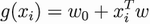
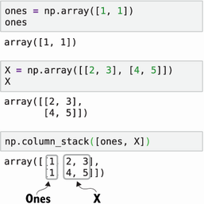

Lab 2: Machine learning for regression
======================================


This chapter covers Creating a car-price prediction project with a linear regression model
Doing an initial exploratory data analysis with Jupyter notebooks
Setting up a validation framework
Implementing the linear regression model from scratch
Performing simple feature engineering for the model
Keeping the model under control with regularization
Using the model to predict car prices


In chapter 1, we talked about supervised machine learning, in which we
teach machine learning models how to identify patterns in data by giving
them examples.


Suppose
that we have a dataset with descriptions of cars, like make, model, and
age, and we would like to use machine learning to predict their prices.
These characteristics of cars are called *features*, and the price is
the *target* *variable*---something we want to predict. Then the model
gets the features and combines them to output the price.


This is an example of supervised learning: we have some information about the
price of some cars, and we can use it to predict the price of others. In
chapter 1, we also talked about different types of supervised learning:
regression and classification. When the target variable is numerical, we
have a regression problem, and when the target variable is categorical,
we have a classification problem.


In this chapter, we create a regression model, starting with the simplest
one: linear regression. We implement the algorithms ourselves, which is
simple enough to do in a few lines of code. At the same time, it's very
illustrative, and it will teach you how to deal with NumPy arrays and
perform basic matrix operations such as matrix multiplication and matrix
inversion. We also come across problems of numerical instability when
inverting a matrix and see how regularization helps solve
them.


2.1 Car-price prediction project
--------------------------------


The problem we solve in this chapter is predicting the price of a car. Suppose that
we have a website where people can sell and buy used cars. When posting
an ad on our website, sellers often struggle to come up with a
meaningful price. We want to help our users with automatic price
recommendations. We ask the sellers to specify the model, make, year,
mileage, and other important characteristics of a car, and based on that
information, we want to suggest the best
price.


One
of the product managers in the company accidentally came across an open
dataset with car prices and asked us to have a look at it. We checked
the data and saw that it contained all the important features as well as
the recommended price---exactly what we needed for our use case. Thus,
we decided to use this dataset for building the price-recommendation
algorithm.


Theplan for the project is the following:


1.  [First,
    we download the dataset.]
2.  [Next,
    we do some preliminary analysis of the data.]
3.  [After
    that, we set up a validation strategy to make sure our model
    produces correct predictions.]
4.  [Then
    we implement a linear regression model in Python and NumPy.]
5.  [Next,
    we cover feature engineering to extract important features from the
    data to improve the model.]
6.  [Finally,
    we see how to make our model stable with regularization and use it
    to predict car prices.]


### 2.1.1 Downloading the dataset


The
first
thing we do for this project is install all the required libraries:
Python, NumPy, Pandas, and Jupyter Notebook. The easiest way to do it is
to use a Python distribution called Anaconda
([https://www.anaconda.com](https://www.anaconda.com/)). Please refer to
appendix A for installation guidelines.


After
the libraries are installed, we need to download the dataset. We have
multiple options for doing this. You can download it manually through
the Kaggle web interface, available at
<https://www.kaggle.com/CooperUnion/cardataset>. (You can read more
about the dataset and the way it was collected at
<https://www.kaggle.com/jshih7/car-price-prediction>.) Go there, open
it, and click the download link. The other option is using the Kaggle
command-line interface (CLI), which is a tool for programmatic access to
all datasets available via Kaggle. For this chapter, we will use the
second option. We describe how to configure the Kaggle
CLI
in appendix A.


##### Note


Kaggle is an online community for people who are interested in machine
learning. It is mostly known for hosting machine learning competitions,
but it is also a data-sharing platform where anyone can share a dataset.
More than 16,000 datasets are available for anyone to use. It is a great
source of project ideas and very useful for machine learning
projects.


In this chapter, as well as throughout the book, we will actively use
NumPy. We cover all necessary NumPy operations as we go along, but
please refer to appendix C for a more in-depth introduction.


The
source code for this project is available in the book's repository in
GitHub at <https://github.com/alexeygrigorev/mlbookcamp-code> in
chapter-02-car-price.


As
the first step, we will create a folder for this project. We can give it
any name, such as chapter-02-car-price:


``` 
mkdir chapter-02-car-price
cd chapter-02-car-price
```


Then we download the dataset:


``` 
kaggle datasets download -d CooperUnion/cardataset
```


This
command downloads the cardataset.zip file, which is a zip archive. Let's
unpack it:


``` 
unzip cardataset.zip
```


Inside,
there's one file: data.csv.


When
we have the dataset, let's move on to the next step:
understanding
it.


2.2 Exploratory data analysis
-----------------------------------------------------------------------------------------------------------------------


Understanding
data
is an important step in the machine learning process. Before we can
train any model, we need to know what kind of data we have and whether
it is useful. We do this with exploratory data analysis (EDA).


We
look at the dataset to learn


- [The distribution of the target variable]
- [The features in this dataset]
- [The distribution of values in these features]
- [The quality of the data]
- [The number of missing values]


### 2.2.1 Exploratory data analysis toolbox


The
main
tools for this analysis are Jupyter Notebook, Matplotlib, and Pandas:


-   [Jupyter
    Notebook is a tool for interactive execution of Python code. It
    allows us to execute a piece of code and immediately see the
    outcome. In addition, we can display charts and add notes with
    comments in free text. It also supports other languages such as R or
    Julia (hence the name: Jupyter stands for Julia, Python, R), but we
    will use it only for Python.]
-   [Matplotlib
    is a library for plotting. It is very powerful and allows you to
    create different types of visualizations, such as line charts, bar
    charts, and histograms.]
-   [Pandas
    is a library for working with tabular data. It can read data from
    any source, be it a CSV file, a JSON file, or a database.]


We
will also use Seaborn, another tool for plotting that is built on top of
Matplotlib and makes it easier to draw
charts.


Let's
start a Jupyter Notebook by executing the following
command:


``` 
jupyter notebook
```


This
command starts a Jupyter Notebook server in the current directory and
opens it in the default web browser (figure 2.1).


##### Figure 2.1 The starting screen of the Jupyter Notebook service


If
Jupyter is running on a remote server, it requires additional
configuration. Please refer to appendix A for details on the setup.


Now
let's create a notebook for this project. Click New, then select Python
3 in the Notebooks section. We can call it
chapter-02-car-price-project---click the current title (Untitled), and
replace it with the new one.


First,
we need to import all the libraries required for this project. Write the
following in the first cell:


``` 
import numpy as np                     #1
import pandas as pd                    #2
 
from matplotlib import pyplot as plt   #3
import seaborn as sns                  #3
%matplotlib inline                     #4
```


The
first two lines, ❶ and ❷, are imports for required libraries: NumPy for
numeric operations and Pandas for tabular data. The convention is to
import these libraries using shorter aliases (such as [pd] in
[import] [pandas] [as] [pd]). This convention is
common in the Python machine learning community, and everybody follows
it.


The
next two lines, ❸, are imports for plotting libraries. The first one,
Matplotlib, is a library for creating good-quality visualizations. It's
not always easy to use this library as is. Some libraries make using
Matplotlib simpler, and Seaborn is one of them.


Finally,
[%matplotlib] [inline] in line ❹ tells Jupyter to expect
plots in the notebook, so it will be able to render them when we need
them.


Press
Shift+Enter or click Run to execute the content of the selected cell.


We
will not get into more detail about Jupyter Notebooks. Check the
official website ([https://jupyter.org](https://jupyter.org/)) to learn
more about it. The site has plenty of documentation and examples that
will help you master
it.


### 2.2.2 Reading and preparing data


Now
let's
read our dataset. We can use the [read\_csv]
function
from Pandas for that purpose. Put the following code in the next cell
and again press Shift+Enter:


``` 
df = pd.read_csv('data.csv')
```


This
line of code reads the CSV file and writes the results to a variable
named
[df],
which is short for *DataFrame*. Now we can check how many rows there
are. Let's use the [len]
function:


``` 
len(df)
```


The
function prints 11914, which means that there are almost 12,000 cars in
this dataset (figure 2.2).


##### Figure 2.2 Jupyter Notebooks are interactive. We can type some code in a cell, execute it, and see the results immediately, which is ideal for exploratory data analysis.


Now
let's use
[df.head]
to look at the first five rows of our DataFrame (figure
2.3).


#####  function of a Pandas DataFrame: it shows the first five rows of the dataset. This output allows us to understand what the data looks like.


This
gives us an idea of what the data looks like. We can already see that
there are some inconsistencies in this dataset: the column names
sometimes have spaces, and sometimes have underscores (\_). The same is
true for feature values: sometimes they're capitalized, and sometimes
they are short strings with spaces. This is inconvenient and confusing,
but we can solve this by normalizing them---replacing all spaces with
underscores and lowercase all letters:


``` 
df.columns = df.columns.str.lower().str.replace(' ', '_')        #1
 
string_columns = list(df.dtypes[df.dtypes == 'object'].index)    #2
 
for col in string_columns:
    df[col] = df[col].str.lower().str.replace(' ', '_')          #3
```


In
❶ and ❸, we use the special [str]
attribute.
Using it, we can apply string operations to the entire column at that
same time without writing any [for]
loops.
We use it to lowercase the column names and the content of these columns
as well as to replace spaces with
underscores.


We
can use this attribute only for columns with string values inside. This
is exactly why we first select such columns in ❷.


##### NOTE


In this chapter and subsequent chapters, we cover relevant Pandas
operations as we go along, but at a fairly high level. Please refer to
appendix D for a more consistent and in-depth introduction to Pandas.


After
this initial preprocessing, the DataFrame looks more uniform (figure
2.4).


##### Figure 2.4 The result of preprocessing the data. The column names and values are normalized: they are lowercase, and the spaces are converted to underscores.


As
we see, this dataset contains multiple columns:


-   [make:
    make of a car (BMW, Toyota, and so on)]
-   [model:
    model of a car]
-   [year:
    year when the car was manufactured]
-   [engine\_fuel\_type:
    type of fuel the engine needs (diesel, electric, and so on)]
-   [engine\_hp:
    horsepower of the engine]
-   [engine\_cylinders:
    number of cylinders in the engine]
-   [transmission\_type:
    type of transmission (automatic or manual)]
-   [driven\_wheels:
    front, rear, all]
-   [number\_of\_doors:
    number of doors a car has]
-   [market\_category:
    luxury, crossover, and so on]
-   [vehicle\_size:
    compact, midsize, or large]
-   [vehicle\_style:
    sedan or convertible]
-   [highway\_mpg:
    miles per gallon (mpg) on the highway]
-   [city\_mpg:
    miles per gallon in the city]
-   [popularity:
    number of times the car was mentioned in a Twitter stream]
-   [msrp:
    manufacturer's suggested retail
    price


For
us, the most interesting column here is the last one: MSRP
(manufacturer's suggested retail price, or simply the price of a car).
We will use this column for predicting the prices of a
car.


### Target variable analysis


The
MSRP
column contains the important information---it's our target variable,
the *y*, which is the value that we want to learn to predict.


One
of the first steps of exploratory data analysis should always be to look
at what the values of *y* look like. We typically do this by checking
the distribution of *y*: a visual description of what the possible
values of *y* can be and how often they occur. This type of
visualization is called a
*histogram*.


We
will use Seaborn to plot the histogram, so type the following in the
Jupyter Notebook:


``` 
sns.histplot(df.msrp, bins=40)
```


After
plotting this graph, we immediately notice that the distribution of
prices has a very long tail. There are many cars with low prices on the
left side, but the number quickly drops, and there's a long tail of very
few cars with high prices (see figure 2.5).


##### Figure 2.5 The distribution of the prices in the dataset. We see many values at the low end of the price axis and almost nothing at the high end. This is a long tail distribution, which is a typical situation for many items with low prices and very few expensive ones.


We
can have a closer look by zooming in a bit and looking at values below
\$100,000 (figure 2.6):


``` 
sns.histplot(df.msrp[df.msrp < 100000])
```


##### Figure 2.6 The distribution of the prices for cars below \$100,000. Looking only at car prices below \$100,000 allows us to see the head of the distribution better. We also notice a lot of cars that cost \$1,000.


The
long tail makes it quite difficult for us to see the distribution, but
it has an even stronger effect on a
model:
such distribution can greatly confuse the model, so it won't learn well
enough. One way to solve this problem is log
transformation.
If we apply the log function to the prices, it removes the undesired
effect (figure 2.7).


##### Figure 2.7 The logarithm of the price. The effect of the long tail is removed, and we can see the entire distribution in one plot.


The
+1 part is important in cases that have zeros. The logarithm of zero is
minus infinity, but the logarithm of one is zero. If our values are all
non-negative, by adding 1, we make sure that the transformed values do
not go below
zero.


For
our specific case, zero values are not an issue---all the prices we have
start at \$1,000---but it's still a convention that we follow. NumPy has
a function that performs this
transformation:


``` 
log_price = np.log1p(df.msrp)
```


To
look at the distribution of the prices after the transformation, we can
use the same [histplot]
function
(figure 2.7):


``` 
sns.histplot(log_price)
```


As
we see, this transformation removes the long tail, and now the
distribution resembles a bell-shaped curve. This distribution is not
normal, of course, because of the large peak in lower prices, but the
model can deal with it more easily.


##### NOTE


Generally, it's good when the target distribution looks like the normal
distribution (figure 2.8). Under this condition, models such as linear
regression perform well.


##### Figure 2.8 The normal distribution, also known as Gaussian, follows the bell-shaped curve, which is symmetrical and has a peak in the center.


##### Exercise 2.1


The
head of a distribution is a range where there are many values. What is a
long tail of a
distribution?


a)
A big peak around 1,000 USD


b)
A case when many values are spread very far from the head---and these
values visually appear as a "tail" on the histogram


c)
A lot of very similar values packed together within a short range


<div>

</div>


### 2.2.4 Checking for missing values


We
will
look more closely at other features a bit later, but one thing we should
do now is check for missing values in the data. This step is important
because, typically, machine learning models cannot deal with missing
values automatically. We need to know whether we need to do anything
special to handle those
values.


Pandas
has a convenient function that checks for missing values:


``` 
df.isnull().sum()
```


This
function shows


``` 
make                    0
model                   0
year                    0
engine_fuel_type        3
engine_hp              69
engine_cylinders       30
transmission_type       0
driven_wheels           0
number_of_doors         6
market_category      3742
vehicle_size            0
vehicle_style           0
highway_mpg             0
city_mpg                0
popularity              0
msrp                    0
```


The
first thing we see is that MSRP---our target variable---doesn't have any
missing values. This result is good, because otherwise, such records
won't be useful to us: we always need to know the target value of an
observation to use it for training the model. Also, a few columns have
missing values, especially market\_category, in which we have almost
4,000 rows with missing values.


We
need to deal with missing values later when we train the model, so we
should keep this problem in mind. For now, we don't do anything else
with these features and proceed to the next step: setting up the
validation framework so that we can train and test machine learning
models.


### 2.2.5 Validation framework


As
we
learned previously, it's important to set up the validation framework as
early as possible to make sure that the models we train are good and can
generalize---that is, that the model can be applied to new, unseen data.
To do that, we put aside some data and train the model only on one part.
Then we use the held-out dataset---the one we didn't use for
training---to make sure that the predictions of the model make sense.


This
step is important because we train the model by using optimization
methods that fit the function *g*(*X* ) to the data *X*. Sometimes these
optimization methods pick up spurious patterns---patterns that appear to
be real patterns to the model but in reality are random fluctuations. If
we have a small training dataset in which all BMW cars cost only
\$10,000, for example, the model will think that this is true for all
BMW cars in the world.


To
ensure that this doesn't happen, we use validation. Because the
validation dataset is not used for training the model, the optimization
method did not see this data. When we apply the model to this data, it
emulates the case of applying the model to new data that we've never
seen. If the validation dataset has BMW cars with prices higher than
\$10,000, but our model will predict \$10,000 on them, we will notice
that the model doesn't perform well on these examples.


As
we already know, we need to split the dataset into three parts: train,
validation, and test (figure 2.9).


##### Figure 2.9 The entire dataset is split into three parts: train, validation and test.


Let's
split the DataFrame such that


-   [20%
    of data goes to validation.]
-   [20%
    goes to test.]
- [The remaining 60% goes to train.]


##### Listing 2.1 Splitting Data into validation, test, and training sets


``` 
n = len(df)
 
n_val = int(0.2 * n)
n_test = int(0.2 * n)
n_train = n - (n_val + n_test)
 
np.random.seed(2)
idx = np.arange(n)
np.random.shuffle(idx)
 
df_shuffled = df.iloc[idx]
 
df_train = df_shuffled.iloc[:n_train].copy()
df_val = df_shuffled.iloc[n_train:n_train+n_val].copy()
df_test = df_shuffled.iloc[n_train+n_val:].copy()
```


Let's
take a closer look at this code and clarify a few
things.


In
❹, we create an array and then shuffle it. Let's see what happens there.
We can take a smaller array of five elements and shuffle it:


``` 
idx = np.arange(5)
print('before shuffle', idx)
np.random.shuffle(idx)
print('after shuffle', idx)
```


If
we run it, it prints something similar to


``` 
before shuffle [0 1 2 3 4]
after shuffle  [2 3 0 4 1]
```


If
we run it again, however, the results will be different:


``` 
before shuffle [0 1 2 3 4]
after shuffle  [4 3 0 2 1]
```


To
make sure that every time we run it, the results are the same, in ❸ we
fix the random seed:


``` 
np.random.seed(2)
idx = np.arange(5)
print('before shuffle', idx)
np.random.shuffle(idx)
print('after shuffle', idx)
```


The
function
[np.random.seed]
takes in any number and uses this number as the starting seed for all
the generated data inside NumPy's random package.


When
we execute this code, it prints


``` 
before shuffle [0 1 2 3 4]
after shuffle  [2 4 1 3 0]
```


In
this case the results are still random, but when we re-execute it, the
result turns out to be the same as the previous run:


``` 
before shuffle [0 1 2 3 4]
after shuffle  [2 4 1 3 0]
```


This
is good for reproducibility. If we want somebody else to run this code
and get the same results, we need to make sure that everything is fixed,
even the "random" component of our code.


##### Note


This makes the results reproducible on the same computer. With a
different operating system and a different version of NumPy, the result
may be
different.


After
we create an array with indices
[idx],
we can use it to get a shuffled version of our initial DataFrame. For
that purpose in ❺, we use [iloc], which is a way to access the
rows of the DataFrame by their numbers:


``` 
df_shuffled = df.iloc[idx]
```


If
[idx] contains shuffled consequent numbers, this code will produce
a shuffled DataFrame (figure 2.10).


#####  to shuffle a DataFrame. When used with a shuffled array of indices, it creates a shuffled DataFrame.


In
this example, we used [iloc] with a list of indices. We can also
use ranges with the colon operator (:), and this is exactly what we do
in ❻ for splitting the shuffled DataFrame into train, validation, and
test:


``` 
df_train = df_shuffled.iloc[:n_train].copy()
df_val = df_shuffled.iloc[n_train:n_train+n_val].copy()
df_test = df_shuffled.iloc[n_train+n_val:].copy()
```


Now
the DataFrame is split into three parts, and we can continue. Our
initial analysis showed a long tail in the distribution of prices, and
to remove its effect, we need to apply the log transformation. We can do
that for each DataFrame separately:


``` 
y_train = np.log1p(df_train.msrp.values)
y_val = np.log1p(df_val.msrp.values)
y_test = np.log1p(df_test.msrp.values)
```


To
avoid accidentally using the target variable later, let's remove it from
the
dataframes:


``` 
del df_train['msrp']
del df_val['msrp']
del df_test['msrp']
```


##### Note


Removing the target variable is an optional step. But it's helpful to
make sure that we don't use it when training a model: if that happens,
we'd use price for predicting the price, and our model would have
perfect
accuracy.


When
the validation split is done, we can go to the next step: training
a
model.


2.3 Machine learning for regression
-----------------------------------------------------------------------------------------------------------------------------


After
performing the initial data analysis, we are ready to train a model. The
problem we are solving is a regression problem: the goal is to predict a
number---the price of a car. For this project we will use the simplest
regression model: linear
regression.


### Linear regression


To
predict
the price of a car, we need to use a machine learning model. To do this,
we will use linear regression, which we will implement ourselves.
Typically, we don't do this by hand; instead, we let a framework do this
for us. In this chapter, however, we want to show that there is no magic
inside these frameworks: it's just code. Linear regression is a perfect
model because it's relatively simple and can be implemented with just a
few lines of NumPy code.


First,
let's understand how linear regression works. As we know from chapter 1,
a supervised machine learning model has the form


This
is a matrix form. *X* is a matrix where the features of observations are
rows of the matrix, and *y* is a vector with the values we want to
predict.


These
matrices and vectors may sound confusing, so let's take a step back and
consider what happens with a single observation *x~i~* and the value
*y~i~* that we want to predict. The index *i* here means that this is an
observation number *i*, one of *m* observations that we have in our
training dataset.


Then,
for this single observation, the previous formula looks like


If
we have *n* features, our vector *x~i~* is *n*-dimensional, so it has
*n* components:


Because
it has *n* components, we can write the function *g* as a function with
*n* parameters, which is the same as the previous formula:


For
our case, we have 7,150 cars in the training dataset. This means that
*m* = 7,150, and *i* can be any number between 0 and 7,149. For *i =*
10, for example, we have the following car:


``` 
make                                 rolls-royce
model                     phantom_drophead_coupe
year                                        2015
engine_fuel_type     premium_unleaded_(required)
engine_hp                                    453
engine_cylinders                              12
transmission_type                      automatic
driven_wheels                   rear_wheel_drive
number_of_doors                                2
market_category        exotic,luxury,performance
vehicle_size                               large
vehicle_style                        convertible
highway_mpg                                   19
city_mpg                                      11
popularity                                    86
msrp                                      479775
```


Let's
pick a few numerical features and ignore the rest for now. We can start
with horsepower, MPG in the city, and popularity:


``` 
engine_hp         453
city_mpg           11
popularity         86
```


Then
let's assign these features to *x*~i1~, *x*~i2~, and *x*~i3~,
respectively. This way, we get the feature vector *x~i~* with three
components:


To
make it easier to understand, we can translate this mathematical
notation to Python. In our case, the function
*g*
has the following signature:


``` 
def g(xi):
    # xi is a list with n elements
    # do something with xi
    # return the result
    pass
```


In
this code, the variable
[xi]
is our vector *x~i~*. Depending on implementation, [xi] could be a
list with *n* elements or a NumPy array of size
*n*.


For
the car described previously, [xi] is a list with three
elements:


``` 
xi = [453, 11, 86]
```


When
we apply the function [g] to a vector [xi], it produces
[y\_pred] as the output, which is the [g]'s prediction for
[xi]:


``` 
y_pred = g(xi)
```


We
expect this prediction to be as close as possible to *y~i~*, which is
the real price of the car.


##### Note


In this section, we will use Python to illustrate the ideas behind
mathematical formulas. We don't need to use these code snippets for
doing the project. On the other hand, taking this code, putting it into
Jupyter, and trying to run it could be helpful for understanding the
concepts.


There
are many ways the function *g* could look, and the choice of a machine
learning algorithm defines the way it works.


If
*g* is the linear regression model, it has the following form:


The
variables *w*~0~, *w*~1~, *w*~2~, \..., *w~n~* are the parameters of the
model:


-   [*w*~0~
    is the *bias* term.]
-   [*w*~1~,
    *w*~2~, \..., *w~n~* are the *weights* for each feature *x*~i1~,
    *x*~i2~, \..., *x*~in~.]


These
parameters define exactly how the model should combine the features so
that the predictions at the end are as good as possible. It's okay if
the meaning behind these parameters is not clear yet, because we will
cover them later in this section.


To
keep the formula shorter, let's use sum notation:


##### Exercise 2.2


For
supervised learning, we use a machine learning model for a single
observation *y~i~* ≈ *g*(*x~i~*). What are *x~i~* and *y~i~* for this
project?


a)
*x~i~* is a feature vector---a vector that contains a few numbers that
describe the object (a car)---and *y~i~* is the logarithm of the price
of this car.


b)
*y~i~* is a feature vector---a vector that contains a few numbers that
describe the object (a car)---and *x~i~* is the logarithm of the price
of this car.


<div>

</div>


These
weights are what the model learns when we train it. To better understand
how the model uses these weights, let's consider the following values
(table 2.1).


##### Table 2.1 An example of weights that a linear regression model learned [(view table figure)](https://drek4537l1klr.cloudfront.net/grigorev/HighResolutionFigures/table_2-1.png)

  w~3~
  ------------------------------------------------------------------------------------------------ ------------------------------------------------------------------------------------------------ ------------------------------------------------------------------------------------------------ -------------------------------------------------------------------------------------------------
  0.002


So
if we want to translate this model to
Python,
it will look like
this:


``` 
w0 = 7.17
#   [w1    w2    w3   ]
w = [0.01, 0.04, 0.002]
n = 3
 
def linear_regression(xi):
    result = w0
    for j in range(n):
        result = result + xi[j] * w[j]
    return result
```


We
put all the feature weights inside a single list [w]---just like
we did with [xi] previously. All we need to do now is loop over
these weights and multiply them by the corresponding feature values.
This is nothing else but the direct translation of the previous formula
to Python.


This
is easy to see. Have another look at the formula:


Our
example has three features, so *n =* 3, and we have


This
is exactly what we have in the code


``` 
result = w0 + xi[0] * w[0] + xi[1] * w[1] + xi[2] * w[2]
```


with
the simple exception that indexing in Python starts with 0, *x*~i1~
becomes [xi\[0\]] and *w*~1~ is
[w\[0\]].


Now
let's see what happens when we apply the model to our observation *x~i~*
and replace the weights with their values:


The
prediction we get for this observation is 12.31. Remember that during
preprocessing, we applied the logarithmic transformation to our target
variable *y*. This is why the model we trained on this data also
predicts
the
logarithm of the price. To undo the transformation, we need to take the
exponent of the prediction. In our case, when we do it, the predicted
price becomes \$222,347:


exp(12.31)
-- 1 = 222,347


The
bias term (7.17) is the value we would predict if we didn't know
anything about the car; it serves as a baseline.


We
do know something about the car, however: horsepower, MPG in the city,
and popularity. These features are the *x*~i1~, *x*~i2~, and *x*~i3~
features, each of which tells us something about the car. We use this
information to adjust the baseline.


Let's
consider the first feature: horsepower. The weight for this feature is
0.01, which means that for each extra unit of horsepower, we adjust the
baseline by adding 0.01. Because we have 453 horses in the engine, we
add 4.53 to the baseline: 453 horses · 0.01 = 4.53.


The
same happens with MPG. Each additional mile per gallon increases the
price by 0.04, so we add 0.44: 11 MPG · 0.04 = 0.44.


Finally,
we take popularity into account. In our example, each mention in the
Twitter stream results in a 0.002 increase. In total, popularity
contributes 0.172 to the final prediction.


This
is exactly why we get 12.31 when we combine everything (figure 2.11).


##### Figure 2.11 The prediction of linear regression is the baseline of 7.17 (the bias term) adjusted by information we have from the features. Horsepower contributes 4.53 to the final prediction; MPG, 0.44; and popularity, 0.172.


Now,
let's remember that we are actually dealing with vectors, not individual
numbers. We know that *x~i~* is a vector with *n*
components:


We
can also put all the weights together in a single vector *w* :


In
fact, we already did that in the Python example when we put all the
weights in a list, which was a vector of dimensionality 3 with weights
for each individual feature. This is how the vectors look for our
example:


Because
we now think of both features and weights as vectors *x~i~* and *w*,
respectively, we can replace the sum of the elements of these vectors
with a dot product between them:


The
dot product is a way of multiplying two vectors: we multiply
corresponding elements of the vectors and then sum the results. Refer to
appendix C for more details about vector-vector multiplication.


The
translation of the formula for dot product to the code is
straightforward:


``` 
def dot(xi, w):
    n = len(w)
    result = 0.0
    for j in range(n):
        result = result + xi[j] * w[j]
    return result
```


Using
the new notation, we can rewrite the entire equation for linear
regression as





where


-   [*w*~0~
    is the bias term.]
-   [*w*
    is the *n*-dimensional vector of weights.]


Now
we can use the new [dot]
function,
so the linear regression function in Python becomes very short:


``` 
def linear_regression(xi):
    return w0 + dot(xi, w)
```


Alternatively,
if [xi] and [w] are NumPy arrays, we can use the built-in
[dot]
method
for
multiplication:


``` 
def linear_regression(xi):
    return w0 + xi.dot(w)
```


To
make it even shorter, we can combine *w*~0~ and *w* into one
(*n+*1)-dimensional vector by prepending *w*~0~ to *w* right in front of
*w*~1~:


Here,
we have a new weights vector *w* that consists of the bias term *w*~0~
followed by the weights *w*~1~, *w*~2~*, \...* from the original
weights
vector *w*.


In
Python, this is very easy to do. If we already have the old weights in a
list [w], all we need to do is the following:


``` 
w = [w0] + w
```


Remember
that the plus operator in Python concatenates lists, so [\[1\]]
[+] [\[2,] [3,] [4\]] will create a new list
with four elements: [\[1,] [2,] [3,] [4\]]. In
our case, [w] is already a list, so we create a new [w] with
one extra element at the beginning: [w0].


Because
now *w* becomes a (*n*+1)-dimensional vector, we also need to adjust the
feature vector *x~i~* so that the dot product between them still works.
We can do this easily by adding a dummy feature *x*~i\ 0~, which always
takes the value 1. Then we prepend this new dummy feature to *x~i~*
right before *x*~i\ 1~:


Or,
in code:


``` 
xi = [1] + xi
```


We
create a new list [xi] with 1 as the first element followed by all
the elements from the old list [xi].


With
these modifications, we can express the model as the dot product between
the new *x~i~* and the new *w*:


The
translation to the code is simple:


``` 
w0 = 7.17
w = [0.01, 0.04, 0.002]
w = [w0] + w
 
def linear_regression(xi):
    xi = [1] + xi
    return dot(xi, w)
```


These
formulas for linear regressions are equivalent because the first feature
of the new *x~i~* is 1, so when we multiply the first component of
*x~i~* by the first component of *w*, we get the bias term, because
*w*~0~ · 1 = *w*~0~.


We
are ready to consider the bigger picture again and talk about the matrix
form. There are many observations and *x~i~* is one of them. Thus, we
have *m* feature vectors *x*~1~, *x*~2~, \..., *x~i~* , \..., *x*~m~,
and each of these vectors consists of *n*+1
features:


We
can put these vectors together as rows of a matrix. Let's call this
matrix *X* (figure 2.12).


##### Figure 2.12 Matrix *X*, in which observations *x*~1~, *x*~2~, \..., *x*~m~ are rows


Let's
see how it looks in code. We can take a few rows from the training
dataset, such as the first, second, and tenth:


``` 
x1  = [1, 148, 24, 1385]
x2  = [1, 132, 25, 2031]
x10 = [1, 453, 11, 86]
```


Now
let's put the rows together in another list:


``` 
X = [x1, x2, x10]
```


List
[X] now contains three lists. We can think of it as a 3x4
matrix---a matrix with three rows and four columns:


``` 
X = [[1, 148, 24, 1385],
     [1, 132, 25, 2031],
     [1, 453, 11, 86]]
```


Each
column of this matrix is a feature:


1.  [The
    first column is a dummy feature with "1."]
2.  [The
    second column is the engine horsepower.]
3.  [The
    third---MPG in the city.]
4.  [And
    the last one---popularity, or the number of mentions in a Twitter
    stream.]


We
already learned that to make a prediction for a single feature vector,
we need to calculate the dot product between this feature vector and the
weights vector. Now we have a matrix [X], which in Python is a
list of feature vectors. To make predictions for all the rows of the
matrix, we can simply iterate over all rows of [X] and compute the
dot
product:


``` 
predictions = []
 
for xi in X:
    pred = dot(xi, w)
    predictions.append(pred)
```


In
linear algebra, this is the matrix-vector multiplication: we multiply
the matrix *X* by the vector *w*. The formula for linear regression
becomes


The
result is an array with predictions for each row of *X*. Refer to
appendix C for more details about matrix-vector multiplication.


With
this matrix formulation, the code for applying linear regression to make
predictions becomes very simple. The translation to NumPy becomes
straightforward:


``` 
predictions = X.dot(w)
```


##### Exercise 2.3


When
we multiply the matrix *X* by the weights vector *w*, we
get


a)
A vector *y* with the actual price


b)
A vector *y* with price predictions


c)
A single number *y* with price predictions


<div>

</div>


### 2.3.2 Training linear regression model


So
far,
we've only covered making predictions. To be able to do that, we need to
know the weights *w*. How do we get them?


We
learn the weights from data: we use the target variable *y* to find such
*w* that combines the features of *X* in the best possible way. "Best
possible" in the case of linear regression means that it minimizes the
error between the predictions *g*(*X* ) and the actual target *y*.


We
have multiple ways to do that. We will use normal equation, which is the
simplest method to implement. The weight vector *w* can be computed with
the following formula:


##### Note


Covering the derivation of the normal equation is out of scope for this
book. We give a bit of intuition of how it works in appendix C, but you
should consult a machine learning textbook for a more in-depth
introduction. *The Elements of Statistical Learning*, 2nd edition by
Hastie, Tibshirani, and Friedman is a good
start.


This
piece of math may appear scary or confusing, but it's quite easy to
translate to NumPy:


-   [*X^T^*
    is the transpose of *X*. In NumPy, it's [X.T].]
-   [*X^T^X*
    is a matrix--matrix multiplication, which we can do with the
    [dot] method from NumPy: [X.T.dot(X)].]
-   [*X*^--1^
    is the inverse of *X*. We can use [np.linalg.inv]
    function
    to calculate the inverse.]


So
the formula above translates directly to


``` 
inv(X.T.dot(X)).dot(X.T).dot(y)
```


Please
refer to appendix C for more details about this equation.


To
implement the normal equation, we need to do the following:


1.  [Create
    a function that takes in a matrix *X* with features and a vector *y*
    with the target.]
2.  [Add
    a dummy column (the feature that is always set to 1) to the matrix
    *X*.]
3.  [Train
    the model: compute the weights *w* by using the normal
    equation.]
4.  [Split
    this *w* into the bias *w*~0~ and the rest of the weights, and
    return them.]


The
last step---splitting *w* into the bias term and the rest---is optional
and mostly for convenience; otherwise, we need to add the dummy column
every time we want to make predictions instead of doing it once during
training.


Let's
implement it.


##### Listing 2.2 Linear regression implemented with NumPy


``` 
def train_linear_regression(X, y):
    # adding the dummy column
    ones = np.ones(X.shape[0])         #1
    X = np.column_stack([ones, X])     #2
   
    # normal equation formula
    XTX = X.T.dot(X)                   #3
    XTX_inv = np.linalg.inv(XTX)       #4
    w = XTX_inv.dot(X.T).dot(y)        #5
   
    return w[0], w[1:]                 #6
```


With
six lines of code, we have implemented our first machine learning
algorithm. In ❶, we create a vector containing only ones, which we
append to the matrix *X* as the first column; this is the dummy feature
in ❷.
Next,
we compute *X^T^X* in ❸ and its inverse in ❹, and we put them together
to calculate *w* in ❺. Finally, we split the weights into the bias
*w*~0~ and the
remaining
weights *w*
in
❻.


The
[column\_stack]
function
from NumPy that we used for adding a column of ones might be confusing
at first, so let's have a closer look at it:


``` 
np.column_stack([ones, X])
```


It
takes in a list of NumPy arrays, which in our case contains [ones]
and [X] and stacks them (figure 2.13).


#####  takes a list of NumPy arrays and stacks them in columns. In our case, the function appends the array with ones as the first column of the matrix.




If
weights are split into the bias term and the rest, the linear regression
formula for making predictions changes slightly:


This
is still very easy to translate to NumPy:


``` 
y_pred = w0 + X.dot(w)
```


Let's
use it for
our
project!


2.4 Predicting the price
------------------------------------------------------------------------------------------------------------------


We've
covered
a great deal of theory, so let's come back to our project: predicting
the price of a car. We now have a function for training a linear
regression model at our disposal, so let's use it to build a simple
baseline
solution.


### 2.4.1 Baseline solution


To
be
able to use it, however, we need to have some data: a matrix *X* and a
vector with the target variable *y*. We have already prepared the *y*,
but we still don't have the *X*: what we have right now is a data frame,
not a matrix. So we need to extract some features from our dataset to
create this
matrix
*X*.


We will start with a very naive way of creating features: select a few
numerical features, and form the matrix *X* from them. In the previous
example, we used only three features. This time, we include a couple
more features and use the following columns:


- engine_hp
- engine_cylinders
- highway_mpg
- city_mpg
- popularity


Let's
select the features from the data frame and write them to a new
variable, [df\_num]:


``` 
base = ['engine_hp', 'engine_cylinders', 'highway_mpg', 'city_mpg',
        'popularity']
df_num = df_train[base]
```


As
discussed in the section on exploratory data analysis, the dataset has
missing values. We need to do something because the linear regression
model cannot deal with missing values automatically.


One
option is to drop all the rows that contain at least one missing value.
This approach, however, has some disadvantages. Most important, we will
lose the information that we have in the other columns. Even though we
may not know the number of doors of a car, we still know other things
about the car, such as make, model, age, and other things that we don't
want to throw away.


The
other option is filling the missing values with some other value. This
way, we don't lose the information in other columns and still can make
predictions, even if the row has missing values. The simplest possible
approach is to fill the missing values with zeros. We can use the
[fillna]
method
from Pandas:


``` 
df_num = df_num.fillna(0)
```


This
method may not be the best way to deal with missing values, but often,
it's good enough. If we set the missing feature value to zero, the
respective feature is simply ignored.


##### Note


An alternative option is to replace the missing values with the average
values. For some variables, for example, the number of cylinders, the
value of zero doesn't make much sense: a car cannot have zero cylinders.
However, this will make our code more complex and won't have a
significant impact on the results. That's why we follow a simpler
approach and replace the missing values with
zeros.


It's
not difficult to see why setting a feature to zero is the same as
ignoring it. Let's recall the formula for linear regression. In our
case, we have five features, so the formula is


If
feature three is missing, and we fill it with zero, *x*~i\ 3~ becomes
zero:


In
this case, regardless of the weight *w*~3~ for this feature, the product
*x*~i\ 3~*w*~3~ will always be zero. In other words, this feature will
have no contribution to the final prediction, and we will base our
prediction only on features that aren't missing:


Now
we need to convert this DataFrame to a NumPy array. The easiest way to
do it is to use its [values]
property:


``` 
X_train = df_num.values
```


is a matrix---a two-dimensional NumPy array. It's something we can use
as input to our [linear\_regresson]
function.
Let's call it


``` 
w_0, w = train_linear_regression(X_train, y_train)
```


We
have just trained the first model! Now we can apply it to the training
data to see how well it predicts:


``` 
y_pred = w_0 + X_train.dot(w)
```


To
see how good the predictions are, we can use [histplot]---a
function from Seaborn for plotting histograms that we used
previously---to plot the predicted values and compare them with the
actual prices:


``` 
sns.histplot(y_pred, label='prediction')
sns.histplot(y_train, label='target')
plt.legend()
```


We
can see from the plot (figure 2.14) that the distribution of values we
predicted looks quite different from the actual values. This result may
indicate that the model is not powerful enough to capture the
distribution of the target variable. This shouldn't be a surprise to us:
the model we used is quite basic and includes only five very simple
.


##### Figure 2.14 The distribution of the predicted values (light gray) and the actual values (dark gray). We see that our predictions aren't very good; they are very different from the actual distribution.


### 2.4.2 RMSE: Evaluating model quality


Looking
at
plots and comparing the distributions of the actual target variable with
the predictions is a good way to evaluate quality, but we cannot do this
every time we change something in the model. Instead, we need to use a
metric that quantifies the quality of the model. We can use many metrics
to evaluate how well a regression model behaves. The most commonly used
one is *root mean squared error*---RMSE for short.


RMSE
tells us how large the errors are that our model makes. It's computed
with the following formula:


Let's
try to understand what's going on here. First, let's look inside the
sum. We have


This
is the difference between the prediction we make for the observation and
the actual target value for that observation (figure 2.15).


##### Figure 2.15 The difference between the predictions *g*(*x~i~*) and the actual values *y~i~*


Then
we use the square of the difference, which gives a lot more weight to
larger differences. If we predict 9.5, for example, and the actual value
is 9.6, the difference is 0.1, so its square is 0.01, which is quite
small. But if we predict 7.3, and the actual value is 10.3, the
difference is 3, and the square of the difference is 9 (figure
2.16).


This
is the SE part (*squared
error*)
of RMSE.


##### Figure 2.16 The square of the difference between the predictions and the actual values. For large differences, the square is quite big.


Next,
we have a sum:


This
summation goes over all *m* observations and puts all the squared errors
together (figure 2.17) into a single number.


##### Figure 2.17 The result of the summation of all the square differences is a single number.


If
we divide this sum by *m*, we get the mean squared error:


This
is the squared error that our model makes on average---the M part
(*mean*) of RMSE, or *mean squared
error*
(MSE). MSE is also a good metric on its own (figure 2.18).


##### Figure 2.18 MSE is computed by calculating the mean of the squared errors.


Finally,
we take the square root of that:


This
is the R part (*root*) of RMSE (figure 2.19).


##### Figure 2.19 RMSE: we first compute MSE and then calculate its square root.


When
using NumPy to implement RMSE, we can take advantage of
*vectorization*:
the process of applying the same operation to all elements of one or
more NumPy arrays. We get multiple benefits from using vectorization.
First, the code is more concise: we don't have to write any loops to
apply the same operation to each element of the array. Second,
vectorized operations are a lot faster than simple Python for
loops.


Consider
the following
implementation.


##### Listing 2.3 The implementation of root mean squared error


``` 
def rmse(y, y_pred):
    error = y_pred - y
    mse = (error ** 2).mean()
    return np.sqrt(mse)
```


In
❶, we compute element-wise difference between the vector with
predictions and the vector with the target variable. The result is a new
NumPy array [error] that contains the differences. In ❷, we do two
operations in one line: compute the square of each element of the
[error]
array
and then get the mean value of the result, which gives us MSE. In ❸, we
compute the square root to get RMSE.


Element-wise
operations in NumPy and Pandas are quite convenient. We can apply an
operation to an entire NumPy array (or a Pandas series) without writing
loops.


In
the first line of our [rmse]
function,
for example, we compute the difference between the predictions and the
actual prices:


``` 
error = y_pred - y
```


What
happens here is that for each element of [y\_pred], we subtract
the corresponding element of [y] and then put the result to the
new array [error] (figure 2.20).


#####  array.


Next,
we compute the square of each element of the [error] array and
then calculate its mean to get the mean squared error of our model
(figure 2.21).


##### Figure 2.21 To calculate MSE, we first compute the square of each element in the error array and then compute the mean value of the result.


To
see exactly what happens, we need to know that the power operator (\*\*)
is also applied element-wise, so the result is another array in which
all elements of the original array are squared. When we have this new
array with squared elements, we simply compute its mean by using the
[mean()]
method
(figure 2.22).


##### Figure 2.22 The power operator (\*\*) applied element-wise to the error array. The result is another array in which each element is squared. Then we compute the mean of the array with the squared error to compute MSE.


Finally,
we compute the square root of the mean value to get RMSE:


``` 
np.sqrt(mse)
```


Now
we can use RMSE to evaluate the quality of the model:


``` 
rmse(y_train, y_pred)
```


The
code prints 0.75. This number tells us that on average, the model's
predictions are off by 0.75. This result alone may not be very useful,
but we can use it to compare this model with other models. If one model
has a better (lower) RMSE than the other, it indicates that model is
better.


### 2.4.3 Validating the model


In
the
example from the previous section we computed RMSE on the training set.
The result is useful to know but doesn't reflect the way the model will
be used later. The model will be used to predict the price of cars that
it didn't see before. For that purpose, we set aside a validation
dataset. We intentionally don't use it for training and keep it for
validating the model.


We
have already split our data into multiple parts:
[df\_train],
[df\_val],
and
[df\_test].
We have also created a matrix
[X\_train]
from [df\_train] and used [X\_train] and
[y\_train]
to train the model. Now we need to do the same steps to get
[X\_val]---a
matrix with features computed from the validation dataset. Then we can
apply the model to [X\_val] to get predictions and compare them
with
[y\_val].


First,
we create the [X\_val] matrix, following the same steps as for
[X\_train]:


``` 
df_num = df_val[base]
df_num = df_num.fillna(0)
X_val = df_num.values
```


We're
ready to apply the model to [X\_val] to get predictions:


``` 
y_pred = w_0 + X_val.dot(w)
```


The
[y\_pred]
array
contains the predictions for the validation dataset. Now we use
[y\_pred] and compare it with the actual prices from
[y\_val], using the RMSE function that we implemented previously:


``` 
rmse(y_val, y_pred)
```


The
value this code prints is 0.76, which is the number we should use for
comparing models.


In
the previous code we already see some duplication: training and
validation tests require the same preprocessing, and we wrote the same
code twice. Thus, it makes sense to move this logic to a separate
function and avoid duplicating the code.


We
can call this function
[prepare\_X]
because it creates a matrix [X] from a DataFrame.


##### function for converting a DataFrame into a matrix


``` 
def prepare_X(df):
    df_num = df[base]
    df_num = df_num.fillna(0)
    X = df_num.values
    return X
```


Now
the whole training and evaluation becomes simpler and looks like this:


``` 
X_train = prepare_X(df_train)                        #1
w_0, w = train_linear_regression(X_train, y_train)   #1
 
X_val = prepare_X(df_val)                            #2
y_pred = w_0 + X_val.dot(w)                          #2
print('validation:', rmse(y_val, y_pred))            #3
```


This
gives us a way to check whether any model adjustments lead to
improvements in the predictive quality of the model. As the next step,
let's add more features and check whether it gets lower RMSE
scores.


### 2.4.4 Simple feature engineering


We
already
have a simple baseline model with simple features. To improve our model
further, we can add more features to the model: we create others and add
them to the existing features. As we already know, this process is
called *feature engineering*.


Because
we have already set up the validation framework, we can easily verify
whether adding new features improves the quality of the model. Our aim
is to improve the RMSE calculated on the validation
data.


First,
we create a new feature, "age," from the feature "year." The age of a
car should be very helpful when predicting its price: intuitively, the
newer the car, the more expensive it should be.


Because
the dataset was created in 2017 (which we can verify by checking
[df\_train.year.max()]), we can calculate the age by subtracting
the year when the car was made from 2017:


``` 
df_train['age'] = 2017 - df_train.year
```


This
operation is an element-wise operation. We calculate the difference
between 2017 and each element of the year series. The result is a new
Pandas series containing the differences, which we write back to the
dataframe as the age column.


We
already know that we will need to apply the same preprocessing twice: to
the training and validation sets. Because we don't want to repeat the
feature extraction code multiple times, let's put this logic into the
[prepare\_X] function.


##### function


``` 
def prepare_X(df):
    df = df.copy()
    features = base.copy()
 
    df['age'] = 2017 - df.year
    features.append('age')
 
    df_num = df[features]
    df_num = df_num.fillna(0)
    X = df_num.values
    return X
```


The
way we implement the function this time is slightly different from the
previous version. Let's look at these differences. First, in ❶, we
create a copy of the DataFrame [df] that we pass in the function.
Later in the code, we modify [df] by adding extra rows in ❸. This
kind of behavior is known as a *side
effect*:
the caller of the function may not expect the function to change the
DataFrame. To prevent the unpleasant surprise, we instead modify the
copy of the original DataFrame. In ❷, we create a copy for the list with
the base features for the same reason. Later, we extend this list with
new features ❹, but we don't want to change the original list. The rest
of the code is the same as previously.


Let's
test if adding the feature "age" leads to any improvements:


``` 
X_train = prepare_X(df_train)
w_0, w = train_linear_regression(X_train, y_train)
 
X_val = prepare_X(df_val)
y_pred = w_0 + X_val.dot(w)
print('validation:', rmse(y_val, y_pred))
```


The
code prints


``` 
validation: 0.517
```


The
validation error is 0.517, which is a good improvement from 0.76---the
value we had in the baseline solution. Thus, we conclude that adding
"age" is indeed helpful when making predictions.


We
can also look at the distribution of the predicted values:


``` 
sns.histplot(y_pred, label='prediction')
sns.histplot(y_val, label='target')
plt.legend()
```


We
see (figure 2.23) that the distribution of the predictions follows the
target distribution a lot more closely than previously. Indeed, the
validation RMSE score confirms
it.


##### Figure 2.23 The distribution of predicted (light gray) versus actual (dark gray). With the new features, the model follows the original distribution closer than previously.


### 2.4.5 Handling categorical variables


We
see
that adding "age" is quite helpful for the model. Let's continue adding
more features. One of the columns we can use next is the number of
doors. This variable appears to be numeric and can take three values: 2,
3, and 4 doors. Even though it's tempting to put the variable to the
model as is, it's not really a numeric variable: we cannot say that by
adding one more door, the price of a car grows (or drops) by a certain
amount of money. Rather, the variable is categorical.


*Categorical
variables* describe characteristics of objects and can take one of a few
possible values. The make of a car is a categorical variable; for
example, it can be Toyota, BWM, Ford, or any other make. It's easy to
recognize a categorical variable by its values, which typically are
strings and not numbers. That's not always the case, however. The number
of doors, for example, is categorical: it can take only one of the three
possible values (2, 3, and 4).


We
can use categorical variables in a machine learning model in multiple
ways. One of the simplest ways is to encode such variables by a set of
binary features, with a separate feature for each distinct value.


In
our case, we will create three binary features: [num\_doors\_2],
[num\_doors\_3], and [num\_doors\_4]. If the car has two
doors, [num\_doors\_2] will be set to 1, and the rest will be 0.
If the car has three doors, [num\_doors\_3] will get the value 1,
and the same goes for
[num\_doors\_4].


This
method of encoding categorical variables is called *one-hot
encoding*.
We will learn more about this way of encoding categorical variables in
chapter 3. For now, let's choose the simplest way to do this encoding:
looping over the possible values (2, 3, and 4) and, for each value,
checking whether the value of the observation matches it.


Let's
add these lines to the [prepare\_X] function:


``` 
for v in [2, 3, 4]:                                     #1
    feature = 'num_doors_%s' % v                        #2
    value = (df['number_of_doors'] == v).astype(int)    #3
    df[feature] = value                                 #4
    features.append(feature)
```


This
code may be difficult to understand, so let's take a closer look at
what's going on here. The most difficult line is ❸:


``` 
(df['number_of_doors'] == v).astype(int)
```


Two
things happen here. The first one is the expression inside the
parentheses, where we use the equals (==) operator. This operation is
also an element-wise operation, like the ones we used previously when
computing RMSE. In this case, the operation creates a new Pandas series.
If elements of the original series equal [v], the corresponding
elements in the result is True; otherwise, the elements are False. The
operation creates a series of True/False values. Because [v] has
three values (2, 3, and 4), and we apply this operation to every value
of [v], we create three series (figure 2.24).


##### Figure 2.24 We use the == operator to create the new series from the original one: one for two doors, one for three doors, and one for four doors.


Next,
we convert the Boolean series to integers in such a way that True
becomes 1 and False becomes 0, which is easy to do with the
[astype(int)]
method
(figure 2.25). Now we can use the results as features and put them into
linear regression.


#####  to convert series with Boolean values to integers


The
number of doors, as we discussed, is a categorical variable that appears
to be numerical because the values are integers (2, 3 and 4). All the
remaining categorical variables we have in the dataset are
strings.


We
can use the same approach to encode other categorical variables. Let's
start with [make]. For our purposes, it should be enough to get
and use only the most frequently occurring values. Let's find out what
the five most frequent values are:


``` 
df['make'].value_counts().head(5)
```


The code prints


``` 
chevrolet     1123
ford           881
volkswagen     809
toyota         746
dodge          626
```


We
take these values and use them to encode [make] in the same way
that we encoded the number of doors.


Next,
we create five new variables called [is\_make\_chevrolet],
[is\_make\_ford], [is\_] [make\_volkswagen],
[is\_make\_toyota], and [is\_make\_dodge]:


``` 
for v in ['chevrolet', 'ford', 'volkswagen', 'toyota', 'dodge']:
    feature = 'is_make_%s' % v
    df[feature] = (df['make'] == v).astype(int)
    features.append(feature)
```


Now the whole [prepare\_X] should look like the following.


``` 
def prepare_X(df):
    df = df.copy()
    features = base.copy()
 
    df['age'] = 2017 - df.year
    features.append('age')
 
    for v in [2, 3, 4]:
        feature = 'num_doors_%s' % v
        df[feature] = (df['number_of_doors'] == v).astype(int)
        features.append(feature)
 
    for v in ['chevrolet', 'ford', 'volkswagen', 'toyota', 'dodge']:
        feature = 'is_make_%s' % v
        df[feature] = (df['make'] == v).astype(int)
        features.append(feature)
    df_num = df[features]
    df_num = df_num.fillna(0)
    X = df_num.values
    return X
```


Let's
check whether this code improves the RMSE of the model:


``` 
X_train = prepare_X(df_train)
w_0, w = train_linear_regression(X_train, y_train)
 
X_val = prepare_X(df_val)
y_pred = w_0 + X_val.dot(w)
print('validation:', rmse(y_val, y_pred))
```


The
code prints


``` 
validation: 0.507
```


The
previous value was 0.517, so we managed to improve the RMSE score
further.


We
can use a few more variables: [engine\_fuel\_type],
[transmission\_type], [driven\_] [wheels],
[market\_category], [vehicle\_size], and
[vehicle\_style]. Let's do the same thing for them. After the
modifications, the [prepare\_X] starts looking a bit more complex.


##### function


``` 
def prepare_X(df):
    df = df.copy()
    features = base.copy()
 
    df['age'] = 2017 - df.year
    features.append('age')
 
    for v in [2, 3, 4]:
        feature = 'num_doors_%s' % v
        df[feature] = (df['number_of_doors'] == v).astype(int)
        features.append(feature)
 
    for v in ['chevrolet', 'ford', 'volkswagen', 'toyota', 'dodge']:
        feature = 'is_make_%s' % v
        df[feature] = (df['make'] == v).astype(int)
        features.append(feature)
 
    for v in ['regular_unleaded', 'premium_unleaded_(required)',
              'premium_unleaded_(recommended)',
              'flex-fuel_(unleaded/e85)']:
        feature = 'is_type_%s' % v
        df[feature] = (df['engine_fuel_type'] == v).astype(int)
        features.append(feature)
 
    for v in ['automatic', 'manual', 'automated_manual']:
        feature = 'is_transmission_%s' % v
        df[feature] = (df['transmission_type'] == v).astype(int)
        features.append(feature)
 
    for v in ['front_wheel_drive', 'rear_wheel_drive',
              'all_wheel_drive', 'four_wheel_drive']:
        feature = 'is_driven_wheels_%s' % v
        df[feature] = (df['driven_wheels'] == v).astype(int)
        features.append(feature)
 
    for v in ['crossover', 'flex_fuel', 'luxury',
              'luxury,performance', 'hatchback']:
        feature = 'is_mc_%s' % v
        df[feature] = (df['market_category'] == v).astype(int)
        features.append(feature)
 
    for v in ['compact', 'midsize', 'large']:
        feature = 'is_size_%s' % v
        df[feature] = (df['vehicle_size'] == v).astype(int)
        features.append(feature)
 
    for v in ['sedan', '4dr_suv', 'coupe', 'convertible',
              '4dr_hatchback']:
        feature = 'is_style_%s' % v
        df[feature] = (df['vehicle_style'] == v).astype(int)
        features.append(feature)
    df_num = df[features]
    df_num = df_num.fillna(0)
    X = df_num.values
    return X
```


Let's test it:


``` 
X_train = prepare_X(df_train)
w_0, w = train_linear_regression(X_train, y_train)
 
X_val = prepare_X(df_val)
y_pred = w_0 + X_val.dot(w)
print('validation:', rmse(y_val, y_pred))
```


The
number we see is significantly worse than before. We get 34.2, which is
a lot more than the 0.5 we had before.


##### NOTE


The number you get may be different, depending on the Python version,
the NumPy version, the versions of NumPy dependencies, the OS, and other
factors. But the jump in the validation metric from 0.5 to something
significantly bigger should always alert
us.


Instead
of helping, the new features made the score a lot worse. Luckily, we
have validation to help us spot this problem. In the next section, we
will see why it happens and how to deal with


### 2.4.6 Regularization


We
saw
that adding new features does not always help, and in our case, it made
things a lot worse. The reason for this behavior is numerical
instability. Recall the formula of the normal
equation:


One
of the terms in the equation is the inverse of the *X^T^X* matrix:


The
inversion is the issue in our case. Sometimes, when adding new columns
to *X*, we can accidentally add a column that is a combination of other
columns. For example, if we already have the MPG in the city feature and
decide to add kilometers per liter in the city, the second feature is
the same as the first one but multiplied by a constant.


When
this happens, *X^T^X* becomes *undetermined* or *singular*, which means
that it's not possible to find an inverse for this matrix. If we try to
invert a singular matrix, NumPy will tell us about that by raising a
[LinAlgError]:


``` 
LinAlgError: Singular matrix
```


Our
code didn't raise any exceptions, however. It happened because we don't
typically have columns that are perfect linear combinations of other
columns. The real data is often noisy, with measurement errors (such as
recording 1.3 instead of 13 for MPG), rounding errors (such as storing
0.0999999 instead of 0.1), and many other errors. Technically, such
matrices are not singular, so NumPy doesn't complain.


For
this reason, however, some of the values in the weights become extremely
large---a lot larger than they are supposed to be.


If
we look at the values of our *w*~0~ and *w*, we see that this is indeed
the case. The bias term *w*~0~ has the value 5788519290303866.0, for
example (the value may vary depending on the machine, OS, and version of
NumPy), and a few components of *w* have extremely large negative values
as well.


In
numerical linear algebra, such issues are called *numerical instability
issues*, and they are typically solved with regularization techniques.
The aim of *regularization* is to make sure that the inverse exists by
forcing the matrix to be invertible. Regularization is an important
concept in machine learning: it means "controlling"---controlling the
weights of the model so that they behave correctly and don't grow too
large, as in our
case.


One
way to do regularization is to add a small number to each diagonal
element of the matrix. Then we get the following formula for linear
regression:


##### NOTE


Regularized linear regression is often called *ridge
regression*.
Many libraries, including Scikit-learn, use *ridge* to refer to
regularized linear regression and *linear
regression*
to refer to the unregularized model.


Let's
look at the part that changed: the matrix that we need to invert. This
is how it looks:


This
formula says that we need *I*---an *identity
matrix*,
which is a matrix with ones on the main diagonal and zeros everywhere
else. We multiply this identity matrix by a number *α*. This way, all
the ones on the diagonal of *I* become *α*. Then we sum *αI* and
*X^T^X*, which adds *α* to all the diagonal elements of *X^T^X*.


This
formula can directly translate to NumPy code:


``` 
XTX = X_train.T.dot(X_train)
XTX = XTX + 0.01 * np.eye(XTX.shape[0])
```


The
[np.eye]
function
creates a two-dimensional NumPy array that is also an identity matrix.
When we multiply by 0.01, the ones on the diagonal become 0.01, so when
we add this matrix to [XTX], we add only 0.01 to its main diagonal
(figure 2.26).


##### (A) The eye function from NumPy creates an identity matrix.


##### (B) When we multiply the identity matrix by a number, this number goes to the main diagonal of the result.


##### Figure 2.26 Using an identity matrix to add 0.01 to the main diagonal of a square matrix

##### (C) The effect of adding an identity matrix multiplied by 0.01 to another matrix is the same as adding 0.01 to the main diagonal of that matrix.


Let's
create a new function that uses this idea and implements linear
regression with
regularization.


##### Listing 2.8 Linear regression with regularization


``` 
def train_linear_regression_reg(X, y, r=0.0):   #1
    ones = np.ones(X.shape[0])
    X = np.column_stack([ones, X])
 
    XTX = X.T.dot(X)
    reg = r * np.eye(XTX.shape[0])              #2
    XTX = XTX + reg                             #2
    XTX_inv = np.linalg.inv(XTX)
    w = XTX_inv.dot(X.T).dot(y)
 
    return w[0], w[1:]
```


The
function is very similar to linear regression, but a few lines are
different. First, there's an extra parameter [r] that controls the
amount of regularization---this corresponds to the number *α* in the
formula that we add to the main diagonal of *X^T^X*.


Regularization
affects the final solution by making the components of *w* smaller. We
can see that the more regularization we add, the smaller the weights
become.


Let's
check what happens with our weights for different values of [r]:


``` 
for r in [0, 0.001, 0.01, 0.1, 1, 10]:
    w_0, w = train_linear_regression_reg(X_train, y_train, r=r)
    print('%5s, %.2f, %.2f, %.2f' % (r, w_0, w[13], w[21]))
```


The
code prints


``` 
0, 5788519290303866.00, -9.26, -5788519290303548.00
0.001, 7.20, -0.10, 1.81
 0.01, 7.18, -0.10, 1.81
  0.1, 7.05, -0.10, 1.78
    1, 6.22, -0.10, 1.56
   10, 4.39, -0.09, 1.08
```


We
start with 0, which is an unregularized solution, and get very large
numbers. Then we try 0.001 and increase it 10 times on each step: 0.01,
0.1, 1, and 10. We see that the values that we selected become smaller
as [r] grows.


Now
let's check whether regularization helps with our problem and what RMSE
we get after that. Let's run it with r=0.001:


``` 
X_train = prepare_X(df_train)
w_0, w = train_linear_regression_reg(X_train, y_train, r=0.001)
 
X_val = prepare_X(df_val)
y_pred = w_0 + X_val.dot(w)
print('validation:', rmse(y_val, y_pred))
```


The
code prints


``` 
Validation: 0.460
```


This
result is an improvement over the previous score: 0.507.


##### NOTE


Sometimes, when adding a new feature causes performance degradation,
simply removing this feature may be enough to solve the problem. Having
a validation dataset is important to decide whether to add
regularization, remove the feature, or do both: we use the score on the
validation data to choose the best option. In our particular case, we
see that adding regularization helps: it improves the score we had
previously.


We
tried using [r]=0.001, but we should try other values as well.
Let's try a couple of different ones to select the best parameter
[r]:


``` 
X_train = prepare_X(df_train)
X_val = prepare_X(df_val)
 
for r in [0.000001, 0.0001, 0.001, 0.01, 0.1, 1, 5, 10]:
    w_0, w = train_linear_regression_reg(X_train, y_train, r=r)
    y_pred = w_0 + X_val.dot(w)
    print('%6s' %r, rmse(y_val, y_pred))
```


We
see that the best performance is achieved with a smaller [r]:


``` 
1e-06 0.460225
0.0001 0.460225
 0.001 0.460226
  0.01 0.460239
   0.1 0.460370
     1 0.461829
     5 0.468407
    10 0.475724
```


We
also notice that the performance for values below 0.1 don't change much
except in the sixth digit, which we shouldn't consider to be
significant.


Let's
take the model with [r]=0.01 as the final model. Now we can check
it against the test dataset to verify if the model
works:


``` 
X_train = prepare_X(df_train)
w_0, w = train_linear_regression_reg(X_train, y_train, r=0.01)
 
X_val = prepare_X(df_val)
y_pred = w_0 + X_val.dot(w)
print('validation:', rmse(y_val, y_pred))
 
X_test = prepare_X(df_test)
y_pred = w_0 + X_test.dot(w)
print('test:', rmse(y_test, y_pred))
```


The
code prints


``` 
validation: 0.460
test: 0.457
```


Because
these two numbers are pretty close, we conclude that the model can
generalize well to the new unseen data.


##### Exercise 2.4


Regularization
is needed because


a)
It can control the weights of the model and not let them grow too large.


b)
Real-world data is noisy.


c)
We often have numerical instability problems.


Multiple
answers are
possible.


<div>

</div>


### 2.4.7 Using the model


Because
we
now have a model, we can start using it for predicting the price of a
car.


Suppose
that a user posts the following ad on our website:


``` 
ad = {
    'city_mpg': 18,
    'driven_wheels': 'all_wheel_drive',
    'engine_cylinders': 6.0,
    'engine_fuel_type': 'regular_unleaded',
    'engine_hp': 268.0,
    'highway_mpg': 25,
    'make': 'toyota',
    'market_category': 'crossover,performance',
    'model': 'venza',
    'number_of_doors': 4.0,
    'popularity': 2031,
    'transmission_type': 'automatic',
    'vehicle_size': 'midsize',
    'vehicle_style': 'wagon',
    'year': 2013
}
```


We'd
like to suggest the price for this car. For that, we use our model:


``` 
df_test = pd.DataFrame([ad])
X_test = prepare_X(df_test)
```


First,
we create a small DataFrame with one row. This row contains all the
values of the [ad] dictionary we created earlier. Next, we convert
this DataFrame to a matrix.


Now
we can apply our model to the matrix to predict the price of this car:


``` 
y_pred = w_0 + X_test.dot(w)
```


This
prediction is not the final price, however; it\'s the logarithm of the
price. To get the actual price, we need to undo the logarithm and apply
the exponent function:


``` 
suggestion = np.expm1(y_pred)
suggestion
```


The
output is 28,294.13. The real price of this car is \$31,120, so our
model is not far from the
actual
price.


2.5 Next steps
--------------------------------------------------------------------------------------------------------


### 2.5.1 Exercises


You
can try the following things to make the model better:


-   [*Write
    a function for binary encoding.* In this chapter we implemented the
    category encoding manually: we looked at the top five values, wrote
    them in a list, and then looped over the list to create binary
    features. Doing it this way is cumbersome, which is why it's a good
    idea to write a function that will do this automatically. It should
    have multiple arguments: the dataframe, the name of the categorical
    variable, and the number of most frequent values it should consider.
    This function should also help us do the previous exercise.]
-   [*Try
    more feature
    engineering.*
    When implementing category encoding, we included only the top five
    values for each categorical variable. Including more values during
    the encoding process might improve the model. Try doing that, and
    reevaluate the quality of the model in terms of RMSE.]


### 2.5.2 Other projects


There
are other projects you can do now:


-   [Predict
    the price of a house. You can take the New York City Airbnb Open
    Data dataset from
    <https://www.kaggle.com/dgomonov/new-york-city-airbnb-open-data> or
    the California housing dataset from
    [https://scikit-learn.org/stable/modules/
    generated/sklearn.datasets.fetch\_california\_housing.html](https://scikit-learn.org/stable/modules/generated/sklearn.datasets.fetch_california_housing.html).]
-   [Check
    other datasets, such as
    [https://archive.ics.uci.edu/ml/datasets.php?task
    =reg](https://archive.ics.uci.edu/ml/datasets.php?task=reg), that
    have numerical target values. For example, we can use the data from
    the student performance dataset
    ([http://archive.ics.uci.edu/ml/datasets/
    Student+Performance](http://archive.ics.uci.edu/ml/datasets/Student+Performance))
    to train a model for determining the performance of
    students


Summary
-------------------------------------------------------------------------------------------------


-   [Doing
    simple initial exploratory analysis is important. Among other
    things, it helps us find out whether the data has missing values.
    It's not possible to train a linear regression model when there are
    missing values, so it's important to check our data and fill in the
    missing values if necessary.]
-   [As
    a part of exploratory data analysis, we need to check the
    distribution of the target variable. If the target distribution has
    a long tail, we need to apply the log transformation. Without it, we
    may get inaccurate and misleading predictions from the linear
    regression model.]
- [The train/validation/test split is the best way to check our models. It
    gives us a way to measure the performance of the model reliably, and
    things like numerical instability issues won't go unnoticed.]
- [The linear regression model is based on a simple mathematical formula,
    and understanding this formula is the key to successful application
    of the model. Knowing these details helps us learn how the model
    works before coding it.]
-   [It's
    not difficult to implement linear regression from scratch using
    Python and NumPy. Doing so helps us understand that there\'s no
    magic behind machine learning: it's simple math translated to
    code.]
-   [RMSE
    gives us a way to measure the predictive performance of our model on
    the validation set. It lets us confirm that the model is good and
    helps us compare multiple models to find the best one.]
-   [Feature
    engineering is the process of creating new features. Adding new
    features is important for improving the performance of a model.
    While adding new features, we always need to use the validation set
    to make sure that our model indeed improves. Without constant
    monitoring, we risk getting mediocre or very bad performance.]
-   [Sometimes,
    we face numerical instability issues that we can solve with
    regularization. Having a good way to validate models is crucial for
    spotting a problem before it's too late.]
-   [After
    the model is trained and validated, we can use it to make
    predictions, such as applying it to cars with unknown prices to
    estimate
    how much they may cost.]


In
chapter 3, we will learn how to do classification with machine learning,
using logistic regression to predict customer
churn.


Answers to exercises
--------------------------------------------------------------------------------------------------------------


-   [Exercise
    2.1 B) Values spread far from the head.]
-   [Exercise
    2.2 A) *x~i~* is a feature vector and *y~i~* is the logarithm of the
    price.]
-   [Exercise
    2.3 B) A vector *y* with price predictions.]
-   [Exercise
    2.4 A), B), and C) All three answers are
    correct.]


