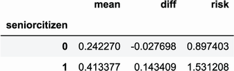
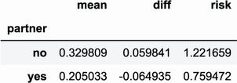
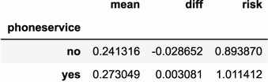
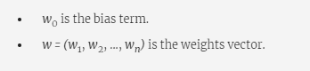
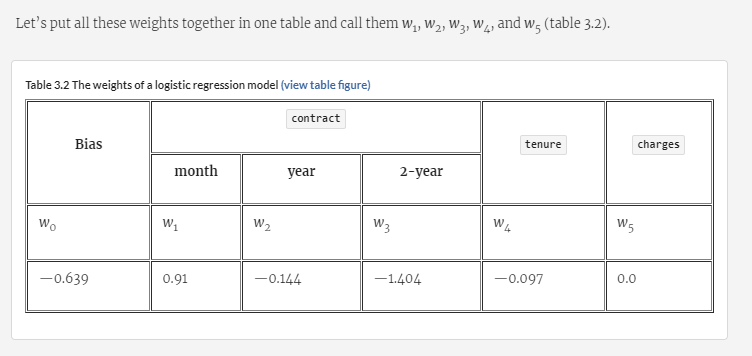

Lab 3: Machine learning for classification
==========================================


### This lab covers

- Performing exploratory data analysis for identifying important features
- Encoding categorical variables to use them in machine learning models
- Using logistic regression for classification


In this lab, we are going to use machine learning to predict churn.


*Churn*
is when customers stop using the services of a company. Thus, churn
prediction is about identifying customers who are likely to cancel their
contracts soon. If the company can do that, it can offer discounts on
these services in an effort to keep the users.


Naturally,
we can use machine learning for that: we can use past data about
customers who churned and, based on that, create a model for identifying
present customers who are about to leave. This is a binary
classification problem. The target variable that we want to predict is
categorical and has only two possible outcomes: churn or not
churn.


In
lab 1, we learned that many supervised machine learning models
exist, and we specifically mentioned ones that can be used for binary
classification, including logistic regression, decision trees, and
neural networks. In this lab, we start with the simplest one:
logistic regression. Even though it's indeed the simplest, it's still
powerful and has many advantages over other models: it's fast and easy
to understand, and its results are easy to interpret. It's a workhorse
of machine learning and the most widely used model in the industry.


3.1 Churn prediction project
----------------------------------------------------------------------------------------------------------------------


The
project
we prepared for this lab is churn prediction for a telecom company.
We will use logistic regression and Scikit-learn for that.


Imagine
that we are working at a telecom company that offers phone and internet
services, and we have a problem: some of our customers are churning.
They no longer are using our services and are going to a different
provider. We would like to prevent that from happening, so we develop a
system for identifying these customers and offer them an incentive to
stay. We want to target them with promotional messages and give them a
discount. We also would like to understand why the model thinks our
customers churn, and for that, we need to be able to interpret the
model's
predictions.


We
have collected a dataset where we've recorded some information about our
customers: what type of services they used, how much they paid, and how
long they stayed with us. We also know who canceled their contracts and
stopped using our services (churned). We will use this information as
the target variable in the machine learning model and predict it using
all other available
information.


The
plan for the project follows:


1.  [First,
    we download the dataset and do some initial preparation: rename
    columns and change values inside columns to be consistent throughout
    the entire dataset.]
2.  [Then
    we split the data into train, validation, and test so we can
    validate our models.]
3.  [As
    part of the initial data analysis, we look at feature importance to
    identify which features are important in our data.]
4.  [We
    transform categorical variables into numeric variables so we can use
    them in the model.]
5.  [Finally,
    we train a logistic regression model.]


In
the previous lab, we implemented everything ourselves, using Python
and NumPy. In this project, however, we will start using Scikit-learn, a
Python library for machine learning. Namely, we will use it for


-   [Splitting
    the dataset into train and test]
-   [Encoding
    categorical variables]
-   [Training
    logistic regression]


Build it yourself with a liveProject!


Predicting Loan Defaults Using scikit-learn and H2O


Ready to put theory into practice? Buy this related liveProject and use
scikit-learn and H2O frameworks to build your own working machine
learning classifiers.


### 3.1.1 Telco churn dataset

As in the previous lab, we will use Kaggle datasets for data. This time we
will use data from
<https://www.kaggle.com/blastchar/telco-customer-churn>.


According to the description, this dataset has the following information:


-   [Services
    of the customers: phone; multiple lines; internet; tech support and
    extra services such as online security, backup, device protection,
    and TV streaming]
-   [Account
    information: how long they have been clients, type of contract, type
    of payment method]
-   [Charges:
    how much the client was charged in the past month and in total]
-   [Demographic
    information: gender, age, and whether they have dependents or a
    partner]
-   [Churn:
    yes/no, whether the customer left the company within the past
    month]


To keep things organized, we first create a
folder, lab-03-churn-prediction. Dataset which we will be using in this lab is available here:

`https://github.com/fenago/ml-bootcamp/tree/master/lab-03-churn-prediction`


We are ready to start now.


### 3.1.2 Initial data preparation


We name the notebook lab-03-churn-project (or any other name that we
like).


As previously, we begin with adding the usual imports:


``` 
import pandas as pd
import numpy as np
 
import seaborn as sns
from matplotlib import pyplot as plt
%matplotlib inline
```


And
now we can read the dataset:


``` 
df = pd.read_csv('WA_Fn-UseC_-Telco-Customer-Churn.csv')
```


We
use the [read\_csv]
function
to read the data and then write the results to a dataframe named
[df]. To see how many rows it contains, let's use the [len]
function:


``` 
len(df)
```


It
prints 7043, so there are 7,043 rows in this dataset. The dataset is not
large but should be enough to train a decent model.


Next,
let's look at the first couple of rows using
[df.head]
(figure 3.1). By default, it shows the first five rows of the dataframe.


#####  command showing the first five rows of the telco churn dataset


This
dataframe has quite a few columns, so they all don't fit on the screen.
Instead, we can transpose the dataframe using the [T]
function,
switching columns and rows so the columns (customerID, gender, and so
on) become rows. This way we can see a lot more data (figure 3.2):


``` 
df.head().T
```


#####  command showing the first three rows of the telco churn dataset. The original rows are shown as columns: this way, it's possible to see more data without having to use the slider.


We
see that the dataset has a few columns:


-   [CustomerID:
    the ID of the customer]
-   [Gender:
    male/female]
-   [SeniorCitizen:
    whether the customer is a senior citizen (0/1)]
-   [Partner:
    whether they live with a partner (yes/no)]
-   [Dependents:
    whether they have dependents (yes/no)]
-   [Tenure:
    number of months since the start of the contract]
-   [PhoneService:
    whether they have phone service (yes/no)]
-   [MultipleLines:
    whether they have multiple phone lines (yes/no/no phone
    service)]
-   [InternetService:
    the type of internet service (no/fiber/optic)]
    
    
    

    

    

    
    

    
    

    
    
    
-   [OnlineSecurity:
    if online security is enabled (yes/no/no internet)]
-   [OnlineBackup:
    if online backup service is enabled (yes/no/no internet)]
-   [DeviceProtection:
    if the device protection service is enabled (yes/no/no
    internet)]
-   [TechSupport:
    if the customer has tech support (yes/no/no internet)]
-   [StreamingTV:
    if the TV streaming service is enabled (yes/no/no internet)]
-   [StreamingMovies:
    if the movie streaming service is enabled (yes/no/no internet)]
-   [Contract:
    the type of contract (monthly/yearly/two years)]
-   [PaperlessBilling:
    if the billing is paperless
    (yes/no
-   [PaymentMethod:
    payment method (electronic check, mailed check, bank transfer,
    credit card)]
-   [MonthlyCharges:
    the amount charged monthly (numeric)]
-   [TotalCharges:
    the total amount charged (numeric)]
-   [Churn:
    if the client has canceled the contract (yes/no)]


The
most interesting one for us is Churn. As the target variable for our
model, this is what we want to learn to predict. It takes two values:
yes if the customer churned and no if the customer didn't.


When
reading a CSV file, Pandas tries to automatically determine the proper
type of each column. However, sometimes it's difficult to do it
correctly, and the inferred types aren't what we expect them to be. This
is why it's important to check whether the actual types are correct.
Let's have a look at them by using
[df.dtypes]:


``` 
df.dtypes
```


We
see (figure 3.3) that most of the types are inferred correctly. Recall
that object means a string value, which is what we expect for most of
the columns. However, we may notice two things. First, SeniorCitizen is
detected as int64, so it has a type of integer, not object. The reason
for this is that instead of the values yes and no, as we have in other
columns, there are 1 and 0 values, so Pandas interprets this as a column
with integers. It's not really a problem for us, so we don't need to do
any additional preprocessing for this column.


##### Figure 3.3 Automatically inferred types for all the columns of the dataframe. Object means a string. TotalCharges is incorrectly identified as "object," but it should be "float."


The
other thing to note is the type for TotalCharges. We would expect this
column to be numeric: it contains the total amount of money the client
was charged, so it should be a number, not a string. Yet Pandas infers
the type as "object." The reason is that in some cases this column
contains a space (" ") to represent a missing value. When coming across
nonnumeric characters, Pandas has no other option but to declare the
column "object."


##### Important


Watch out for cases when you expect a column to be numeric, but Pandas
says it's not: most likely the column contains special encoding for
missing values that require additional preprocessing.


We
can force this column to be numeric by converting it to numbers using a
special function in Pandas:
[to\_numeric].
By default, this function raises an exception when it sees nonnumeric
data (such as spaces), but we can make it skip these cases by specifying
the [errors=\'coerce\']
option.
This way Pandas will replace all nonnumeric values with a [NaN]
(not a
number):


``` 
total_charges = pd.to_numeric(df.TotalCharges, errors='coerce')
```


To
confirm that data indeed contains nonnumeric characters, we can now use
the [isnull()]
function
of
[total\_charges]
to refer to all the rows where Pandas couldn't parse the original
string:


``` 
df[total_charges.isnull()][['customerID', 'TotalCharges']]
```


We
see that indeed there are spaces in the TotalCharges column (figure
3.4).


##### Figure 3.4 We can spot nonnumeric data in a column by parsing the content as numeric and see at which rows the parsing fails.


Now
it's up to us to decide what to do with these missing values. Although
we could do many things with them, we are going to do the same thing we
did in the previous lab---set the missing values to zero:


``` 
df.TotalCharges = pd.to_numeric(df.TotalCharges, errors='coerce')
df.TotalCharges = df.TotalCharges.fillna(0)
```


In
addition, we notice that the column names don't follow the same naming
convention. Some of them start with a lower letter, whereas others start
with a capital letter, and there are also spaces in the values.


Let's
make it uniform by lowercasing everything and replacing spaces with
underscores. This way we remove all the inconsistencies in the data. We
use the exact same code we used in the previous lab:


``` 
df.columns = df.columns.str.lower().str.replace(' ', '_')
 
string_columns = list(df.dtypes[df.dtypes == 'object'].index)
 
for col in string_columns:
    df[col] = df[col].str.lower().str.replace(' ', '_')
```


Next,
let's look at our target variable:
[churn].
Currently, it's categorical, with two values, "yes" and "no" (figure
3.5A). For binary classification, all models typically expect a number:
0 for "no" and 1 for "yes." Let's convert it to
numbers:


``` 
df.churn = (df.churn == 'yes').astype(int)
```


When
we use [df.churn] [==] [\'yes\'], we create a Pandas
series of type boolean. A position in the series is equal to
[True] if it's "yes" in the original series and [False]
otherwise. Because the only other value it can take is "no," this
converts "yes" to [True] and "no" to [False] (figure 3.5B).
When we perform casting by using the [astype(int)]
function,
we convert [True] to 1 and [False] to 0 (figure. 3.5C). This
is exactly the same idea that we used in the previous lab when we
implemented category encoding.


##### (A) The original Churn column: it's a Pandas series that contains only "yes" and "no" values.


#####  otherwise.


#####  broken down by individual steps

#####  is converted to 0.


We've
done a bit of preprocessing already, so let's put aside some data for
testing. In the previous lab, we implemented the code for doing it
ourselves. This is great for understanding how it works, but typically
we don't write such things from scratch every time we need them.
Instead, we use existing implementations from libraries. In this lab
we use Scikit-learn, and it has a module called
[model\_selection]
that can handle data splitting. Let's use it.


The
function we need to import from [model\_selection] is called
[train\_test\_split]:


``` 
from sklearn.model_selection import train_test_split
```


After
importing, it's ready to be used:


``` 
df_train_full, df_test = train_test_split(df, test_size=0.2, random_state=1)
```


The
function [train\_test\_split] takes a dataframe
[df]
and creates two new dataframes: [df\_train\_full] and
[df\_test].
It does this by shuffling the original dataset and then splitting it in
such a way that the test set contains 20% of the data and the train set
contains the remaining 80% (figure 3.6). Internally, it's implemented
similarly to what we did ourselves in the previous lab.


##### , the original dataset is shuffled and then split such that 80% of the data goes to the train set and the remaining 20% goes to the test set.


This
function contains a few parameters:


1.  [The
    first parameter that we pass is the dataframe that we want to split:
    [df]
2.  [The
    second parameter is
    [test\_size],
    which specifies the size of the dataset we want to set aside for
    testing---20% for our case.]
3.  [The
    third parameter we pass is
    [random\_state].
    It's needed for ensuring that every time we run this code, the
    dataframe is split in the exact same way.]


Shuffling
of data is done using a random-number generator; it's important to fix
the random seed to ensure that every time we shuffle the data, the final
arrangement of rows will be the same.


We
do see a side effect from shuffling: if we look at the dataframes after
splitting by using the [head()]
method,
for example, we notice that the indices appear to be randomly ordered
(figure 3.7).


##### : the indices (the first column) are shuffled in the new dataframes, so instead of consecutive numbers like 0, 1, 2, \..., they look random.


In
the previous lab, we split the data into three parts: train,
validation, and test. However, the [train\_test\_split] function
splits the data into only two parts: train and test. In spite of that,
we can still split the original dataset into three parts; we just take
one part and split it again (figure 3.8).


#####  splits a dataset into only two parts, we perform the split two times because we need three parts. First, we split the entire dataset into full train and test, and then we split full train into train and validation.


Let's
take the [df\_train\_full]
dataframe
and split it one more time into train and validation:


``` 
df_train, df_val = train_test_split(df_train_full, test_size=0.33, random_state=11)              #1
 
y_train = df_train.churn.values    #2
y_val = df_val.churn.values        #2
 
del df_train['churn']              #3
del df_val['churn']                #3
```


Now
the dataframes are prepared, and we are ready to use the training
dataset for performing initial exploratory data
analysis.


### 3.1.3 Exploratory data analysis


Looking
at
the data before training a model is important. The more we know about
the data and the problems inside, the better the model we can build
afterward.


We
should always check for any missing values in the dataset because many
machine learning models cannot easily deal with missing data. We have
already found a problem with the TotalCharges column and replaced the
missing values with zeros. Now let's see if we need to perform any
additional null handling:


``` 
df_train_full.isnull().sum()
```


It
prints all zeros (figure 3.9), so we have no missing values in the
dataset and don't need to do anything extra.


##### Figure 3.9 We don't have to handle missing values in the dataset: all the values in all the columns are present.


Another
thing we should do is check the distribution of values in the target
variable. Let's take a look at it using the [value\_counts()]
method:


``` 
df_train_full.churn.value_counts()
```


It
prints


``` 
0    4113
1    1521
```


The
first column is the value of the target variable, and the second is the
count. As we see, the majority of the customers didn't
churn.


We
know the absolute numbers, but let's also check the proportion of
churned users among all customers. For that, we need to divide the
number of customers who churned by the total number of customers. We
know that 1,521 of 5,634 churned, so the proportion is


1521
/ 5634 = 0.27


This
gives us the proportion of churned users, or the probability that a
customer will churn. As we see in the training dataset, approximately
27% of the customers stopped using our services, and the rest remained
as customers.


The
proportion of churned users, or the probability of churning, has a
special name: churn
rate.


There's
another way to calculate the churn rate: the [mean()]
method.
It's more convenient to use than manually calculating the rate:


``` 
global_mean = df_train_full.churn.mean()
```


Using
this method, we also get 0.27 (figure 3.10).


##### Figure 3.10 Calculating the global churn rate in the training dataset


The
reason it produces the same result is the way we calculate the mean
value. If you don't remember, the formula for that is


where
*n* is the number of items in the dataset.


Because
*y~i~* can take only zeros and ones, when we sum all of them, we get the
number of ones, or the number of people who churned. Then we divide it
by the total number of customers, which is exactly the same as the
formula we used for calculating the churn rate previously.


Our
churn dataset is an example of a so-called *imbalanced*
dataset.
There were three times as many people who didn't churn in our dataset as
those who did churn, and we say that the nonchurn class dominates the
churn class. We can clearly see that: the churn rate in our data is
0.27, which is a strong indicator of class imbalance. The opposite of
*imbalanced* is the *balanced* case, when positive and negative classes
are equally distributed among all
observations.


##### Exercise 3.1


The
mean of a Boolean array is


a)
The percentage of `False` elements in the array: the number of `False`
elements divided by the length of the array


b)
The percentage of `True` elements in the array: the number of `True`
elements divided by the length of the array


c)
The length of an array


Both
the categorical and numerical variables in our dataset are important,
but they are also different and need different treatment. For that, we
want to look at them separately.


We
will create two lists:


-   [,
    which will contain the names of categorical variables]
-   [,
    which, likewise, will have the names of numerical variables]


Let's
create them:


``` 
categorical = ['gender', 'seniorcitizen', 'partner', 'dependents',
               'phoneservice', 'multiplelines', 'internetservice',
               'onlinesecurity', 'onlinebackup', 'deviceprotection',
               'techsupport', 'streamingtv', 'streamingmovies',
               'contract', 'paperlessbilling', 'paymentmethod']
numerical = ['tenure', 'monthlycharges', 'totalcharges']
```


First,
we can see how many unique values each variable has. We already know we
should have just a few for each column, but let's verify it:


``` 
df_train_full[categorical].nunique()
```


Indeed,
we see that most of the columns have two or three values and one
(paymentmethod) has four (figure 3.11). This is good. We don't need to
spend extra time preparing and cleaning the data; everything is already
good to go.


##### Figure 3.11 The number of distinct values for each categorical variable. We see that all the variables have very few unique values.


Now
we come to another important part of exploratory data analysis:
understanding which features may be important for our
model.


### 3.1.4 Feature importance


Knowing
how
other variables affect the target variable, churn, is the key to
understanding the data and building a good model. This process is called
*feature importance analysi*s, and it's often done as a part of
exploratory data analysis to figure out which variables will be useful
for the model. It also gives us additional insights about the dataset
and helps answer questions like "What makes customers churn?" and "What
are the characteristics of people who
churn?"


We
have two different kinds of features: categorical and numerical. Each
kind has different ways of measuring feature importance, so we will look
at each separately.


Churn
rate


Let's
start
by looking at categorical variables. The first thing we can do is look
at the churn rate for each variable. We know that a categorical variable
has a set of values it can take, and each value defines a group inside
the dataset.


We
can look at all the distinct values of a variable. Then, for each
variable, there's a group of customers: all the customers who have this
value. For each such group, we can compute the churn rate, which is the
group churn rate. When we have it, we can compare it with the global
churn rate---the churn rate calculated for all the observations at once.


If
the difference between the rates is small, the value is not important
when predicting churn because this group of customers is not really
different from the rest of the customers. On the other hand, if the
difference is not small, something inside that group sets it apart from
the rest. A machine learning algorithm should be able to pick this up
and use it when making predictions.


Let's
check first for the [gender]
variable.
This [gender] variable can take two values, female and male. There
are two groups of customers: ones that have [gender] [==]
[\'female\'] and ones that have [gender] [==]
[\'male\'] (figure 3.12). To compute the churn rate for all female
customers, we first select only rows that correspond to [gender]
[==] [\'female\'] and then compute the churn rate for them:


``` 
female_mean = df_train_full[df_train_full.gender == 'female'].churn.mean()
```


##### .


We
then do the same for all male customers:


``` 
male_mean = df_train_full[df_train_full.gender == 'male'].churn.mean()
```


When
we execute this code and check the results, we see that the churn rate
of female customers is 27.7% and that of male customers is 26.3%,
whereas the global churn rate is 27% (figure 3.13). The difference
between the group rates for both females and males is quite small, which
indicates that knowing the gender of the customer doesn't help us
identify whether they will churn.


#####  is not a useful variable when predicting churn.


Now
let's take a look at another variable:
[partner].
It takes values of yes and no, so there are two groups of customers: the
ones for which [partner] [==] [\'yes\'] and the ones
for which [partner] [==] [\'no\'].


We
can check the group churn rates using the same code as we used
previously. All we need to change is the filter conditions:


``` 
partner_yes = df_train_full[df_train_full.partner == 'yes'].churn.mean()
partner_no = df_train_full[df_train_full.partner == 'no'].churn.mean()
```


As
we see, the rates for those who have a partner are quite different from
rates for those who don't: 20% and 33%, respectively. It means that
clients with no partner are more likely to churn than the ones with a
partner
(figure
3.14).


#####  variable is useful for predicting churn.


Risk
ratio


In
addition
to looking at the difference between the group rate and the global rate,
it's interesting to look at the ratio between them. In statistics, the
ratio between probabilities in different groups is called the *risk
ratio*, where *risk* refers to the risk of having the effect. In our
case, the effect is churn, so it's the risk of
churning:


risk
= group rate / global rate


For
[gender] [==] [female], for example, the risk of
churning is 1.02:


risk
= 27.7% / 27% = 1.02


Risk
is a number between zero and infinity. It has a nice interpretation that
tells you how likely the elements of the group are to have the effect
(churn) compared with the entire population.


If
the difference between the group rate and the global rate is small, the
risk is close to 1: this group has the same level of risk as the rest of
the population. Customers in the group are as likely to churn as anyone
else. In other words, a group with a risk close to 1 is not risky at all
(figure 3.15, group A).


If
the risk is lower than 1, the group has lower risks: the churn rate in
this group is smaller than the global churn. For example, the value 0.5
means that the clients in this group are two times less likely to churn
than clients in general (figure 3.15, group B).


On
the other hand, if the value is higher than 1, the group is risky:
there's more churn in the group than in the population. So a risk of 2
means that customers from the group are two times more likely to churn
(figure 3.15, group C).


##### Figure 3.15 Churn rate of different groups compared with the global churn rate. In group (A), the rates are approximately the same, so the risk of churn is around 1. In group (B), the group churn rate is smaller than the global rate, so the risk is around 0.5. Finally, in group (C), the group churn rate is higher than the global rate, so the risk is close to 2.


The
term *risk* originally comes from controlled trials, in which one group
of patients is given a treatment (a medicine) and the other group isn't
(only a placebo). Then we compare how effective the medicine is by
calculating the rate of negative outcomes in each group and then
calculating the ratio between the rates:


risk
= negative outcome rate in group 1 / negative outcome rate in group 2


If
medicine turns out to be effective, it's said to reduce the risk of
having the negative outcome, and the value of the risk is less than 1.


Let's
calculate the risks for [gender] and [partner]. For the
[gender] variable, the risks for both males and females is around
1 because the rates in both groups aren't significantly different from
the global rate. Not surprisingly, it's different for the
[partner] variable; having no partner is more risky (table 3.1).


#####  variables. The churn rates for females and males are not significantly different from the global churn rates, so the risks for them to churn are low: both have risks values around 1. On the other hand, the churn rate for people with no partner is significantly higher than average, making them risky, with the risk value of 1.22. People with partners tend to churn less, so for them, the risk is only 0.75. [(view table figure)](https://drek4537l1klr.cloudfront.net/grigorev/HighResolutionFigures/table_3-1.png)

  Risk
  ---------------------------------------------------------------------------------------------------- -------------------------------------------------------------------------------------------------- ------------------------------------------------------------------------------------------------------ ------------------------------------------------------------------------------------------------
  1.02
  0.97
  0.75
  1.22


We
did this from only two variables. Let's now do this for all the
categorical variables. To do that, we need a piece of code that checks
all the values a variable has and computes churn rate for each of these
values.


If
we used SQL, that would be straightforward to do. For gender, we'd need
to do something like this:


``` 
SELECT
    gender, AVG(churn),
    AVG(churn) - global_churn,
    AVG(churn) / global_churn
FROM
    data
GROUP BY
    gender
```


This
is a rough translation to Pandas:


``` 
global_mean = df_train_full.churn.mean()
 
df_group = df_train_full.groupby(by='gender').churn.agg(['mean'])   #1
df_group['diff'] = df_group['mean'] - global_mean                   #2
df_group['risk'] = df_group['mean'] / global_mean                   #3
 
df_group
```


In
❶ we calculate the
[AVG(churn]
part. For that, we use the [agg]
function
to indicate that we need to aggregate data into one value per group: the
mean value. In ❷ we create another column, diff, where we will keep the
difference between the group mean and the global mean. Likewise, in ❸ we
create the column risk, where we calculate the fraction between the
group mean and the global mean.


We
can see the results in figure 3.16.


#####  variable. We see that for both values, the difference between the group churn rate and the global churn rate is not very large.


Let's
now do that for all categorical variables. We can iterate through them
and apply the same code for each:


``` 
from IPython.display import display 
 
for col in categorical:                                           #1
    df_group = df_train_full.groupby(by=col).churn.agg(['mean'])  #2
    df_group['diff'] = df_group['mean'] - global_mean
    df_group['rate'] = df_group['mean'] / global_mean
    display(df_group)                                             #3
```


Two
things are different in this code. First, instead of manually specifying
the column name, we iterate over all categorical variables.


The
second difference is more subtle: we need to call the [display]
function
to render a dataframe inside the loop. The way we typically display a
dataframe is to leave it as the last line in a Jupyter Notebook cell and
then execute the cell. If we do it that way, the dataframe is displayed
as the cell output. This is exactly how we managed to see the content of
the dataframe at the beginning of the lab (figure 3.1). However, we
cannot do this inside a loop. To still be able to see the content of the
dataframe, we call the [display] function
explicitly.


From
the results (figure 3.17) we learn that


-   [For
    gender, there is not much difference between females and males. Both
    means are approximately the same, and for both groups the risks are
    close to 1.]
-   [Senior
    citizens tend to churn more than nonseniors: the risk of churning is
    1.53 for seniors and 0.89 for nonseniors.]
-   [People
    with a partner churn less than people with no partner. The risks are
    0.75 and 1.22, respectively.]
-   [People
    who use phone service are not at risk of churning: the risk is close
    to 1, and there's almost no difference with the global churn rate.
    People who don't use phone service are even less likely to churn:
    the risk is below 1, and the difference with the global churn rate
    is negative.]


##### 


##### 




##### 




##### 

##### 




Some
of the variables have quite significant differences (figure 3.18):


-   [Clients
    with no tech support tend to churn more than those who
    do
-   [People
    with monthly contracts cancel the contract a lot more often than
    others, and people with two-year contacts churn very rarely.]


##### 


##### . People with no tech support and month-to-month contracts tend to churn a lot more than clients from other groups, whereas people with tech support and two-year contracts are very low-risk clients.

##### 


This
way, just by looking at the differences and the risks, we can identify
the most discriminative features: the features that are helpful for
detecting churn. Thus, we expect that these features will be useful for
our
future
models.


Mutual
information


The
kinds
of differences we just explored are useful for our analysis and
important for understanding the data, but it's hard to use them to say
what the most important feature is and whether tech support is more
useful than the type of contract.


Luckily,
the metrics of importance can help us: we can measure the degree of
dependency between a categorical variable and the target variable. If
two variables are dependent, knowing the value of one variable gives us
some information about another. On the other hand, if a variable is
completely independent of the target variable, it's not useful and can
be safely removed from the dataset.


In
our case, knowing that the customer has a month-to-month contract may
indicate that this customer is more likely to churn than not.


##### Important


Customers with month-to-month contracts tend to churn a lot more than
customers with other kinds of contracts. This is exactly the kind of
relationship we want to find in our data. Without such relationships in
data, machine learning models will not work---they will not be able to
make predictions. The higher the degree of dependency, the more useful a
feature is.


For
categorical variables, one such metric is mutual information, which
tells how much information we learn about one variable if we learn the
value of the other variable. It's a concept from information theory, and
in machine learning, we often use it to measure the mutual dependency
between two variables.


Higher
values of mutual information mean a higher degree of dependence: if the
mutual information between a categorical variable and the target is
high, this categorical variable will be quite useful for predicting the
target. On the other hand, if the mutual information is low, the
categorical variable and the target are independent, and thus the
variable will not be useful for predicting the target.


Mutual
information is already implemented in Scikit-learn in the
[mutual\_info\_ score]
function
from the [metrics]
package,
so we can just use it:


``` 
from sklearn.metrics import mutual_info_score
 
def calculate_mi(series):                                      #1
    return mutual_info_score(series, df_train_full.churn)      #2
 
df_mi = df_train_full[categorical].apply(calculate_mi)         #3
df_mi = df_mi.sort_values(ascending=False).to_frame(name='MI') #4
df_mi
```


In
❸, we use the [apply]
method
to apply the [calculate\_mi]
function
we defined in ❶ to each column of the [df\_train\_full] dataframe.
Because we include an additional step of selecting only categorical
variables, it's applied only to them. The function we define in ❶ takes
only one parameter:
[series].
This is a column from the dataframe on which we invoked the
[apply()]
method.
In ❷, we compute the mutual information score between the series and the
target variable [churn]. The output is a single number, so the
output of the [apply()] method is a Pandas series. Finally, we
sort the elements of the series by the mutual information score and
convert the series to a dataframe. This way, the result is rendered
nicely in Jupyter.


As
we see,
[contract],
[onlinesecurity],
and
[techsupport]
are among the most important features (figure 3.19). Indeed, we've
already noted that [contract] and [techsupport] are quite
informative. It's also not surprising that [gender] is among the
least important features, so we shouldn't expect it to be useful for the
model.


##### (A) The most useful features according to the mutual information score.


#####  is the least useful.

##### (B) The least useful features according to the mutual information score.


Correlation
coefficient


Mutual
information
is a way to quantify the degree of dependency between two categorical
variables, but it doesn't work when one of the features is numerical, so
we cannot apply it to the three numerical variables that we have.


We
can, however, measure the dependency between a binary target variable
and a numerical variable. We can pretend that the binary variable is
numerical (containing only the numbers zero and one) and then use the
classical methods from statistics to check for any dependency between
these variables.


One
such method is the *correlation* coefficient (sometimes referred as
*Pearson's correlation coefficient*). It is a value from --1 to 1:


-   [Positive
    correlation means that when one variable goes up, the other variable
    tends to go up as well. In the case of a binary target, when the
    values of the variable are high, we see ones more often than zeros.
    But when the values of the variable are low, zeros become more
    frequent than ones.]
-   [Zero
    correlation means no relationship between two variables: they are
    completely independent.]
-   [Negative
    correlation occurs when one variable goes up and the other goes
    down. In the binary case, if the values are high, we see more zeros
    than ones in the target variable. When the values are low, we see
    more ones.]


It's
very easy to calculate the correlation coefficient in Pandas:


``` 
df_train_full[numerical].corrwith(df_train_full.churn)
```


We
see the results in figure 3.20:


- [The correlation between
    [tenure]
    and churn is --0.35: it has a negative sign, so the longer customers
    stay, the less often they tend to churn. For customers staying with
    the company for two months or less, the churn rate is 60%; for
    customers with tenure between 3 and 12 months, the churn rate is
    40%; and for customers staying longer than a year, the churn rate is
    17%. So the higher the value of tenure, the smaller the churn rate
    (figure
    3.21A)
-   [
    has a positive coefficient of 0.19, which means that customers who
    pay more tend to leave more often. Only 8% of those who pay less
    than \$20 monthly churned; customers paying between \$21 and \$50
    churn more frequently with a churn rate of 18%; and 32% of people
    paying more than \$50 churned (figure 3.21B).]
-   [
    has a negative correlation, which makes sense: the longer people
    stay with the company, the more they have paid in total, so it's
    less likely that they will leave. In this case, we expect a pattern
    similar to [tenure]. For small values, the churn rate is high;
    for larger values, it's lower.]


#####  has positive correlation: the more customers pay, the more likely they are to churn.


After
doing initial exploratory data analysis, identifying important features,
and getting some insights into the problem, we are ready to do the next
step: feature engineering
and
model
training.


##### , the churn rate is smaller.


#####  (positive correlation of 0.19)

##### , the churn rate is higher.


3.2 Feature engineering
-----------------------------------------------------------------------------------------------------------------


We
had
an initial look at the data and identified what could be useful for the
model. After doing that, we have a clear understanding how other
variables affect churn---our
target.


Before
we proceed to training, however, we need to perform the feature
engineering step: transforming all categorical variables to numeric
features. We'll do that in the next section, and after that, we'll be
ready to train the logistic regression model.


### 3.2.1 One-hot encoding for categorical variables


As
we
already know from the first lab, we cannot just take a categorical
variable and put it into a machine learning model. The models can deal
only with numbers in matrices. So, we need to convert our categorical
data into a matrix form, or encode.


One
such encoding technique is *one-hot encoding*. We already saw this
encoding technique in the previous lab, when creating features for
the make of a car and other categorical variables. There, we mentioned
it only briefly and used it in a very simple way. In this lab, we
will spend more time understanding and using it.


If
a variable
[contract]
has possible values (monthly, yearly, and two-year), we can represent a
customer with the yearly contract as (0, 1, 0). In this case, the yearly
value is active, or *hot*, so it gets 1, whereas the remaining values
are not active, or *cold*, so they are 0.


To
understand this better, let's consider a case with two categorical
variables and see how we create a matrix from them. These variables are


-   [,
    with values female and male]
-   [,
    with values monthly, yearly, and two-year]


Because
the [gender] variable has only two possible values, we create two
columns in the resulting matrix. The [contract] variable has three
columns, and in total, our new matrix will have five columns:


-   [
-   [
-   [
-   [
-   [


Let's
consider two customers (figure 3.22):


-   [A
    female customer with a yearly contract]
-   [A
    male customer with a monthly contract]


For
the first customer, the [gender] variable is encoded by putting 1
in the gender =female column and 0 in the gender=male column. Likewise,
contract=yearly gets 1, whereas the remaining contract columns,
contract=monthly and contract=two-year, get
0.


As
for the second customer, gender=male and contract=monthly get ones, and
the rest of the columns get zeros (figure 3.22).


##### Figure 3.22 The original dataset with categorical variables is on the left and the one-hot encoded representation on the right. For the first customer, gender=male and contract=monthly are the hot columns, so they get 1. For the second customer, the hot columns are gender=female and contract=yearly.


The
way we implemented it previously was simple but quite limited. We first
looked at the top five values of the variable and then looped over each
value and manually created a column in the dataframe. When the number of
features grows, however, this process becomes tedious.


Luckily,
we don't need to implement this by hand: we can use Scikit-learn. We can
perform one-hot encoding in multiple ways in Scikit-learn, but we will
use [DictVectorizer].


As
the name suggests, [DictVectorizer] takes in a dictionary and
*vectorizes* it---that is, it creates vectors from it. Then the vectors
are put together as rows of one matrix. This matrix is used as input to
a machine learning algorithm (figure 3.23).


##### Figure 3.23 The process of creating a model. First, we convert a dataframe to a list of dictionaries, then we vectorize the list to a matrix, and finally, we use the matrix to train a model.


To
use this method, we need to convert our dataframe to a list of
dictionaries, which is simple to do in Pandas using the [to\_dict]
method
with the [orient=\"records\"] parameter:


``` 
train_dict = df_train[categorical + numerical].to_dict(orient='records')
```


If
we take a look at the first element of this new list, we see


``` 
{'gender': 'male',
 'seniorcitizen': 0,
 'partner': 'yes',
 'dependents': 'yes',
 'phoneservice': 'yes',
 'multiplelines': 'no',
 'internetservice': 'no',
 'onlinesecurity': 'no_internet_service',
 'onlinebackup': 'no_internet_service',
 'deviceprotection': 'no_internet_service',
 'techsupport': 'no_internet_service',
 'streamingtv': 'no_internet_service',
 'streamingmovies': 'no_internet_service',
 'contract': 'two_year',
 'paperlessbilling': 'no',
 'paymentmethod': 'mailed_check',
 'tenure': 12,
 'monthlycharges': 19.7,
 'totalcharges': 258.35}
```


Each
column from the dataframe is the key in this dictionary, with values
coming from the actual dataframe row values.


Now
we can use [DictVectorizer]. We create it and then fit it to the
list of dictionaries we created previously:


``` 
from sklearn.feature_extraction import DictVectorizer
 
dv = DictVectorizer(sparse=False)
dv.fit(train_dict)
```


In
this code we create a [DictVectorizer] instance, which we call
[dv], and "train" it by invoking the [fit]
method.
The [fit] method looks at the content of these dictionaries and
figures out the possible values for each variable and how to map them to
the columns in the output matrix. If a feature is categorical, it
applies the one-hot encoding scheme, but if a feature is numerical, it's
left intact.


The
[DictVectorizer]
class
can take in a set of parameters. We specify one of them:
[sparse=False].
This parameter means that the created matrix will not be sparse and
instead will create a simple NumPy array. If you don't know about sparse
matrices, don't worry: we don't need them in this lab.


After
we fit the vectorizer, we can use it for converting the dictionaries to
a matrix by using the [transform]
method:


``` 
X_train = dv.transform(train_dict)
```


This
operation creates a matrix with 45 columns. Let's have a look at the
first row, which corresponds to the customer we looked at previously:


``` 
X_train[0]
```


When
we put this code into a Jupyter Notebook cell and execute it, we get the
following output:


``` 
array([   0. ,    0. ,    1. ,    1. ,    0. ,    0. ,    0. ,    1. ,
          0. ,    1. ,    1. ,    0. ,    0. ,   86.1,    1. ,    0. ,
          0. ,    0. ,    0. ,    1. ,    0. ,    0. ,    1. ,    0. ,
          1. ,    0. ,    1. ,    1. ,    0. ,    0. ,    0. ,    0. ,
          1. ,    0. ,    0. ,    0. ,    1. ,    0. ,    0. ,    1. ,
          0. ,    0. ,    1. ,   71. , 6045.9])
```


As
we see, most of the elements are ones and zeros---they're one-hot
encoded categorical variables. Not all of them are ones and zeros,
however. We see that three of them are other numbers. These are our
numeric variables: [monthlycharges], [tenure], and
[totalcharges].


We
can learn the names of all these columns by using the
[get\_feature\_names]
method:


``` 
dv.get_feature_names()
```


It
prints


``` 
['contract=month-to-month',
 'contract=one_year',
 'contract=two_year',
 'dependents=no',
 'dependents=yes',
 # some rows omitted
 'tenure',
 'totalcharges']
```


As
we see, for each categorical feature it creates multiple columns for
each of its distinct values. For [contract], we have
[contract=month-to-month], [contract=one\_year], and
[contract=two\_year], and for [dependents], we have
[dependents=no] and [dependents =yes]. Features such as
[tenure] and [totalcharges] keep the original names because
they are numerical; therefore, [DictVectorizer] doesn't change
them.


Now
our features are encoded as a matrix, so we can move to the next step:
using a model to predict
churn.


##### Exercise 3.2


How
would `DictVectorizer` encode the following list
of
dictionaries?


``` 
records = [
    {'total_charges': 10, 'paperless_billing': 'yes'},
    {'total_charges': 30, 'paperless_billing': 'no'},
    {'total_charges': 20, 'paperless_billing': 'no'}
]
```


a)
  Columns: `['total_charges',` `'paperless_billing=yes',`
`'paperless_ billing=no']`


      Values:
`[10,` `1,` `0],` `[30,` `0,` `1],` `[20,` `0,` `1]`


b)
  Columns: `['total_charges=10',` `'total_charges=20',`
`'total_charges= 30',` `'paperless_billing=yes',`
`'paperless_billing=no']`


      Values:
`[1,` `0,` `0,` `1,` `0],` `[0,` `0,` `1,` `0,` `1],` `[0,` `1,` `0,`
`0,` `1]`


3.3 Machine learning for classification
---------------------------------------------------------------------------------------------------------------------------------


We
have learned how to use Scikit-learn to perform one-hot encoding for
categorical variables, and now we can transform them into a set of
numerical features and put everything together into a matrix.


When
we have a matrix, we are ready to do the model training part. In this
section we learn how to train the logistic regression model and
interpret its results.


### 3.3.1 Logistic regression


In
this
lab, we use logistic regression as a classification model, and now
we train it to distinguish churned and not-churned users.


Logistic
regression has a lot in common with linear regression, the model we
learned in the previous lab. If you remember, the linear regression
model is a regression model that can predict a number. It has the form


where


-   [*x~i~*
    is the feature vector corresponding to the *i* th
    observation.]
-   [*w*~0~
    is the bias term.]
-   [*w*
    is a vector with the weights of the model.]


We
apply this model and get *g*(*x~i~*)---the prediction of what we think
the value for *x~i~* should be. Linear regression is trained to predict
the target variable *y~i~*---the actual value of the observation *i*. In
the previous lab, this was the price of a car.


Linear
regression is a linear model. It's called *linear* because it combines
the weights of the model with the feature vector *linearly*, using the
dot product. Linear models are simple to implement, train, and use.
Because of their simplicity, they are also
fast.


Logistic
regression is also a linear model, but unlike linear regression, it's a
classification model, not regression, even though the name might suggest
that. It's a binary classification model, so the target variable *y~i~*
is binary; the only values it can have are zero and one. Observations
with *y~i~* *=* 1 are typically called *positive
examples*:
examples in which the effect we want to predict is present. Likewise,
examples with *y~i~* *=* 0 are called *negative
examples*:
the effect we want to predict is absent. For our project, *y~i~* *=* 1
means that the customer churned, and *y~i~* *=* 0 means the opposite:
the customer stayed with us.


The
output of logistic regression is probability---the probability that the
observation *x~i~* is positive, or, in other words, the probability that
*y~i~* *=* 1. For our case, it's the probability that the customer *i*
will
churn.


To
be able to treat the output as a probability, we need to make sure that
the predictions of the model always stay between zero and one. We use a
special mathematical function for this purpose called
*sigmoid*,
and the full formula for the logistic regression model is


The sigmoid function maps any value to a number between zero and one (figure
3.24). It's defined this way:


##### Figure 3.24 The sigmoid function outputs values that are always between 0 and 1. When the input is 0, the result of sigmoid is 0.5; for negative values, the results are below 0.5 and start approaching 0 for input values less than --6. When the input is positive, the result of sigmoid is above 0.5 and approaches 1 for input values starting from 6.


We
know from lab 2 that if the feature vector *x~i~* is
*n*-dimensional, the dot product *x~i~^T^w* can be unwrapped as a sum,
and we can write *g*(*x~i~*)
as


Or, using sum notation, as


Previously,
we translated the formulas to Python for illustration. Let's do the same
here.


The linear regression model has the following formula:


If you remember from the previous lab, this formula translates to the
following Python code:


``` 
def linear_regression(xi):
    result = bias
    for j in range(n):
        result = result + xi[j] * w[j]
    return result
```


The translation of the logistic regression formula to Python is almost
identical to the linear regression case, except that at the end, we
apply the sigmoid function:


``` 
def logistic_regression(xi):
    score = bias
    for j in range(n):
        score = score + xi[j] * w[j]
    prob = sigmoid(score)
    return prob
```


Of course, we also need to define the sigmoid function:


``` 
import math
 
def sigmoid(score):
    return 1 / (1 + math.exp(-score))
```


We
use
*score*
to mean the intermediate result before applying the sigmoid function.
The score can take any real value. The
*probability*
is the result of applying the sigmoid function to the score; this is the
final output, and it can take only the values between zero and
one.


The
parameters of the logistic regression model are the same as for linear
regression.


To
learn the weights, we need to train the model, which we will do now
using Scikit-learn.


##### Exercise 3.3


Why
do we need sigmoid for logistic
regression?


a)
Sigmoid converts the output to values between --6 and 6, which is easier
to deal with.


b)
Sigmoid makes sure the output is between zero and one, which can be
interpreted as probability.


### 3.3.2 Training logistic regression


To
get
started, we first import the model:


``` 
from sklearn.linear_model import LogisticRegression
```


Then
we train it by calling the [fit] method:


``` 
model = LogisticRegression(solver='liblinear', random_state=1)
model.fit(X_train, y_train)
```


The class LogisticRegression from Scikit-learn encapsulates the training logic behind this model. It’s configurable, and we can change quite a few parameters. In fact, we already specify two of them: `solver` and `random_state`. Both are needed for reproducibility.


Other
useful parameters for the model include [C], which controls the
regularization level. We talk about it in the next lab when we cover
parameter tuning. Specifying [C] is optional; by default, it gets
the value
1.0.


The
training takes a few seconds, and when it's done, the model is ready to
make predictions. Let's see how well the model performs. We can apply it
to our validation data to obtain the probability of churn for each
customer in the validation dataset.


To
do that, we need to apply the one-hot encoding scheme to all the
categorical variables. First, we convert the dataframe to a list of
dictionaries and then feed it to the [DictVectorizer] we fit
previously:


``` 
val_dict = df_val[categorical + numerical].to_dict(orient='records')
X_val = dv.transform(val_dict)
```


As
a result, we get [X\_val], a matrix with features from the
validation dataset. Now we are ready to put this matrix to the model. To
get the probabilities, we use the [predict\_ proba]
method
of the model:


``` 
y_pred = model.predict_proba(X_val)
```


The
result of [predict\_proba] is a two-dimensional NumPy array, or a
two-column matrix. The first column of the array contains the
probability that the target is negative (no churn), and the second
column contains the probability that the target is positive (churn)
(figure 3.25).


##### Figure 3.25 The predictions of the model: a two-column matrix. The first column contains the probability that the target is zero (the client won't churn). The second column contains the opposite probability (the target is one, and the client will churn).


These
columns convey the same information. We know the probability of
churn---it's *p*---and the probability of not churning is always 1 --
*p*, so we don't need both columns.


Thus,
it's enough to take only the second column of the prediction. To select
only one column from a two-dimensional array in NumPy, we can use the
slicing operation [\[:,] [1\]]:


``` 
y_pred = model.predict_proba(X_val)[:, 1]
```


This
syntax might be confusing, so let's break it down. Two positions are
inside the brackets, the first one for rows and the second one for
columns.


When we use `[:, 1]`, NumPy interprets it this way:

- `:` means select all the rows.
- `1` means select only the column at index 1, and because the indexing starts at 0, it’s the second column.


As
a result, we get a one-dimensional NumPy array that contains the values
from the second column only.


This
output (probabilities) is often called *soft*
predictions.
These tell us the probability of churning as a number between zero and
one. It's up to us to decide how to interpret this number and how to use
it.


Remember
how we wanted to use this model: we wanted to retain customers by
identifying those who are about to cancel their contract with the
company and send them promotional messages, offering discounts and other
benefits. We do this in the hope that after receiving the benefit, they
will stay with the company. On the other hand, we don't want to give
promotions to all our customers, because it will hurt us financially: we
will make less profit, if any.


To
make the actual decision about whether to send a promotional letter to
our customers, using the probability alone is not enough. We need *hard*
predictions---binary
values of [True] (churn, so send the mail) or [False] (not
churn, so don't send the mail).


To
get the binary predictions, we take the probabilities and cut them above
a certain threshold. If the probability for a customer is higher than
this threshold, we predict churn, otherwise, not churn. If we select 0.5
to be this threshold, making the binary predictions is easy. We just use
the "[\>=]" operator:


``` 
y_pred >= 0.5
```


The
comparison operators in NumPy are applied element-wise, and the result
is a new array that contains only Boolean values: [True] and
[False]. Under the hood, it performs the comparison for each
element of the [y\_pred]
array.
If the element is greater than 0.5 or equal to 0.5, the corresponding
element in the output array is [True], and otherwise, it's
[False] (figure 3.26).


Let's
write the results to the [churn]
array:


``` 
churn = y_pred >= 0.5
```


When
we have these hard predictions made by our model, we would like to
understand how good they are, so we are ready to move to the next step:
evaluating the quality of these predictions. In the next lab, we
will spend a lot more time learning about different evaluation
techniques for binary classification, but for now, let's do a simple
check to make sure our model learned something
useful.


The
simplest thing to check is to take each prediction and compare it with
the actual value. If we predict churn and the actual value is churn, or
we predict non-churn and the actual value is non-churn, our model made
the correct prediction. If the predictions don't match, they aren't
good. If we calculate the number of times our predictions match the
actual value, we can use it for measuring the quality of our model.


This
quality measure is called *accuracy*. It's very easy to calculate
accuracy with NumPy:


``` 
(y_val == churn).mean()
```


Even
though it's easy to calculate, it might be difficult to understand what
this expression does when you see it for the first time. Let's try to
break it down into individual steps.


First,
we apply the [==]
operator
to compare two NumPy arrays: [y\_val] and [churn]. If you
remember, the first array, [y\_val], contains only numbers: zeros
and ones. This is our target variable: one if the customer churned and
zero otherwise. The second array contains Boolean predictions:
[True] and [False] values. In this case [True] means
we predict the customer will churn, and [False] means the customer
will not churn (figure 3.27).


Even
though these two arrays have different types inside (integer and
Boolean), it's still possible to compare them. The Boolean array is cast
to integer such that [True] values are turned to "1" and
[False] values are turned to "0." Then it's possible for NumPy to
perform the actual comparison (figure 3.28).


##### Figure 3.28 To compare the prediction with the target data, the array with predictions is cast to integer.


Like
the [\>=]
operator,
the [==] operator is applied element-wise. In this case, however,
we have two arrays to compare, and here, we compare each element of one
array with the respective element of the other array. The result is
again a Boolean array with [True] or [False] values,
depending on the outcome of the comparison (figure 3.29).


#####  operator from NumPy is applied element-wise for two NumPy arrays.


In
our case, if the true value in [y\_pred] matches our prediction in
churn, the label is [True], and if it doesn't, the label is
[False]. In other words, we have [True] if our prediction is
correct and [False] if it's not.


Finally,
we take the results of comparison---the Boolean array---and compute its
mean using the [mean()] method. This method, however, is applied
to numbers, not Boolean values, so before calculating the mean, the
values are cast to integers: [True] values to "1" and
[False] values to "0" (figure 3.30).


##### Figure 3.30 When computing the mean of a Boolean array, NumPy first casts it to integers and then computes the mean.


Finally,
as we already know, if we compute the mean of an array that contains
only ones and zeros, the result is the fraction of ones in that array,
which we already used for calculating the churn rate. Because "1"
([True]) in this case is a correct prediction and "0"
([False]) is an incorrect prediction, the resulting number tells
us the percentage of correct
predictions.


After
executing this line of code, we see 0.8 in output. This means that the
model predictions matched the actual value 80% of the time, or the model
makes correct predictions in 80% of cases. This is what we call the
accuracy of the model.


Now
we know how to train a model and evaluate its accuracy, but it's still
useful to understand how it makes the predictions. In the next section,
we try to look inside the models and see how we can interpret the
coefficients it
learned.


### 3.3.3 Model interpretation

We know that the logistic regression model has two parameters that it learns from data:




We
can get the bias term from [model.intercept\_\[0\]]. When we train
our model on all features, the bias term is --0.12.


The
rest of the weights are stored in [model.coef\_\[0\]]. If we look
inside, it's just an array of numbers, which is hard to understand on
its own.


To
see which feature is associated with each weight, let's use the
[get\_feature\_ names] method of the [DictVectorizer]. We
can zip the feature names together with the coefficients before looking
at them:


``` 
dict(zip(dv.get_feature_names(), model.coef_[0].round(3)))
```


This
prints


``` 
{'contract=month-to-month': 0.563,
 'contract=one_year': -0.086,
 'contract=two_year': -0.599,
 'dependents=no': -0.03,
 'dependents=yes': -0.092,
 ... # the rest of the weights is omitted
 'tenure': -0.069,
 'totalcharges': 0.0}
```


To
understand how the model works, let's consider what happens when we
apply this model. To build the intuition, let's train a simpler and
smaller model that uses only three variables: [contract],
[tenure], and [totalcharges].


The
variables [tenure] and [totalcharges] are numeric so we
don't need to do any additional preprocessing; we can take them as is.
On the other hand, [contract] is a categorical variable, so to be
able to use it, we need to apply one-hot encoding.


Let's
redo the same steps we did for training, this time using a smaller set
of features:


``` 
small_subset = ['contract', 'tenure', 'totalcharges']
train_dict_small = df_train[small_subset].to_dict(orient='records')
dv_small = DictVectorizer(sparse=False)
dv_small.fit(train_dict_small)
 
X_small_train = dv_small.transform(train_dict_small)
```


So
as not to confuse it with the previous model, we add [small] to
all the names. This way, it's clear that we use a smaller model, and it
saves us from accidentally overwriting the results we already have.
Additionally, we will use it to compare the quality of the small model
with the full
one.


Let's
see which features the small model will use. For that, as previously, we
use the [get\_feature\_names] method from [DictVectorizer]:


``` 
dv_small.get_feature_names()
```


It
outputs the feature names:


``` 
['contract=month-to-month',
 'contract=one_year',
 'contract=two_year',
 'tenure',
 'totalcharges']
```


There
are five features. As expected, we have [tenure] and
[totalcharges], and because they are numeric, their names are not
changed.


As
for the [contract] variable, it's categorical, so
[DictVectorizer] applies the one-hot encoding scheme to convert it
to numbers. [contract] has three distinct values: month-to-month,
one year, and two years. Thus, one-hot encoding scheme creates three new
features: [contract=month-to-month], [contract=one\_year],
and [contract= two\_years].


Let's
train the small model on this set of features:


``` 
model_small = LogisticRegression(solver='liblinear', random_state=1)
model_small.fit(X_small_train, y_train)
```


The
model is ready after a few seconds, and we can look inside the weights
it learned. Let's first check the bias term:


``` 
model_small.intercept_[0]
```


It
outputs --0.638. Then we can check the other weights, using the same
code as previously:


``` 
dict(zip(dv_small.get_feature_names(), model_small.coef_[0].round(3)))
```


This
line of code shows the weight for each feature:


``` 
{'contract=month-to-month': 0.91,
 'contract=one_year': -0.144,
 'contract=two_year': -1.404,
 'tenure': -0.097,
 'totalcharges': 0.000}
```




Now let's take a look at these weights and try to understand what they mean
and how we can interpret them.


First,
let's think about the bias term and what it means. Recall that in the
case of linear regression, it's the baseline prediction: the prediction
we would make without knowing anything else about the observation. In
the car price prediction project, it would be the price of a car on
average. This is not the final prediction; later, this baseline is
corrected with other
weights.


In
the case of logistic regression, it's similar: it's the baseline
prediction---or the score we would make on average. Likewise, we later
correct this score with the other weights. However, for logistic
regression, interpretation is a bit trickier because we also need to
apply the sigmoid function before we get the final output. Let's
consider an example to help us understand that.


In
our case, the bias term has the value of --0.639. This value is
negative. If we look at the sigmoid function, we can see that for
negative values, the output is lower than 0.5 (figure 3.31). For
--0.639, the resulting probability of churning is 34%. This means that
on average, a customer is more likely to stay with us than churn.


##### Figure 3.31 The bias term --0.639 on the sigmoid curve. The resulting probability is less than 0.5, so the average customer is more likely to not churn.


The
reason why the sign before the bias term is negative is the class
imbalance. There are a lot fewer churned users in the training data than
non-churned ones, meaning the probability of churn on average is low, so
this value for the bias term makes
sense.


The
next three weights are the weights for the contract variable. Because we
use one-hot encoding, we have three [contract] features and three
weights, one for each
feature:


``` 
'contract=month-to-month': 0.91,
 'contract=one_year': -0.144,
 'contract=two_year': -1.404.
```


To
build our intuition on how one-hot encoded weights can be understood and
interpreted, let's think of a client with a month-to-month contract. The
[contract] variable has the following one-hot encoding
representation: the first position corresponds to the month-to-month
value and is hot, so it's set to "1." The remaining positions correspond
to one\_year and two\_years, so they are cold and set to "0" (figure
3.32).


##### Figure 3.32 The one-hot encoding representation for a customer with a month-to-month contract


We
also know the weights *w*~1~, *w*~2~, and *w*~3~ that correspond to
[contract=month-to-month], [contract=one\_year], and
[contract=two\_years] (figure 3.33).


##### Figure 3.33 The weights of the contract=month-to-month, contract=one\_year, and contract=two\_years features


To
make a prediction, we perform the dot product between the feature vector
and the weights, which is multiplication of the values in each position
and then summation. The result of the multiplication is 0.91, which
turns out to be the same as the weight of the
[contract=month-to-month] feature (figure
3.34).


##### Figure 3.34 The dot product between the one-hot encoding representation of the contract variable and the corresponding weights. The result is 0.91, which is the weight of the hot feature.


Let's
consider another example: a client with a two-year contract. In this
case, the [contract=two\_year] feature is hot and has a value of
"1," and the rest are cold. When we multiply the vector with the one-hot
encoding representation of the variable by the weight vector, we get
--1.404 (figure 3.35).


##### Figure 3.35 For a customer with a two-year contract, the result of the dot product is --1.404.


As
we see, during the prediction, only the weight of the hot feature is
taken into account, and the rest of the weights are not considered in
calculating the score. This makes sense: the cold features have values
of zero, and when we multiply by zero, we get zero again (figure 3.36).


Figure
3.36 When we multiply the one-hot encoding representation of a variable
by the weight vector from the model, the result is the weight
corresponding to the hot feature.


The
interpretation of the signs of the weights for one-hot encoded features
follows the same intuition as the bias term. If a weight is positive,
the respective feature is an indicator of churn, and vice versa. If it's
negative, it's more likely to belong to a non-churning
customer.


Let's
look again at the weights of the [contract] variable. The first
weight for [contract=month-to-month] is positive, so customers
with this type of contract are more likely to churn than not. The other
two features, [contract=one\_year] and
[contract=two\_years], have negative signs, so such clients are
more likely to remain loyal to the company (figure 3.37).


##### Figure 3.37 The sign of the weight matters. If it's positive, it's a good indicator of churn; if it's negative, it indicates a loyal customer.


The
magnitude of the weights also matters. For [two\_year], the weight
is --1.404, which is greater in magnitude than --0.144---the weight for
[one\_year]. So, a two-year contract is a stronger indicator of
not churning than a one-year one. It confirms the feature importance
analysis we did previously. The risk ratios (the risk of churning) for
this set of features are 1.55 for monthly, 0.44 for one-year, and 0.10
for two-year (figure 3.38).


##### , the weight is 0.910, and the probability is quite high.


Now
let's have a look at the numerical features. We have two of them:
[tenure] and [totalcharges]. The weight of the
[tenure] feature is --0.097, which has a negative sign. This means
the same thing: the feature is an indicator of no churn. We already know
from the feature importance analysis that the longer clients stay with
us, the less likely they are to churn. The correlation between
[tenure] and churn is --0.35, which is also a negative number. The
weight of this feature confirms it: for every month that the client
spends with us, the total score gets lower by
0.097.


The
other numerical feature, [totalchanges], has weight of zero.
Because it's zero, no matter what the value of this feature is, the
model will never consider it, so this feature is not really important
for making the predictions.


To
understand it better, let's consider a couple of examples. For the first
example, let's imagine we have a user with a month-to-month contract,
who spent a year with us and paid \$1,000 (figure 3.39).


##### Figure 3.39 The score the model calculates for a customer with a month-to-month contract and 12 months of tenure


This
is the prediction we make for this customer:


-   [We
    start with the baseline score. It's the bias term with the value of
    --0.639.]
-   [Because
    it's a month-to-month contract, we add 0.91 to this value and get
    0.271. Now the score becomes positive, so it may mean that the
    client is going to churn. We know that a monthly contract is a
    strong indicator of churning.]
-   [Next,
    we consider the [tenure] variable. For each month that the
    customer stayed with us, we subtract 0.097 from the score so far.
    Thus, we get 0.271 -- 12 · 0.097 = --0.893. Now the score is
    negative again, so the likelihood of churn decreases.]
-   [Now
    we add the amount of money the customer paid us
    ([totalcharges]) multiplied by the weight of this feature, but
    because it's zero, we don't do anything. The result stays
    --0.893.]
- [The final score is a negative number, so we believe that the customer is
    not very likely to churn soon.]
-   [To
    see the actual probability of churn, we compute the sigmoid of the
    score, and it's approximately 0.29. We can treat this as the
    probability that this customer will churn.]


If
we have another client with a yearly contract who stayed 24 months with
us and spent \$2,000, the score is --2.823 (figure 3.40).


##### Figure 3.40 The score that the model calculates for a customer with a yearly contract and 24 months of tenure


After
taking sigmoid, the score of --2.823 becomes 0.056, so the probability
of churn for this customer is even
lower
(figure
3.41).


##### Figure 3.41 The scores of --2.823 and --0.893 translated to probability: 0.05 and 0.29, respectively


### 3.3.4 Using the model


Now
we
know a lot better how logistic regression, and we can also interpret
what our model learned and understand how it makes the predictions.


Additionally,
we applied the model to the validation set, computed the probabilities
of churning for every customer there, and concluded that the model is
80% accurate. In the next lab we will evaluate whether this number
is satisfactory, but for now, let's try to use the model we trained. Now
we can apply the model to customers for scoring them. It's quite
easy.


First,
we take a customer we want to score and put all the variable values in a
dictionary:


``` 
customer = {
    'customerid': '8879-zkjof',
    'gender': 'female',
    'seniorcitizen': 0,
    'partner': 'no',
    'dependents': 'no',
    'tenure': 41,
    'phoneservice': 'yes',
    'multiplelines': 'no',
    'internetservice': 'dsl',
    'onlinesecurity': 'yes',
    'onlinebackup': 'no',
    'deviceprotection': 'yes',
    'techsupport': 'yes',
    'streamingtv': 'yes',
    'streamingmovies': 'yes',
    'contract': 'one_year',
    'paperlessbilling': 'yes',
    'paymentmethod': 'bank_transfer_(automatic)',
    'monthlycharges': 79.85,
    'totalcharges': 3320.75,
}
```


##### Note


When we prepare items for prediction, they should undergo the same
preprocessing steps we did for training the model. If we don't do it in
exactly the same way, the model might not get things it expects to see,
and, in this case, the predictions could get really off. This is why in
the previous example, in the `customer` dictionary, the field names and
string values are lowercased and spaces are replaced with underscores.


Now
we can use our model to see whether this customer is going to churn.
Let's do it.


First,
we convert this dictionary to a matrix by using the
[DictVectorizer]:


``` 
X_test = dv.transform([customer])
```


The
input to the vectorizer is a list with one item: we want to score only
one customer. The output is a matrix with features, and this matrix
contains only one row---the features for this one customer:


``` 
[[   0.  ,    1.  ,    0.  ,    1.  ,    0.  ,    0.  ,    0.  ,
     1.  ,    1.  ,    0.  ,    1.  ,    0.  ,    0.  ,   79.85,
     1.  ,    0.  ,    0.  ,    1.  ,    0.  ,    0.  ,    0.  ,
     0.  ,    1.  ,    0.  ,    1.  ,    1.  ,    0.  ,    1.  ,
     0.  ,    0.  ,    0.  ,    0.  ,    1.  ,    0.  ,    0.  ,
     0.  ,    1.  ,    0.  ,    0.  ,    1.  ,    0.  ,    0.  ,
     1.  ,   41.  , 3320.75]]
```


We
see a bunch of one-hot encoding features (ones and zeros) as well as
some numeric ones ([monthlycharges], [tenure], and
[totalcharges]).


Now
we take this matrix and put it into the trained model:


``` 
model.predict_proba(X_test)
```


The
output is a matrix with predictions. For each customer, it outputs two
numbers, which are the probability of staying with the company and the
probability of churn. Because there's only one customer, we get a tiny
NumPy array with one row and two columns:


``` 
[[0.93, 0.07]]
```


All
we need from the matrix is the number at the first row and second
column: the probability of churning for this customer. To select this
number from the array, we use the brackets
operator:


``` 
model.predict_proba(X_test)[0, 1]
```


We
used this operator to select the second column from the array. However,
this time there's only one row, so we can explicitly ask NumPy to return
the value from that row. Because indexes start from 0 in NumPy,
[\[0,] [1\]] means first row, second column.


When
we execute this line, we see that the output is 0.073, so that the
probability that this customer will churn is only 7%. It's less than
50%, so we will not send this customer a promotional mail.


We
can try to score another client:


``` 
customer = {
    'gender': 'female',
    'seniorcitizen': 1,
    'partner': 'no',
    'dependents': 'no',
    'phoneservice': 'yes',
    'multiplelines': 'yes',
    'internetservice': 'fiber_optic',
    'onlinesecurity': 'no',
    'onlinebackup': 'no',
    'deviceprotection': 'no',
    'techsupport': 'no',
    'streamingtv': 'yes',
    'streamingmovies': 'no',
    'contract': 'month-to-month',
    'paperlessbilling': 'yes',
    'paymentmethod': 'electronic_check',
    'tenure': 1,
    'monthlycharges': 85.7,
    'totalcharges': 85.7
}
```


Let's
make a prediction:


``` 
X_test = dv.transform([customer])
model.predict_proba(X_test)[0, 1]
```


The
output of the model is 83% likelihood of churn, so we should send this
client a promotional mail in the hope of retaining
them.


So
far, we've built intuition on how logistic regression works, how to
train it with Scikit-learn, and how to apply it to new data. We haven't
covered the evaluation of the results yet; this is what we will do in
the
next
lab.


3.4 Next steps
--------------------------------------------------------------------------------------------------------


### 3.4.1 Exercises


You
can try a couple of things to learn the topic better:


-   [In
    the previous lab, we implemented many things ourselves,
    including linear regression and dataset splitting. In this lab
    we learned how to use Scikit-learn for that. Try to redo the project
    from the previous lab using Scikit-learn. To use linear
    regression, you need
    [LinearRegression]
    from the [sklearn.linear\_model]
    package.
    To use regularized regression, you need to import [Ridge] from
    the same package [sklearn.linear\_model].]
-   [We
    looked at feature importance metrics to get some insights into the
    dataset but did not really use this information for other purposes.
    One way to use this information could be removing features that
    aren't useful from the dataset to make the model simpler, faster,
    and potentially better. Try to exclude the two least useful features
    ([gender] and [phoneservices]) from the training data
    matrix, and see what happens to validation accuracy. What if we
    remove the most useful feature ([contract])?]


### 3.4.2 Other projects


We
can use classification in numerous ways to solve real-life problems, and
now, after learning the materials of this lab, you should have
enough knowledge to apply logistic regression to solve similar problems.
In particular, we suggest these:


-   [Classification
    models are often used for marketing purposes, and one of the
    problems it solves is *lead scoring*. A *lead* is a potential
    customer who may convert (become an actual customer) or not. In this
    case, the conversion is the target we want to predict. You can take
    a dataset from [https://www.kaggle.com/ashydv/
    leads-dataset](https://www.kaggle.com/ashydv/leads-dataset) and
    build a model for that. You may notice that the lead-scoring problem
    is similar to churn prediction, but in one case, we want to get a
    new client to sign a contract with us, and in another case, we want
    a client not to cancel the
    contract
-   [Another
    popular application of classification is default prediction, which
    is estimating the risk of a customer's not paying back a loan. In
    this case, the variable we want to predict is default, and it also
    has two outcomes: whether the customer managed to pay back the loan
    in time (good customer) or not (default). You can find many datasets
    online for training a model, such as
    <https://archive.ics.uci.edu/ml/datasets/default+of+credit+card+clients>
    (or the same one available via Kaggle:
    <https://www.kaggle.com/pratjain/credit-card-default>)


Summary
-------------------------------------------------------------------------------------------------


- [The *risk* of a categorical feature tells us if a group that has the
    feature will have the condition we model. For churn, values lower
    than 1.0 indicate low risk of churning, whereas values higher than
    1.0 indicate high risk of churning. It tells us which features are
    important for predicting the target variable and helps us better
    understand the problem we're solving.]
-   [Mutual
    information measures the degree of (in)dependence between a
    categorical variable and the target. It's a good way of determining
    important features: the higher the mutual information is, the more
    important the feature.]
-   [Correlation
    measures the dependence between two numerical variables, and it can
    be used for determining if a numerical feature is useful for
    predicting the target variable.]
-   [One-hot
    encoding gives us a way to represent categorical variables as
    numbers. Without it, it wouldn't be possible to easily use these
    variables in a model. Machine learning models typically expect all
    input variables to be numeric, so having an encoding scheme is
    crucial if we want to use categorical features in modeling.]
-   [We
    can implement one-hot encoding by using [DictVectorizer] from
    Scikit-learn. It automatically detects categorical variables and
    applies the one-hot encoding scheme to them while leaving numerical
    variables intact. It's very convenient to use and doesn't require a
    lot of coding on our side.]
-   [Logistic
    regression is a linear model, just like linear regression. The
    difference is that logistic regression has an extra step at the end:
    it applies the sigmoid function to convert the scores to
    probabilities (a number between zero and one). That allows us to use
    it for classification. The output is the probability of belonging to
    a positive class (churn, in our case).]
-   [When
    the data is prepared, training logistic regression is very simple:
    we use the [LogisticRegression] class from Scikit-learn and
    invoke the [fit] function.]
- [The model outputs probabilities, not hard predictions. To binarize the
    output, we cut the predictions at a certain threshold. If the
    probability is greater than or equal to 0.5, we predict [True]
    (churn), and [False] (no churn) otherwise. This allows us to
    use the model for solving our problem: predicting customers who
    churn.]
- [The weights of the logistic regression model are easy to interpret and
    explain, especially when it comes to the categorical variables
    encoded using the one-hot encoding scheme. It helps us understand
    the behavior of the model better and explain to others what it's
    doing and how it's
    working


In
the next lab we will continue with this project on churn prediction.
We will look at ways of evaluating binary classifiers and then use this
information for tuning the model's performance.


Answers to exercises
--------------------------------------------------------------------------------------------------------------


-   [Exercise
    3.1 B) The percentage of [True] elements]
-   [Exercise
    3.2 A) It will keep a numeric variable as is and encode only the
    categorical variable.]
-   [Exercise
    3.3 B) Sigmoid converts the output to a value between zero and
    one.]

