Lab 4: Evaluation metrics for classification
============================================


### This lab covers

-   [Accuracy as a way of evaluating binary classification
    models and its limitations]
-   [Determining where our model makes mistakes using a
    confusion table]
-   [Deriving other metrics like precision and recall from the
    confusion table]
-   [Using ROC (receiver operating characteristics) and AUC
    (area under the ROC curve) to further understand the performance of
    a binary classification model]
-   [Cross-validating a model to make sure it behaves
    optimally]
-   [Tuning the parameters of a model to achieve the best
    predictive performance]


In this lab, we continue with the project we started in the previous
lab: churn prediction. We have already downloaded the dataset,
performed the initial preprocessing and exploratory data analysis, and
trained the model that predicts whether customers will churn. We have
also evaluated this model on the validation dataset and concluded that
it has 80% accuracy.


The
question we postponed until now was whether 80% accuracy is good and
what it actually means in terms of the quality of our model. We answer
this question in this lab and discuss other ways of evaluating a
binary classification model: the confusion table, precision and recall,
the ROC curve, and AUC.


This
lab provides a lot of complex information, but the evaluation
metrics we cover here are essential for doing practical machine
learning. Don't worry if you don't immediately understand all the
details of the different evaluation metrics: it requires time and
practice. Feel free to come back to this lab to revisit the finer
points.


4.1 Evaluation metrics
----------------------------------------------------------------------------------------------------------------


We
have already built a binary classification model for predicting churning
customers. Now we need to be able to determine how good it
is.


For
this, we use a *metric*---a function that looks at the predictions the
model makes and compares them with the actual values. Then, based on the
comparison, it calculates how good the model is. This is quite useful:
we can use it to compare different models and select the one with the
best metric
value.


There
are different kinds of metrics. In lab 2, we used RMSE (root mean
squared error) to evaluate regression models. However, this metric can
be used only for regression models and doesn't work for classification.


For
evaluating classification models, we have other more suitable metrics.
In this section, we cover the most common evaluation metrics for binary
classification, starting with accuracy, which we already saw in lab
3.


### 4.1.1 Classification accuracy


As
you
probably remember, the accuracy of a binary classification model is the
percentage of correct predictions it makes (figure 4.1).


##### Figure 4.1 The accuracy of a model is the fraction of predictions that turned out to be correct.

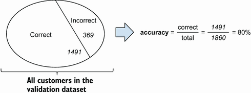


This
accuracy is the simplest way to evaluate a classifier: by counting the
number of cases in which our model turned out to be right, we can learn
a lot about the model's behavior and quality.


Computing
accuracy on the validation dataset is easy---we simply calculate the
fraction of correct predictions:


``` 
y_pred = model.predict_proba(X_val)[:, 1]
churn = y_pred >= 0.5
(churn == y_val).mean()
```


We
first apply the model to the validation set to get the predictions in ❶.
These predictions are probabilities, so we cut them at 0.5 in ❷.
Finally, we calculate the fraction of predictions that matched reality
in ❷.


The
result is 0.8016, which means that our model is 80% accurate.


The
first thing we should ask ourselves is why we chose 0.5 as the threshold
and not any other number. That was an arbitrary choice, but it's
actually not difficult to check other thresholds as well: we can just
loop over all possible threshold candidates and compute the accuracy for
each. Then we can choose the one with the best accuracy score.


Even
though it's easy to implement accuracy ourselves, we can use existing
implementations as well. The Scikit-learn library offers a variety of
metrics, including accuracy and many others that we will use later. You
can find these metrics in the metrics package.


We'll
continue working on the same notebook that we started in lab 3.
Let's open it and add the [import]
statement
to import accuracy from Scikit-learn's metrics package:


``` 
from sklearn.metrics import accuracy_score
```


Now
we can loop over different thresholds and check which one gives the best
accuracy:


``` 
thresholds = np.linspace(0, 1, 11)
 
for t in thresholds:
    churn = y_pred >= t
    acc = accuracy_score(y_val, churn)
    print('%0.2f %0.3f' % (t, acc))
```


In
this code, we first create an array with thresholds. We use the
[linspace]
function
from NumPy for that: it takes two numbers (0 and 1, in our case) and the
number of elements the array should have (11). As a result, we get an
array with the numbers 0.0, 0.1, 0.2, \..., 1.0. 


We use these numbers as thresholds: we loop over them, and for each one, we
calculate the accuracy. Finally, we print the thresholds and the
accuracy scores so we can decide which threshold is the best.


When
we execute the code, it prints the following:


``` 
0.00 0.261
0.10 0.595
0.20 0.690
0.30 0.755
0.40 0.782
0.50 0.802
0.60 0.790
0.70 0.774
0.80 0.742
0.90 0.739
1.00 0.739
```


As
we see, using the threshold of 0.5 gives us the best accuracy.
Typically, 0.5 is a good threshold value to start with, but we should
always try other threshold values to make sure 0.5 is the best choice.


To
make it more visual, we can use Matplotlib to create a plot that shows
how accuracy changes depending on the threshold. We repeat the same
process as previously, but instead of just printing the accuracy scores,
we first put the values to a list:


``` 
thresholds = np.linspace(0, 1, 21)              #1
accuracies = []                                 #2
for t in thresholds:
    acc = accuracy_score(y_val, y_pred >= t)    #3
    accuracies.append(acc)                      #4
```


And
then we plot these values using Matplotlib:


``` 
plt.plot(thresholds, accuracies)
```


After
executing this line, we should see a plot that shows the relationship
between the threshold and the accuracy (figure 4.2). As we already know,
the 0.5 threshold is the best in terms of accuracy.


##### Figure 4.2 Accuracy of our model evaluated at different thresholds. The best accuracy is achieved when cutting the predictions at the 0.5 threshold: if a prediction is higher than 0.5, we predict "churn," and otherwise, we predict "no churn."

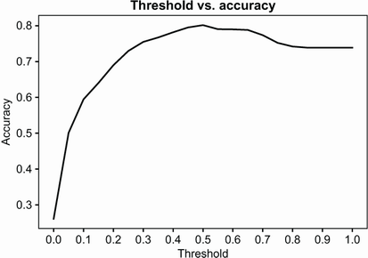


So,
the best threshold is 0.5, and the best accuracy for this model that we
can achieve is 80%.


In
the previous lab, we trained a simpler model: we called it
model\_small. It was based on only three variables: [contract],
[tenure], and [totalcharges].


Let's
also check its accuracy. For that, we first make predictions on the
validation dataset and then compute the accuracy score:


``` 
val_dict_small = df_val[small_subset].to_dict(orient='records')
 
X_small_val = dv_small.transform(val_dict_small)
y_pred_small = model_small.predict_proba(X_small_val)[:, 1]
 
churn_small = y_pred_small >= 0.5
accuracy_score(y_val, churn_small)
```


When
we run this code, we see that the accuracy of the small model is 76%.
So, the large model is actually 4% more accurate than the small model.


However,
this still doesn't tell us whether 80% (or 76%) is a good accuracy
score.


### 4.1.2 Dummy baseline


Although
it
seems like a decent number, to understand whether 80% is actually good,
we need to relate it to something---for example, a simple baseline
that's easy to understand. One such baseline could be a dummy model that
always predicts the same value.


In
our example, the dataset is imbalanced, and we don't have many churned
users. So, the dummy model can always predict the majority class---"no
churn." In other words, this model will always output False, regardless
of the features. This is not a super useful model, but we can use it as
a baseline and compare it with the other two models.


Let's
create this baseline prediction:


``` 
size_val = len(y_val)                     #1
baseline = np.repeat(False, size_val)     #2
```


To
create an array with the baseline predictions, we first need to
determine how many elements are in the validation set.


Next, we create an array of dummy predictions---all the elements of this array
are False values. We do this using the [repeat]
function
from NumPy: it takes in an element and repeats it as many times as we
ask.


Now
we can check the accuracy of this baseline prediction using the same
code as we used previously:


``` 
accuracy_score(baseline, y_val)
```


When
we run this code, it shows 0.738. This means that the accuracy of the
baseline model is around 74% (figure 4.3).


##### Figure 4.3 The baseline is a "model" that always predicts the same value for all the customers. The accuracy of this baseline is 74%.

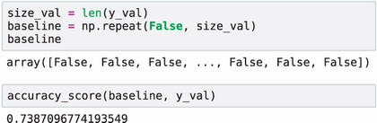


As
we see, the small model is only 2% better than the naive baseline, and
the large one is 6% better. If we think about all the trouble we have
gone through to train this large model, 6% doesn't seem like a
significant improvement over the dummy baseline.


Churn
prediction is a complex problem, and maybe this improvement is great.
However, that's not evident from the accuracy score alone. According to
accuracy, our model is only slightly better than a dummy model that
treats all the customers as non-churning and doesn't attempt to keep any
of them.


Thus,
we need other metrics---other ways of measuring the quality of our
model. These metrics are based on the confusion table, the concept that
we cover in the
next
section.


4.2 Confusion table
-------------------------------------------------------------------------------------------------------------


Even
though
accuracy is easy to understand, it's not always the best metric. In
fact, it sometimes can be misleading. We've already seen this occur: the
accuracy of our model is 80%, and although that seems like a good
number, it's just 6% better than the accuracy of a dummy model that
always outputs the same prediction of "no churn."


This
situation typically happens when we have a class imbalance (more
instances of one class than another). We know that this is definitely
the case for our problem: 74% of customers did not churn, and only 26%
did churn.


For
such cases, we need a different way of measuring the quality of our
models. We have a few options, and most of them are based on the
confusion table: a table that concisely represents every possible
outcome for our model's predictions.


### 4.2.1 Introduction to the confusion table


We
know
that for a binary classification model, we can have only two possible
predictions: True and False. In our case, we can predict that a customer
is either going to churn (True) or not (False).


When
we apply the model to the entire validation dataset with customers, we
split it into two parts (figure
4.4):


-   [Customers
    for whom the model predicts "churn"]
-   [Customers
    for whom the model predicts "no churn"]


##### Figure 4.4 Our model splits all the customers in the validation dataset into two groups: customers who we think will churn and customers who will not.

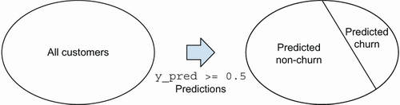


Only
two possible correct outcomes can occur: again, True or False. A
customer has either actually churned (True) or not (False).


This
means that by using the ground truth information---the information about
the target variable---we can again split the dataset into two parts
(figure 4.5):


- [The customers who churned]
- [The customers who didn't churn]


##### Figure 4.5 Using the ground truth data, we can split the validation dataset into two groups: customers who actually churned and customers who didn't.

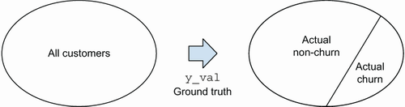


When
we make a prediction, it will either turn out to be correct or not:


-   [If
    we predict "churn," the customer may indeed churn, or they may
    not.]
-   [If
    we predict "no churn," it's possible that the customer indeed
    doesn't churn, but it's also possible that they do
    churn


This
gives us four possible outcomes (figure 4.6):


-   [We
    predict False, and the answer is False.]
-   [We
    predict False, and the answer is True.]
-   [We
    predict True, and the answer is False.]
-   [We
    predict True, and the answer is True.]


##### Figure 4.6 There are four possible outcomes: we predict "churn," and the customers either churn or do not, and we predict "no churn," and the customers again either churn or do not.

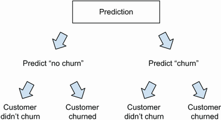


Two
of these situations---the first and last ones---are good: the prediction
matched the actual value. The two
remaining
ones are bad: we didn't make a correct prediction.


Each
of these four situations has its own name (figure 4.7):


-   [True
    negative
    (TN): we predict False ("no churn"), and the actual label is also
    False ("no churn").]
-   [True
    positive
    (TP): we predict True ("churn"), and the actual label is True
    ("churn").]
-   [False
    negative
    (FN): we predict False ("no churn"), but it's actually True (the
    customer churned).]
-   [False
    positive
    (FP): we predict True ("churn"), but it's actually False (the
    customer stayed with us).]


##### Figure 4.7 Each of the four possible outcomes has its own name: true negative, false negative, false positive, and true positive.

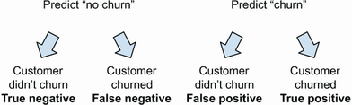


It's
visually helpful to arrange these outcomes in a table. We can put the
predicted classes (False and True) in the columns and the actual classes
(False and True) in the rows (figure 4.8).


##### Figure 4.8 We can organize the outcomes in a table---the predicted values as columns and the actual values as rows. This way, we break down all prediction scenarios into four distinct groups: TN (true negative), TP (true positive), FN (false negative), and FP (false positive).

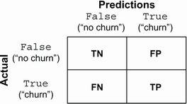


When
we substitute the number of times each outcome happens, we get the
confusion table for our model (figure 4.9).


##### Figure 4.9 In the confusion table, each cell contains the number of times each outcome happens.

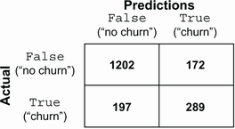


Calculating
the values in the cells of the confusion matrix is quite easy with
NumPy. Next, we see how to do
it.


### 4.2.2 Calculating the confusion table with NumPy


To
help
us understand our confusion table better, we can visually depict what it
does to the validation dataset (figure 4.10).


##### Figure 4.10 When we apply the model to the validation dataset, we get four different outcomes (TN, FP, TP, and FN).

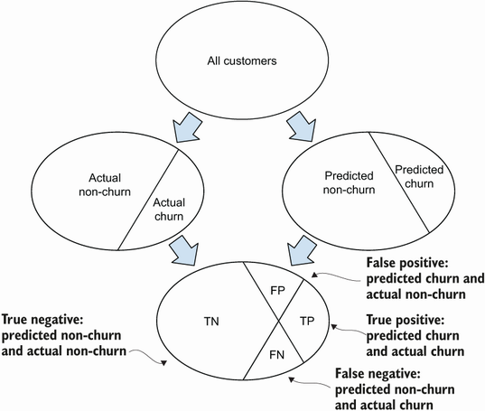


To
calculate the confusion table, we need to do these
steps:


-   [First,
    the predictions split the dataset into two parts: the part for which
    we predict True ("churn") and the part for which we predict False
    ("no churn").]
-   [At
    the same time, the target variable splits this dataset into two
    different parts: the customers who actually churned ("1" in
    [y\_val]) and the customers who didn't ("0" in
    [y\_val]).]
-   [When
    we combine these splits, we get four groups of customers, which are
    exactly the four different outcomes from the confusion table.]


Translating
these steps to NumPy is straightforward:


``` 
t = 0.5                                                      #1
predict_churn = (y_pred >= t)                                #1
predict_no_churn = (y_pred < t)                              #1
 
actual_churn = (y_val == 1)                                  #2
actual_no_churn = (y_val == 0)                               #2
 
true_positive = (predict_churn & actual_churn).sum()         #3
false_positive = (predict_churn & actual_no_churn).sum()     #4
 
false_negative = (predict_no_churn & actual_churn).sum()     #5
true_negative = (predict_no_churn & actual_no_churn).sum()   #6
```


We
begin by making predictions at the threshold of 0.5.


The
results are two NumPy
arrays:


-   [In
    the first array ([predict\_churn]), an element is True if the
    model thinks the respective customer is going to churn and False
    otherwise.]
-   [Likewise,
    in the second array ([predict\_no\_churn]), True means that
    the model thinks the customer isn't going to
    churn


The
second array,
[predict\_no\_churn],
is the exact opposite of
[predict\_churn]:
if an element is True in [predict\_churn], it's False in
[predict\_no\_churn] and vice versa (figure 4.11). This is the
first split of the validation dataset into two parts---the one that's
based on the predictions.


#####  if it's lower

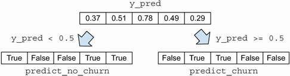


Next,
we record the actual values of the target variable in ❷. The results are
two NumPy arrays as well (figure 4.12):


-   [If
    the customer churned (value "1"), then the respective element of
    [actual\_
    churn]
    is True, and it's False otherwise.]
-   [For
    [actual\_no\_churn]
    it's exactly the opposite: it's True when the customer didn't
    churn.]


##### )

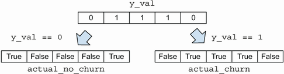


That's
the second split of the dataset---the one that's based on the target
variable.


Now
we combine these two splits---or, to be exact, these four NumPy arrays.


To
calculate the number of true positive outcomes in ❸, we use the logical
"and" operator of NumPy ([&]) and the [sum]
metho:


``` 
true_positive = (predict_churn & actual_churn).sum()
```


The
logical "and" operator evaluates to True only if both values are True.
If at least one is False or both are False, it's False. In case of
[true\_positive], it will be True only if we predict "churn" and
the customer actually churned (figure 4.13).


##### ; this creates another array with True in any position where both arrays contained True and False in all others.

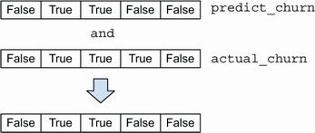


Then
we use the [sum] method from NumPy, which simply counts how many
[True] values are in the array. It does that by first casting the
Boolean array to integers and then summing it (figure 4.14). We already
saw similar behavior in the previous lab when we used the
[mean]
method.


#####  method on a Boolean array: we get the number of elements in this array that are True.

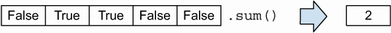


As
a result, we have the number of true positive cases. The other values
are computed similarly in lines ❹, ❺, and ❻.


Now
we just need to put all these values together in a NumPy array:


``` 
confusion_table = np.array(
 [[true_negative, false_positive],
 [false_negative, true_positive]])
```


When
we print it, we get the following numbers:


``` 
[[1202, 172],
 [ 197, 289]]
```


The
absolute numbers may be difficult to understand, so we can turn them
into fractions by dividing each value by the total number of
items:


``` 
confusion_table / confusion_table.sum()
```


This
prints the following numbers:


``` 
[[0.646, 0.092],
[0.105, 0.155]]
```


We
can summarize the results in a table (table 4.1). We see that the model
predicts negative values quite well: 65% of the predictions are true
negatives. However, it makes quite a few mistakes of both types: the
number of false positives and false negatives is roughly equal (9% and
11%,
respectively).


##### Table 4.1 The confusion table for the churn classifier at the threshold of 0.5. We see that it's easy for the model to correctly predict non-churning users, but it's more difficult for it to identify churning users. [(view table figure)](https://drek4537l1klr.cloudfront.net/grigorev/HighResolutionFigures/table_4-1.png)

Full
model with all features


Predicted


False

True

Actual

False

1202
(65%)

172
(9%)

True

197
(11%)

289
(15%)


This
table gives us a better understanding of the performance of the
model---it's now possible to break down the performance into different
components and understand where the model makes mistakes. We actually
see that the performance of the model is not great: it makes quite a few
errors when trying to identify users that will churn. This is something
we couldn't see with the accuracy score alone.


We can repeat the same process for the small model using exactly the same
code (table 4.2).


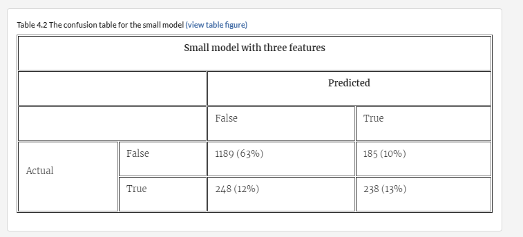


When we compare the smaller model with the full model, we see that it's 2%
worse at correctly identifying non-churning users (63% versus 65% for
true negatives) and 2% worse at correctly identifying churning users
(13% versus 15% for true positives), which together accounts for the 4%
difference between the accuracies of these two models (76% versus
80%).


The
values from the confusion table serve as the basis for many other
evaluation metrics. For example, we can calculate accuracy by taking all
the correct predictions---TN and TP together---and dividing that number
by the total number of observations in all four cells of the
:


accuracy
= (TN + TP) / (TN + TP + FN + FP)


Apart
from accuracy, we can calculate other metrics based on the values from
the confusion table. The most useful ones are precision and recall,
which we will cover next.


##### Exercise 4.1


What
is a false
positive?


a)
A customer for whom we predicted "not churn," but they stopped using our
services


b)
A customer for whom we predicted "churn," but they didn't churn


c)
A customer for whom we predicted "churn," and they churned


### 4.2.3 Precision and recall


As
already
mentioned, accuracy can be misleading when dealing with imbalanced
datasets such as ours. Other metrics are helpful to use for such cases:
precision and recall.


Both
precision and recall are calculated from the values of the confusion
table. They both help us understand the quality of the model in cases of
class imbalance.


Let's
start with precision. The precision of a model tells us how many of the
positive predictions turned out to be correct. It's the fraction of
correctly predicted positive examples. In our case, it's the number of
customers who actually churned (TP) out of all the customers we thought
would churn (TP + FP) (figure 4.15):


P
= TP / (TP + FP)


For
our model, the precision is 62%:


P
= 289 / (289 + 172) = 172 / 461 = 0.62


##### Figure 4.15 The precision of a model is the fraction of correct predictions (TP) among all positive predictions (TP + FP).

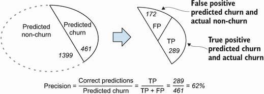


Recall
is the fraction of correctly classified positive examples among all
positive examples. In our case, to calculate recall we first look at all
the customers who churned and see how many of them we managed to
identify
correctly.


The
formula for calculating recall is


R
= TP / (TP + FN)


Like
in the formula for precision, the numerator is the number of true
positives, but the denominator is different: it's the number of all
positive examples ([y\_val] [==] [1]) in our
validation dataset (figure 4.16).


##### Figure 4.16 The recall of a model is the fraction of correctly predicted churning customers (TP) among all customers who churned (TP + FN).


For
our model, the recall is 59%:


R
= 286 / (289 + 197) = 289 / 486 = 0.59


The
difference between precision and recall may seem subtle at first. In
both cases, we look at the number of correct predictions, but the
difference is in the denominators (figure 4.17):


-   [Precision:
    what's the percent of correct predictions (TP) among customers
    predicted as churning (TP +
    FP)
-   [Recall:
    what's the percentage correctly predicted as churning (TP) among all
    churned
    customers
    (TP + FN)?]


##### Figure 4.17 Both precision and recall look at the correct predictions (TP), but the denominators are different. For precision, it's the number of customers predicted as churning, whereas for recall, it's the number of customers who churned.

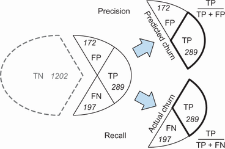


We
can also see that both precision and recall don't take true negatives
into account (figure 4.17). This is exactly why they are good evaluation
metrics for imbalanced datasets. For situations with class imbalance,
true negatives typically outnumber everything else---but at the same
time, they are also often not really interesting for us. Let's see
why.


The
goal of our project is to identify customers who are likely to churn.
Once we do, we can send them promotional messages in the hopes that
they'll change their mind.


When
doing this, we make two types of mistakes:


-   [We
    accidentally send messages to people who weren't going to
    churn---these people are the false positives of the model.]
-   [We
    also sometimes fail to identify people who are actually going to
    churn. We don't send messages to these people---they are our false
    negatives.]


Precision
and recall help us quantify these errors.


Precision
helps us understand how many people received a promotional message by
mistake. The better the precision, the fewer false positives we have.
The precision of 62% means that 62% of the reached customers indeed were
going to churn (our true positives), whereas the remaining 38% were not
(false positives).


Recall
helps us understand how many of the churning customers we failed to
find. The better the recall, the fewer false negatives we have. The
recall of 59% means that we reach only 59% of all churning users (true
positives) and fail to identify the remaining 41% (false negatives).


As
we can see, in both cases, we don't really need to know the number of
true negatives: even though we can correctly identify them as not
churning, we aren't going to do anything with them.


Although
the accuracy of 80% might suggest that the model is great, looking at
its precision and recall tells us that it actually makes quite a few
errors. This is typically not a deal-breaker: with machine learning it's
inevitable that models make mistakes, and at least now we have a better
and more realistic understanding of the performance of our
churn-prediction
model.


Precision
and recall are useful metrics, but they describe the performance of a
classifier only at a certain threshold. Often it's useful to have a
metric that summarizes the performance of a classifier for all possible
threshold choices. We look at such metrics in the next
section.


##### Exercise 4.2


What
is precision?


a)
The percent of correctly identified churned customers in the validation
dataset


b)
The percent of customers who actually churned among the customers who we
predicted as churning


------------------------------------------------------------------------


##### Exercise 4.3


What
is recall?


a)
The percent of correctly identified churned customers among all churned
customers


b)
The percent of correctly classified customers among customers we
predicted
as
churning


4.3 ROC curve and AUC score
---------------------------------------------------------------------------------------------------------------------


The
metrics
we have covered so far work only with binary predictions---when we have
only True and False values in the output. However, we do have ways to
evaluate the performance of a model across all possible threshold
choices. ROC curves is one of these options.


ROC
stands for "receiver operating characteristic," and it was initially
designed for evaluating the strength of radar detectors during World War
II. It was used to assess how well a detector could separate two
signals: whether an airplane was there or not. Nowadays it's used for a
similar purpose: it shows how well a model can separate two classes,
positive and negative. In our case, these classes are "churn" and "no
churn."


We
need two metrics for ROC curves: TPR and FPR, or true positive rate and
false positive rate. Let's take a look at these metrics.


### 4.3.1 True positive rate and false positive rate


ROC
curve is based on two quantities, FPR and TPR:


-   [False
    positive rate (FPR): the fraction of false positives among all
    negative examples]
-   [True
    positive rate (TPR): the fraction of true positives among all
    positive
    examples


Like
precision and recall, these values are based on the confusion matrix. We
can calculate them using the following formulas:


FPR
= FP / (FP + TN)


TPR
= TP / (TP + FN)


FPR
and TPR involve two separate parts of the confusion table (figure
4.18):


-   [For
    FPR, we look at the first row of the table: the fraction of false
    positives among all negatives.]
-   [For
    TPR, we look at the second row of the table: the fraction of true
    positives among all positives.]


##### Figure 4.18 For calculating FPR, we look at the first row of the confusion table, and for calculating TPR, we look at the second row.

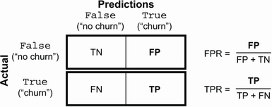


Let's
calculate these values for our model (figure 4.19):


FPR
= 172 / 1374 = 12.5%


FPR
is the fraction of users we predicted as churning among everybody who
didn't churn. A small value for FPR tells us that a model is good---it
has few false positives:


TPR
= 289 / 486 = 59%


TPR
is the fraction of users who we predicted as churning among everybody
who actually did churn. Note that TPR is the same as recall, so the
higher the TPR is, the better.


##### Figure 4.19 FPR is the fraction of false positives among all non-churning customers: the smaller the FPR, the better. TPR is the fraction of true positives among all churning customers: the larger the TPR, the better.

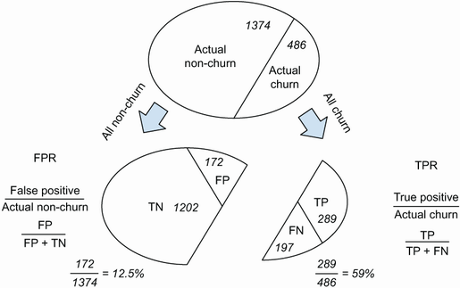


However,
we still consider FPR and TPR metrics at only one threshold value---in
our case, 0.5. To be able to use them for ROC curves, we need to
calculate these metrics for many different
threshold.


### 4.3.2 Evaluating a model at multiple thresholds


Binary
classification
models, such as logistic regression, typically output a probability---a
score between zero and one. To make actual predictions, we binarize the
output by setting some threshold to get only True and False values.


Instead
of evaluating the model at one particular threshold, we can do it for a
range of them---in the same way we did it for accuracy earlier in this
lab.


For
that, we first iterate over different threshold values and compute the
values of the confusion table for each.


##### Listing 4.1 Computing the confusion table for different thresholds


``` 
scores = []
 
thresholds = np.linspace(0, 1, 101)
 
for t in thresholds:
    tp = ((y_pred >= t) & (y_val == 1)).sum()
    fp = ((y_pred >= t) & (y_val == 0)).sum()
    fn = ((y_pred < t) & (y_val == 1)).sum()
    tn = ((y_pred < t) & (y_val == 0)).sum()
    scores.append((t, tp, fp, fn, tn))
```


The
idea is similar to what we previously did with accuracy, but instead of
recording just one value, we record all the four outcomes for the
confusion
table.


It's
not easy to deal with a list of tuples, so let's convert it to a Pandas
dataframe:


``` 
df_scores = pd.DataFrame(scores)
df_scores.columns = ['threshold', 'tp', 'fp', 'fn', 'tn']
```


This gives us a dataframe with five columns (figure 4.20).


#####  expression selects every 10th record of the dataframe.

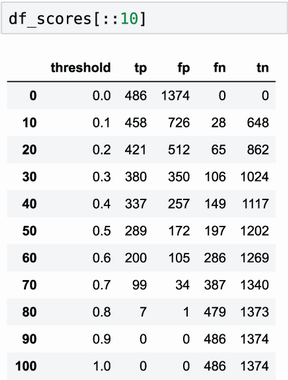


Now
we can compute the TPR and FPR scores. Because the data is now in a
dataframe, we can do it for all the values at once:


``` 
df_scores['tpr'] = df_scores.tp / (df_scores.tp + df_scores.fn)
df_scores['fpr'] = df_scores.fp / (df_scores.fp + df_scores.tn)
```


After
running this code, we have two new columns in the dataframe: tpr and fpr
(figure 4.21).


##### Figure 4.21 The dataframe with the values of the confusion matrix as well as TPR and FPR evaluated at different thresholds

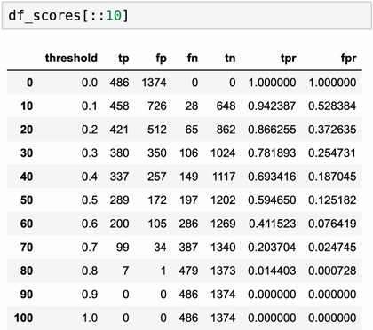


Let's
plot them (figure
4.22):


``` 
plt.plot(df_scores.threshold, df_scores.tpr, label='TPR')
plt.plot(df_scores.threshold, df_scores.fpr, label='FPR')
plt.legend()
```


##### Figure 4.22 The TPR and FPR for our model, evaluated at different thresholds

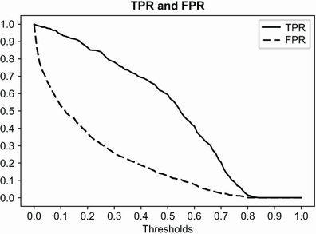


Both
TPR and FPR
start
at 100%---at the threshold of 0.0, we predict "churn" for
everyone:


-   [FPR
    is 100% because we have only false positives in the prediction.
    There are no true negatives: nobody is predicted as
    non-churning.]
-   [TPR
    is 100% because we have only true positives and no false
    negatives.]


As
the threshold grows, both metrics decline but at different rates.


Ideally,
FPR should go down very quickly. A small FPR indicates that the model
makes very few mistakes predicting negative examples (false positives).


On
the other hand, TPR should go down slowly, ideally staying near 100% all
the time: that will mean that the model predicts true positives
well.


To
better understand what these TPR and FPR mean, let's compare it with two
baseline models: a random model and the ideal model. We will start with
a random
model.


### 4.3.3 Random baseline model


A
random
model outputs a random score between 0 and 1, regardless of the input.
It's easy to implement---we simply generate an array with uniform random
numbers:


``` 
np.random.seed(1)                                    #1
y_rand = np.random.uniform(0, 1, size=len(y_val))    #2
```


Now
we can simply pretend that [y\_rand] contains the predictions of
our "model."


Let's
calculate FPR and TPR for our random model. To make it simpler, we'll
reuse the code we wrote previously and put it into a function.


##### Listing 4.2 Function for calculating TPR and FPR at different thresholds


``` 
def tpr_fpr_dataframe(y_val, y_pred):                                 #1
    scores = []                                                       #2
 
    thresholds = np.linspace(0, 1, 101)                               #2
 
    for t in thresholds:                                              #2
        tp = ((y_pred >= t) & (y_val == 1)).sum()                     #2
        fp = ((y_pred >= t) & (y_val == 0)).sum()                     #2
        fn = ((y_pred < t) & (y_val == 1)).sum()                      #2
        tn = ((y_pred < t) & (y_val == 0)).sum()                      #2
        scores.append((t, tp, fp, fn, tn))                            #2
    df_scores = pd.DataFrame(scores)                                  #3
    df_scores.columns = ['threshold', 'tp', 'fp', 'fn', 'tn']         #3
 
    df_scores['tpr'] = df_scores.tp / (df_scores.tp + df_scores.fn)   #4
    df_scores['fpr'] = df_scores.fp / (df_scores.fp + df_scores.tn)   #4
 
    return df_scores                                                  #5
```


Now
let's use this function to calculate the TPR and FPR for the random
model:


``` 
df_rand = tpr_fpr_dataframe(y_val, y_rand)
```


This
creates a dataframe with TPR and FPR values at different thresholds
(figure 4.23).


##### Figure 4.23 The TPR and FPR values of a random model

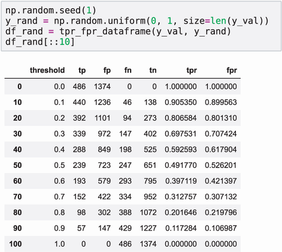


Let's
plot them:


``` 
plt.plot(df_rand.threshold, df_rand.tpr, label='TPR')
plt.plot(df_rand.threshold, df_rand.fpr, label='FPR')
plt.legend()
```


We
see that both TPR and FPR curves go from 100% to 0%, almost following
the straight line (figure 4.24).


##### Figure 4.24 Both TPR and FPR of a random classifier decrease from 100% to 0% as a straight line.

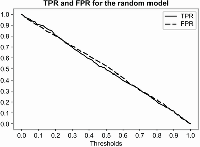


At
the threshold of 0.0, we treat everybody as churning. Both TPR and FPR
are 100%:


-   [FPR
    is 100% because we have only false positives: all non-churning
    customers are identified as churning.]
-   [TPR
    is 100% because we have only true positives: we can correctly
    classify all churning customers as
    churnin


As
we increase the threshold, both TPR and FPR decrease.


At
the threshold of 0.4, the model with a probability of 40% predicts
"non-churn," and with a probability of 60% predicts "churn." Both TPR
and FPR are 60%:


-   [FPR
    is 60% because we incorrectly classify 60% of non-churning customers
    as churning.]
-   [TPR
    is 60% because we correctly classify 60% of churning customers as
    churning.]


Finally,
at 1.0, both TPR and FPR are 0%. At this threshold, we predict everybody
as non-churning:


-   [FPR
    is 0% because we have no false positives: we can correctly classify
    all non-churning customers as non-churning.]
-   [TPR
    is 0% because we have no true positives: all churning customers are
    identified as non-churning.]


Let's
now move on to the next baseline and see how TPR and FPR look for the
ideal
model.


### 4.3.4 The ideal model


The
ideal
model always makes correct decisions. We'll take it a step further and
consider the ideal ranking model. This model outputs scores in such a
way that churning customers always have higher scores than non-churning
ones. In other words, the predicted probability for all churned ones
should be higher than the predicted probability for non-churned ones.


So,
if we apply the model to all the customers in our validation set and
then sort them by the predicted probability, we first will have all the
non-churning customers, followed by the churning ones (figure 4.25).


##### Figure 4.25 The ideal model orders customers such that first we have non-churning customers and then churning ones.

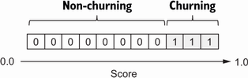


Of
course, we cannot have such a model in real life. It's still useful,
however: we can use it for comparing our TPR and FPR to the TPR and FPR
of the ideal model.


Let's
generate the ideal predictions. To make it easier, we generate an array
with fake target variables that are already ordered: first it contains
only 0s and then only 1s (figure 4.25). As for "predictions," we simply
can create an array with numbers that grow from 0 in the first cell to 1
in the last cell using the [np.linspace]
function.


Let's
do it:


``` 
num_neg = (y_val == 0).sum()                          #1
num_pos = (y_val == 1).sum()                          #1
 
y_ideal = np.repeat([0, 1], [num_neg, num_pos])       #2
y_pred_ideal = np.linspace(0, 1, num_neg + num_pos)   #3
 
df_ideal = tpr_fpr_dataframe(y_ideal, y_pred_ideal)   #4
```


As a result, we get a dataframe with the TPR and FPR values of the ideal
model (figure 4.26).


##### Figure 4.26 The TPR and FPR values for the ideal model

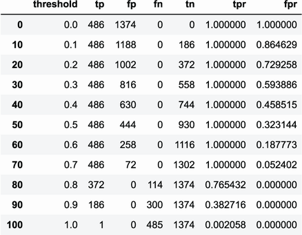


Now
we can plot it (figure 4.27):


``` 
plt.plot(df_ideal.threshold, df_ideal.tpr, label='TPR')
plt.plot(df_ideal.threshold, df_ideal.fpr, label='FPR')
plt.legend()
```


##### Figure 4.27 The TPR and FPR curves for the ideal model

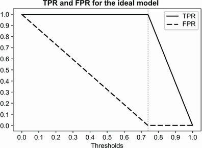


From
the plot, we can see that


-   [Both
    TPR and FPR start at 100% and end at
    0%
-   [For
    thresholds lower than 0.74, we always correctly classify all
    churning customers as churning; that's why TRP stays at 100%. On the
    other hand, we incorrectly classify some non-churning ones as
    churning---those are our false positives. As we increase the
    threshold, fewer and fewer non-churning customers are classified as
    churning, so FPR goes down. At 0.6, we misclassify 258 non-churning
    customers as churning (figure 4.28, A).]
- [The threshold of 0.74 is the ideal situation: all churning customers are
    classified as churning, and all non-churning are classified as
    non-churning; that's why TPR is 100% and FPR is 0% (figure 4.28,
    B).]
-   [Between
    0.74 and 1.0, we always correctly classify all non-churning
    customers, so FPR stays at 0%. However, as we increase the
    threshold, we start incorrectly classifying more and more churning
    customers as non-churning, so TPR goes down. At 0.8, 114 out of 446
    churning customers are incorrectly classified as non-churning. Only
    372 predictictions are correct, so TPR is 76% (figure 4.28,
    C).]


##### Figure 4.28 TPR and FPR of the ideal ranking model evaluated at different thresholds

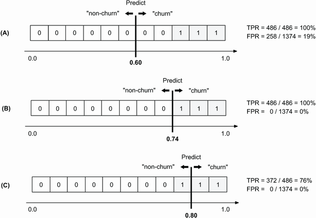


Now
we're ready to build the ROC curve.


##### Exercise 4.4


What
does the ideal ranking model
do?


a)
When applied to the validation data, it scores the customers such that
for non-churning customers, the score is always lower than for churning
ones.


b)
It scores non-churning customers higher than churning ones.


### 4.3.5 ROC Curve


To
create
an ROC curve, instead of plotting FPR and TPR against different
threshold values, we plot them against each other. For comparison, we
also add the ideal and random models to the plot:


``` 
plt.figure(figsize=(5, 5))                             #1
 
plt.plot(df_scores.fpr, df_scores.tpr, label='Model')  #2
plt.plot(df_rand.fpr, df_rand.tpr, label='Random')     #2
plt.plot(df_ideal.fpr, df_ideal.tpr, label='Ideal')    #2
 
plt.legend()
```


As
a result, we get an ROC curve (figure 4.29). When we plot it, we can see
that the ROC curve of the random classifier is an approximately straight
line from bottom left to top right. For the ideal model, however, the
curve first goes up until it reaches 100% TPR, and from there it goes
right until it reaches 100%
FPR.


##### Figure 4.29 The ROC curve shows the relationship between the FPR and TPR of a model.

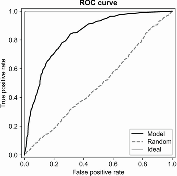


Our
models should always be somewhere between these two curves. We want our
model to be as close to the ideal curve as possible and as far as
possible from the random curve.


The
ROC curve of a random model serves as a good visual baseline---when we
add it to the plot, it helps us to judge how far our model is from this
baseline---so it's a good idea to always include this line in the plot.


However,
we don't really need to generate a random model each time we want to
have an ROC curve: we know what it looks like, so we can simply include
a straight line from (0, 0) to (1, 1) in the plot.


As
for the ideal model, we know that it always goes up to (0, 1) and then
goes right to (1, 1). The top-left corner is called the "ideal spot":
it's the point when the ideal model gets 100% TPR and 0% FPR. We want
our models to get as close to the ideal spot as possible.


With
this information, we can reduce the code for plotting the curve to the
following:


``` 
plt.figure(figsize=(5, 5))
plt.plot(df_scores.fpr, df_scores.tpr)
plt.plot([0, 1], [0, 1])
```


This
produces the result in figure
4.30.


##### Figure 4.30 The ROC curve. The baseline makes it easier to see how far the ROC curve of our model is from that of a random model. The top-left corner (0, 1) is the "ideal spot": the closer our models get to it, the better.

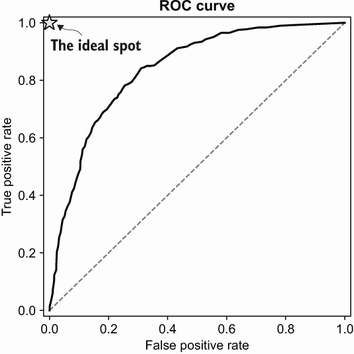


Although
computing all the FPR and TPR values across many thresholds is a good
exercise, we don't need to do it ourselves every time we want to plot an
ROC curve. We simply can use the [roc\_curve]
function
from the [metrics]
package
of Scikit-learn:


``` 
from sklearn.metrics import roc_curve
 
fpr, tpr, thresholds = roc_curve(y_val, y_pred)
 
plt.figure(figsize=(5, 5))
plt.plot(fpr, tpr)
plt.plot([0, 1], [0, 1])
```


As
a result, we get a plot identical to the previous one (figure 4.30).


Now
let's try to make more sense of the curve and understand what it can
actually tell us. To do this, we visually map the TPR and FPR values to
their thresholds on the ROC curve (figure
4.31).


In
the ROC plot, we start from the (0, 0) point---this is the point at the
bottom left. It corresponds to 0% FPR and 0% TPR, which happens at high
thresholds like 1.0, when no customers are above that score. For these
cases we simply end up predicting "no churn" for everyone. That's why
our TPR is 0%: we are never correctly predicting churned customers. FPR,
on the other hand, is 0% because this dummy model can correctly predict
all non-churning customers as non-churning, so there are no false
positives.


As
we go up the curve, we consider FPR and TPR values evaluated at smaller
thresholds. At 0.7, FPR changes only slightly, from 0% to 2%, but the
TPR increases from 0% to 20% (figure 4.31, B and C).


##### (A) TPR and FPR at different thresholds

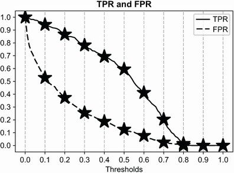


##### (B) FPR and TPR values of the model for different thresholds

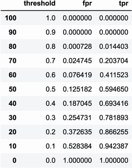


##### Figure 4.31 Translation of the TPR and FPR plots against different threshold values (A and B) to the ROC curve (C). In the ROC plot, we start from the bottom left with high threshold values, where most of the customers are predicted as non-churning, and gradually go to the top right with low thresholds, where most of the customers are predicted as churning.

##### (C) FPR and TPR values for selected thresholds

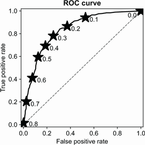


As
we follow the line, we keep decreasing the threshold and evaluating the
model at smaller values, predicting more and more customers as churning.
At some point, we cover most of the positives (churning customers). For
example, at the threshold of 0.2, we predict most of the users as
churning, which means that many of these predictions are false
positives. FPR then starts to grow faster than TPR; at the threshold of
0.2, it's already at almost 40%.


Eventually,
we reach the 0.0 threshold and predict that everyone is churning, thus
reaching the top-right corner of the ROC plot.


When
we start at high threshold values, all models are equal: any model at
high threshold values degrades to the constant "model" that predicts
False all the time. As we decrease the threshold, we start predicting
some of the customers as churning. The better the model, the more
customers are correctly classified as churning, resulting in a better
TPR. Likewise, good models have a smaller FPR because they have fewer
false positives.


Thus,
the ROC curve of a good model first goes up as high as it can and only
then starts turning right. Poor models, on the other hand, from the
start have higher FPRs and lower TPRs, so their curves tend to go to the
right earlier (figure 4.32).


##### Figure 4.32 ROC curves of good models go up as much as they can before turning right. Poor models, on the other hand, tend to have more false positives from the beginning, so they tend to go right earlier.

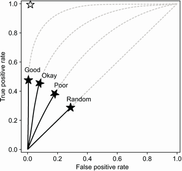


We
can use this for comparing multiple models: we can simply plot them on
the same graph and see which of them is closer to the ideal point of (0,
1). For example, let's take a look at the ROC curves of the large and
small models and plot them on the same graph:


``` 
fpr_large, tpr_large, _ = roc_curve(y_val, y_pred)
fpr_small, tpr_small, _ = roc_curve(y_val, y_pred_small)
 
plt.figure(figsize=(5, 5))
 
plt.plot(fpr_large, tpr_large, color='black', label='Large')
plt.plot(fpr_small, tpr_small, color='black', label='Small')
plt.plot([0, 1], [0, 1])
plt.legend()
```


This
way we can get two ROC curves on the same plot (figure 4.33). We can see
that the large model is better than the small model: it's closer to the
ideal point for all the
thresholds.


##### Figure 4.33 Plotting multiple ROC curves on the same graph helps us visually identify which model performs better.

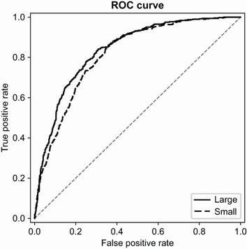


ROC
curves are quite useful on their own, but we also have another metric
that's based on it: AUC, or the area under the ROC
curve.


### 4.3.6 Area under the ROC curve (AUC)


evaluating
our models using the ROC curve, we want them to be as close to the ideal
spot and as far from the random baseline as possible.


We
can quantify this "closeness" by measuring the area under the ROC curve.
We can use this metric---abbreviated as AU ROC, or often simply AUC---as
a metric for evaluating the performance of a binary classification
model.


The
ideal model forms a 1x1 square, so the area under its ROC curve is 1, or
100%. The random model takes only half of that, so its AUC is 0.5, or
50%. The AUCs of our two models---the large one and the small one---will
be somewhere between the random baseline of 50% and the ideal curve of
100%.


##### Important


An AUC of 0.9 is indicative of a reasonably good model; 0.8 is okay, 0.7
is not very performant, and 0.6 indicates quite poor performance.


To
calculate the AUC for our models we can use
[auc],
a function from the [metrics] package of Scikit-learn:


``` 
from sklearn.metrics import auc
auc(df_scores.fpr, df_scores.tpr)
```


For
the large model, the result is 0.84; for the small model, it's 0.81
(figure 4.34). Churn prediction is a complex problem, so an AUC of 80%
is quite
good.


##### Figure 4.34 The AUC for our models: 84% for the large model and 81% for the small model

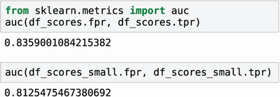


If
all we need is the AUC, we don't need to compute the ROC curve first. We
can take a shortcut and use the [roc\_auc\_score]
function
from Scikit-learn, which takes care of everything and simply returns the
AUC of our model:


``` 
from sklearn.metrics import roc_auc_score
roc_auc_score(y_val, y_pred)
```


We
get approximately the same results as previously (figure 4.35).


#####  function.

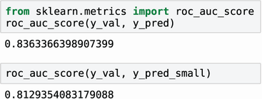


##### Note


The values from `roc_auc_score` may be slightly different from AUC
computed from the dataframes where we calculated TPR and FPR ourselves:
Scikit-learn internally uses a more precise method for creating ROC
curves.


ROC
curves and AUC scores tell us how well the model separates positive and
negative examples. What is more, AUC has a nice probabilistic
interpretation: it tells us what the probability is that a randomly
selected positive example will have a score higher than a randomly
selected negative example.


Suppose
we randomly pick a customer that we know churned and a customer who
didn't and then apply the model to these customers and see what the
score is for each. We want the model to score the churning customer
higher than the non-churning one. AUC tells us the probability of that
happening: it's the probability that the score of a randomly selected
churning customer is higher than the score of a randomly selected
non-churning one.


We
can verify this. If we do this experiment 10,000 times and then count
how many times the score of the positive example was higher than the
score of the negative one, the percentage of cases when it's true should
roughly correspond to the AUC:


``` 
neg = y_pred[y_val == 0]                                           #1
pos = y_pred[y_val == 1]                                           #2
 
np.random.seed(1)                                                  #3
neg_choice = np.random.randint(low=0, high=len(neg), size=10000)   #4
pos_choice = np.random.randint(low=0, high=len(pos), size=10000)   #5
(pos[pos_choice] > neg[neg_choice]).mean()                         #6
```


This
prints 0.8356, which is indeed pretty close to the AUC value of our
classifier.


This
interpretation of AUC gives us additional insight into the quality of
our models. The ideal model orders all the customers such that we first
have non-churning customers and then churning customers. With this
order, the AUC is always 1.0: the score of a randomly chosen churning
customer is always higher than the score of a non-churning customer. On
the other hand, the random model just shuffles the customers, so the
score of a churning customer has only a 50% chance of being higher than
the score of a non-churning one.


AUC
thus not only gives us a way of evaluating the models at all possible
thresholds but also describes how well the model separates two classes:
in our case, churning and non-churning. If the separation is good, then
we can order the customers such that most of the churning users come
first. Such a model will have a good AUC score.


##### Note


You should keep this interpretation in mind: it provides an easy way to
explain the meaning behind AUC to people without a machine learning
background, such as managers and other decision makers.


This
makes AUC the default classification metric in most situations, and it's
often the metric we use when finding the best parameter set for our
models.


The
process of finding the best parameters is called "parameter tuning," and
in the next section we will see how
to
do
this.


4.4 Parameter tuning
--------------------------------------------------------------------------------------------------------------


In
the
previous lab, we used a simple hold-out validation scheme for
testing our models. In this scheme, we take part of the data out and
keep it for validation purposes only. This practice is good but doesn't
always give us the whole picture. It tells us how well the model will
perform on these specific data points. However, it doesn't necessarily
mean the model will perform equally well on other data points. So, how
do we check if the model indeed works well in a consistent and
predictable manner?


### 4.4.1 K-fold cross-validation


It's
possible
to use all the available data to assess the quality of models and get
more reliable validation results. We can simply perform validation
multiple
times.


First,
we split the entire dataset into a certain number of parts (say, three).
Then we train a model on two parts and validate on the remaining one. We
repeat this process three times and at the end get three different
scores. This is exactly the idea behind K-fold cross-validation (figure
4.36).


##### Figure 4.36 K-fold cross-validation (K=3). We split the entire dataset into three equal parts, or folds. Then, for each fold, we take it as the validation dataset and use the remaining K -- 1 folds as the training data. After training the model, we evaluate it on the validation fold, and at the end we get k metric values.

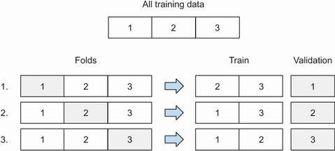


Before
we implement it, we need to make the training process simpler, so it's
easy to run this process multiple times. For that, we'll put all the
code for training into a [train]
function,
which first converts the data into a one-hot encoding representation and
then trains the model.


##### Listing 4.3 Training the model


``` 
def train(df, y):
    cat = df[categorical + numerical].to_dict(orient='records')  #1
  
    dv = DictVectorizer(sparse=False)                            #1
    dv.fit(cat)                                                  #1
 
    X = dv.transform(cat)                                        #1
 
    model = LogisticRegression(solver='liblinear')               #2
    model.fit(X, y)                                              #2
 
    return dv, model
```


Likewise,
we also put the prediction logic into a [predict]
function.
This function takes in a dataframe with customers, the vectorizer we
"trained" previously---for doing one-hot encoding---and the model. Then
we apply the vectorizer to the dataframe, get a matrix, and finally
apply the model to the matrix to get predictions.


##### Listing 4.4 Applying the model to new data


``` 
def predict(df, dv, model):
    cat = df[categorical + numerical].to_dict(orient='records')   #1
 
    X = dv.transform(cat)                                         #1
    y_pred = model.predict_proba(X)[:, 1]                         #2
 
    return y_pred
```


Now
we can use these functions for implementing K-fold cross-validation.


We
don't need to implement cross-validation ourselves: in Scikit-learn
there's a class for doing that. It's called
[KFold],
and it lives in the [model\_selection]
package.


##### Listing 4.5 K-fold cross-validation


``` 
from sklearn.model_selection import KFold                  #1
 
kfold = KFold(n_splits=10, shuffle=True, random_state=1)   #2
 
aucs = []                                                  #3
 
for train_idx, val_idx in kfold.split(df_train_full):      #4
    df_train = df_train_full.iloc[train_idx]               #5
    df_val = df_train_full.iloc[val_idx]                   #5
 
    y_train = df_train.churn.values                        #5
    y_val = df_val.churn.values                            #5
    dv, model = train(df_train, y_train)                   #6
    y_pred = predict(df_val, dv, model)                    #6
 
    auc = roc_auc_score(y_val, y_pred)                     #7
    aucs.append(auc)                                       #8
```


Note
that when defining the splitting in the [KFold] class in ❷, we set
three parameters:


- `n_splits` = `10`: That’s K, which specifies the number of splits.
- `shuffle` = `True`: We ask it to shuffle the data before splitting it.
- `random_state` = `1`: Because there’s randomization in the process (shuffling data), we want the results to be reproducible, so we fix the seed for the random-number generator.


Here
we used K-fold cross-validation with K =10. Thus, when we run it, at the
end we get 10 different numbers---10 AUC scores evaluated on 10
different validation folds:


``` 
0.849, 0.841, 0.859, 0.833, 0.824, 0.841, 0.844, 0.822, 0.845, 0.861
```


It's
not a single number anymore, and we can think of it as a distribution of
AUC scores for our model. We can get some statistics from this
distribution, such as the mean and standard deviation:


``` 
print('auc = %0.3f ± %0.3f' % (np.mean(aucs), np.std(aucs)))
```


This
prints "0.842 ± 0.012".


Now,
not only do we know the average performance, but we also have an idea of
how volatile that performance is, or how far it may deviate from the
average.


A
good model should be quite stable across different folds: this way, we
make sure we don't get a lot of surprises when the model goes live. The
standard deviation tells us about that: the smaller it is, the more
stable the model is.


Now
we can use K-fold cross-validation for parameter tuning: selecting the
best
parameters.


### 4.4.2 Finding best parameters


We
learned
how we can use K-fold cross-validation for evaluating the performance of
our model. The model we trained previously was using the default value
for the parameter [C], which controls the amount of
regularization.


Let's
select our cross-validation procedure for selecting the best parameter
[C]. For that, we first adjust the [train] function to take
in an additional parameter.


##### Listing 4.6 Function for training the model with parameter C for controlling regularization


``` 
def train(df, y, C):                                             #1
    cat = df[categorical + numerical].to_dict(orient='records')
    dv = DictVectorizer(sparse=False)
    dv.fit(cat)
 
    X = dv.transform(cat)
 
    model = LogisticRegression(solver='liblinear', C=C)          #2
    model.fit(X, y)
 
    return dv, model
```


Now
let's find the best parameter [C]. The idea is simple:


-   [Loop
    over different values of [C].]
-   [For
    each [C], run cross-validation and record the mean AUC across
    all folds as well as the standard deviation.]


##### Listing 4.7 Tuning the model: selecting the best parameter C using cross-validation


``` 
nfolds = 5
kfold = KFold(n_splits=nfolds, shuffle=True, random_state=1)
 
for C in [0.001, 0.01, 0.1, 0.5, 1, 10]:
    aucs = []
 
    for train_idx, val_idx in kfold.split(df_train_full):
        df_train = df_train_full.iloc[train_idx]
        df_val = df_train_full.iloc[val_idx]
 
        y_train = df_train.churn.values
        y_val = df_val.churn.values
 
        dv, model = train(df_train, y_train, C=C)
        y_pred = predict(df_val, dv, model)
  
        auc = roc_auc_score(y_val, y_pred)
        aucs.append(auc)
 
    print('C=%s, auc = %0.3f ± %0.3f' % (C, np.mean(aucs), np.std(aucs)))
```


When
we run it, it prints


``` 
C=0.001, auc = 0.825 ± 0.013
C=0.01, auc = 0.839 ± 0.009
C=0.1, auc = 0.841 ± 0.008
C=0.5, auc = 0.841 ± 0.007
C=1, auc = 0.841 ± 0.007
C=10, auc = 0.841 ± 0.007
```


What
we see is that after [C] = 0.1, the average AUC is the same and
doesn't grow anymore.


However,
the standard deviation is smaller for [C] = 0.5 than for [C]
= 0.1, so we should use that. The reason we prefer [C] = 0.5 to
[C] = 1 and [C] = 10 is simple: when the [C] parameter
is small, the model is more regularized. The weights of this model are
more restricted, so in general, they are smaller. Small weights in the
model give us additional assurance that the model will behave well when
we use it on real data. So we select [C] = 0.5.


Now
we need to do the last step: train the model on the entire train and
validation datasets and apply it to the test dataset to verify it indeed
works well.


Let's
use our [train] and [predict] functions for that:


``` 
y_train = df_train_full.churn.values
y_test = df_test.churn.values
 
dv, model = train(df_train_full, y_train, C=0.5)   #1
y_pred = predict(df_test, dv, model)               #2
 
auc = roc_auc_score(y_test, y_pred)                #3
print('auc = %.3f' % auc)                          #3
```


When
we execute the code, we see that the performance of the model (AUC) on
the held-out test set is 0.858.


That's
a little higher than what we had on the validation set, but that's not
an issue; it could happen just by chance. What's important is that the
score is not significantly different from the validation
score.


Now
we can use this model for scoring real customers and think about our
marketing campaign for preventing churn. In the next lab, we will
see how to deploy this model in a
production


4.5 Next steps
--------------------------------------------------------------------------------------------------------


### 4.5.1 Exercises


Try
the following exercises to further explore the topics of model
evaluation and model selection:


-   [In
    this lab, we plotted TPR and FPR for different threshold values,
    and it helped us understand what these metrics mean and also how the
    performance of our model changes when we choose a different
    threshold. It's helpful to do a similar exercise for precision and
    recall, so try to repeat this experiment, this time using precision
    and recall instead of TPR and FPR.]
-   [When
    plotting precision and recall for different threshold values, we can
    see that a conflict exists between precision and recall: when one
    goes up, the other goes down, and the other way around. This is
    called the "precision-recall trade-off": we cannot select a
    threshold that makes both precision and recall good. However, we do
    have strategies for selecting the threshold, even though precision
    and recall are conflicting. One of them is plotting precision and
    recall curves and seeing where they intersect, and using this
    threshold for binarizing the predictions. Try implementing this
    idea.]
-   [Another
    idea for working around the precision-recall trade-off is the F1
    score---a score that combines both precision and recall into one
    value. Then, to select the best threshold, we can simply choose the
    one that maximizes the F1 score. The formula for computing the F1
    score is F1 = 2 · P · R / (P + R), where P is precision and R is
    recall. Implement this idea, and select the best threshold based on
    the F1 metric.]
-   [We've
    seen that precision and recall are better metrics for evaluating
    classification models than accuracy because they don't rely on false
    positives, the amount of which could be high in imbalanced datasets.
    Yet, we saw later that AUC does actually use false positives in FPR.
    For very highly imbalanced cases (say, 1,000 negatives to 1
    positive), AUC may become problematic as well. Another metric works
    better in such cases: area under the precision-recall curve, or AU
    PR. The precision-recall curve is similar to ROC, but instead of
    plotting FPR versus TPR, we plot recall on the x-axis and precision
    on the y-axis. Like for the ROC curve, we can also calculate the
    area under the PR curve and use it as a metric for evaluating
    different models. Try plotting the PR curves for our models,
    calculating the AU PR scores, and comparing them with those of the
    random model as well as the ideal
    model
-   [We
    covered K-fold cross-validation, and we used it to understand what
    the distribution of AUC scores could look like on a test dataset.
    When K = 10, we get 10 observations, which under some circumstances
    might not be enough. However, the idea can be extended to repeated
    K-fold cross-validation steps. The process is simple: we repeat the
    K-fold cross-validation process multiple times, each time shuffling
    the dataset differently by selecting a different random seed at each
    iteration. Implement repeated cross-validation and perform 10-fold
    cross-validation 10 times to see what the distribution of scores
    looks
    like


### 4.5.2 Other projects


You
can also continue with the other self-study projects from the previous
lab: the lead scoring project and the default prediction project.
Try the following:


-   [Calculate
    all the metrics that we covered in this lab: the confusion
    table, precision and recall, and AUC. Also try to calculate the
    scores from the exercises: the F1 score as well as AU PR (the area
    under the precision-recall curve).]
-   [Use
    K-fold cross-validation to select the best parameter [C] for
    the model.]


Summary
-------------------------------------------------------------------------------------------------


-   [A
    metric is a single number that can be used for evaluating the
    performance of a machine learning model. Once we choose a metric, we
    can use it to compare multiple machine learning models with each
    other and select the best one.]
-   [Accuracy
    is the simplest binary classification metric: it tells us the
    percentage of correctly classified observations in the validation
    set. It's easy to understand and compute, but it can be misleading
    when a dataset is imbalanced.]
-   [When
    a binary classification model makes a prediction, we have only four
    possible outcomes: true positive and true negative (correct answers)
    and false positive and false negative (incorrect answers). The
    confusion table arranges these outcomes visually so it's easy to
    understand them. It gives us the foundation for many other binary
    classification
    metrics
-   [Precision
    is the fraction of correct answers among observations for which our
    prediction is True. If we use the churn model to send promotional
    messages, precision tells us the percentage of customers who really
    were going to churn among everybody who received the message. The
    higher the precision, the fewer non-churning users we incorrectly
    classify as
    churning
-   [Recall
    is the fraction of correct answers among all positive observations.
    It tells us the percentage of churning customers who we correctly
    identified as churning. The higher the recall, the fewer churning
    customers we fail to identify.]
- [The ROC curve analyzes binary classification models at all the
    thresholds at once. The area under the ROC curve (AUC) tells us how
    well a model separates positive observations from negative ones.
    Because of its interpretability and wide applicability, AUC has
    become the default metric for evaluating binary classification
    models
-   [K-fold
    cross-validation gives us a way to use all the training data for
    model validation: we split the data into K folds and use each fold
    in turn as a validation set, and the remaining K -- 1 folds are used
    for training. As a result, instead of a single number, we have K
    values, one for each fold. We can use these numbers to understand
    the performance of a model on average as well as to estimate how
    volatile it is across different
    folds
-   [K-fold
    cross-validation is the best way of tuning parameters and selecting
    the best model: it gives us a reliable estimate of the metric across
    multiple folds.]


In
the next lab we look into deploying our model into a production
environment.


Answers to exercises
--------------------------------------------------------------------------------------------------------------


-   [Exercise
    4.1 B) A customer for whom we predicted "churn," but they didn't
    churn.]
-   [Exercise
    4.2 B) The percent of customers who actually churned among the
    customers who we predicted as churning.]
-   [Exercise
    4.3 A) The percent of correctly identified churned customers among
    all churned customers.]
-   [Exercise
    4.4 A) The ideal ranking model always scores churning customers
    higher than non-churning
    ones.]


