Lab 6: Decision trees and ensemble learning
===========================================


### This lab covers

-   [Decision trees and the decision tree learning
    algorithm]
-   [Random forests: putting multiple trees together into one
    model]
-   [Gradient boosting as an alternative way of combining
    decision trees]


In lab 3, we described the binary classification problem and used the
logistic regression model to predict if a customer is going to
churn


In this lab, we also solve a binary classification problem, but we use
a different family of machine learning models: tree-based models.
Decision trees, the simplest tree-based model, are nothing but a
sequence of if-then-else rules put together. We can combine multiple
decision trees into an ensemble to achieve better performance. We cover
two tree-based ensemble models: random forest and gradient
boosting.


The
project we prepared for this lab is default prediction: we predict
whether or not a customer will fail to pay back a loan. We learn how to
train decision trees and random forest models with Scikit-learn and
explore XGBoost---a library for implementing gradient boosting models.


6.1 Credit risk scoring project
-------------------------------------------------------------------------------------------------------------------------


Imagine
that
we work at a bank. When we receive a loan application, we need to make
sure that if we give the money, the customer will be able to pay it
back. Every application carries a risk of *default*---the failure to
return the money.


We'd
like to minimize this risk: before agreeing to give a loan, we want to
score the customer and assess the chances of default. If it's too high,
we reject the application. This process is called "credit risk scoring."


Machine
learning can be used for calculating the risk. For that, we need a
dataset with loans, where for each application, we know whether or not
it was paid back successfully. Using this data, we can build a model for
predicting the probability of default, and we can use this model to
assess the risk of future borrowers not repaying the money.


This
is what we do in this lab: use machine learning to calculate the
risk of default. The plan for the project is the
following:


-   [First,
    we get the data and do some initial preprocessing.]
-   [Next,
    we train a decision tree model from Scikit-learn for predicting the
    probability of default.]
-   [After
    that, we explain how decision trees work and which parameters the
    model has and show how to adjust these parameters to get the best
    performance.]
-   [Then
    we combine multiple decision trees into one model---a random forest.
    We look at its parameters and tune them to achieve the best
    predictive performance.]
-   [Finally,
    we explore a different way of combining decision trees---gradient
    boosting. We use XGBoost, a highly efficient library that implements
    gradient boosting. We'll train a model and tune its
    parameter


Credit
risk scoring is a binary classification problem: the target is positive
("1") if the customer defaults and negative ("0") otherwise. For
evaluating our solution, we'll use AUC (area under the ROC
curve),
which we covered in lab 4. AUC describes how well our model can
separate the cases into positive and negative ones.


The
code for this project is available in the course's GitHub repository at
<https://github.com/fenago/ml-bootcamp> (in the
lab-06-trees folder).


### 6.1.1 Credit scoring dataset


For
this
project, we use a dataset from a data mining course at the Polytechnic
University of Catalonia
(<https://www.cs.upc.edu/~belanche/Docencia/mineria/mineria.html>). The
dataset describes the customers (seniority, age, marital status, income,
and other characteristics), the loan (the requested amount, the price of
the item), and its status (paid back or not).


We
use a copy of this dataset available on GitHub at
[https://github.com/gastonstat/
CreditScoring/](https://github.com/gastonstat/CreditScoring/). Let's
download it.


First,
create a folder for our project (e.g., lab-06-credit-risk), and then
use [wget] to get it:


``` 
wget https://github.com/gastonstat/CreditScoring/raw/master/CreditScoring.csv
```


Alternatively,
you can enter the link to your browser and save it to the project
folder.


Next,
start a Jupyter Notebook server if it's not started yet:


``` 
jupyter notebook
```


Go
to the project folder, and create a new notebook (e.g.,
lab-06-credit-risk).


As
usual, we begin by importing Pandas, NumPy, Seaborn, and Matplotlib:


``` 
import pandas as pd
import numpy as np
 
import seaborn as sns
from matplotlib import pyplot as plt
%matplotlib inline
```


After
we press Ctrl-Enter, the libraries are imported and we're ready to read
the data with Pandas:


``` 
df = pd.read_csv('CreditScoring.csv')
```


Now
the data is loaded, so let's take an initial look at it and see if we
need to do any preprocessing before we can use
it.


### 6.1.2 Data cleaning


To
use
a dataset for our task, we need to look for any issues in the data and
fix them.


Let's
start by looking at the first rows of the DataFrame, generated by the
[df.head()]
function
(figure 6.1).


##### Figure 6.1 The first five rows of the credit scoring dataset

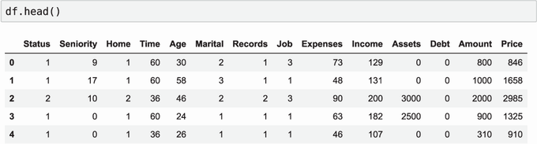


First,
we can see that all the column names start with a capital letter. Before
doing anything else, let's lowercase all the column names and make it
consistent with other projects (figure 6.2):


``` 
df.columns = df.columns.str.lower()
```


##### Figure 6.2 The DataFrame with lowercase column names

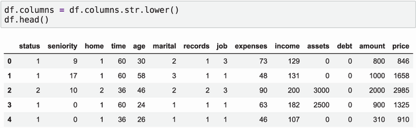


We
can see that the DataFrame has the following
columns:


-   [status:
    whether the customer managed to pay back the loan (1) or
    not (2)]
-   [seniority:
    job experience in years]
-   [home:
    type of homeownership: renting (1), a homeowner (2), and
    others]
-   [time:
    period planned for the loan (in months)]
-   [age:
    age of the client]
-   [marital
    \[status\]: single (1), married (2), and others]
-   [records:
    whether the client has any previous records: no (1), yes (2) (It's
    not clear from the dataset description what kind of records we have
    in this column. For the purposes of this project, we may assume that
    it's about records in the bank's database.)]
-   [job:
    type of job: full-time (1), part-time (2), and others]
-   [expenses:
    how much the client spends per month]
-   [income:
    how much the client earns per month]
-   [assets:
    total worth of all the assets of the client]
-   [debt:
    amount of credit debt]
-   [amount:
    requested amount of the loan]
-   [price:
    price of an item the client wants to buy]


Although
most of the columns are numerical, some are categorical: status, home,
marital \[status\], records, and job. The values we see in the
DataFrame, however, are numbers, not strings. This means that we need to
translate them to their actual names. In the GitHub repository with the
dataset is a script that decodes the numbers to categories
([https://github.com/gastonstat/CreditScoring/blob/master/Part1\_CredScoring\_
Processing.R](https://github.com/gastonstat/CreditScoring/blob/master/Part1_CredScoring_Processing.R)).
Originally, this script was written in R, so we need to translate it to
Pandas.


We
start with the status column. The value "1" means "OK," the value "2"
means "default," and "0" means that the value is missing---let's replace
it with "unk" (short for "unknown").


In
Pandas, we can use
[map]
for converting the numbers to strings. For that, we first define the
dictionary with mapping from the current value (number) to the desired
value (string):


``` 
status_values = {
    1: 'ok',
    2: 'default',
    0: 'unk'
}
```


Now
we can use this dictionary to do the mapping:


``` 
df.status = df.status.map(status_values)
```


It
creates a new series, which we immediately write back to the DataFrame.
As a result, the values in the status column are overwritten and look
more meaningful (figure 6.3).


#####  method.

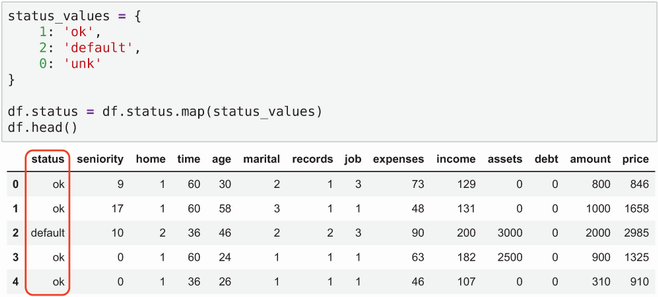


We
repeat the same procedure for all the other columns. First, we'll do it
for the home column:


``` 
home_values = {
    1: 'rent',
    2: 'owner',
    3: 'private',
    4: 'ignore',
    5: 'parents',
    6: 'other',
    0: 'unk'
}
 
df.home = df.home.map(home_values)
```


Next,
let's do it for the marital, records, and job columns:


``` 
marital_values = {
    1: 'single',
    2: 'married',
    3: 'widow',
    4: 'separated',
    5: 'divorced',
    0: 'unk'
}
 
df.marital = df.marital.map(marital_values)
 
 
records_values = {
    1: 'no',
    2: 'yes',
    0: 'unk'
}
 
df.records = df.records.map(records_values)
 
 
job_values = {
    1: 'fixed',
    2: 'parttime',
    3: 'freelance',
    4: 'others',
    0: 'unk'
}
 
df.job = df.job.map(job_values)
```


After
these transformations, the columns with categorical variables contain
the actual values, not numbers (figure 6.4).


##### Figure 6.4 The values of categorical variables are translated from integers to strings.

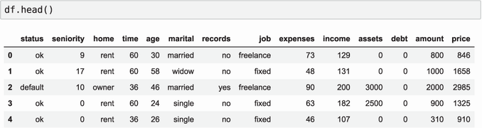


As
the next step, let's take a look at numerical columns. First, let's
check the summary statistics for each of the columns: min, mean, max,
and others. To do so, we can use the [describe]
method
of the DataFrame:


``` 
df.describe().round()
```


##### Note


The output of `describe` may be confusing. In our case, there are values
in scientific notation like 1.000000e+08 or 8.703625e+06. To force
Pandas to use a different notation, we use
`round`:
it removes the fractional part of a number and rounds it to the closest
integer.


It
gives us an idea of how the distribution of the values in each column
looks (figure 6.5).


##### Figure 6.5 The summary of all numerical columns of the dataframe. We notice that some of them have 99999999 as the max value.

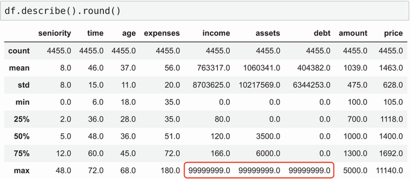


One
thing we notice immediately is that the max value is [99999999] in
some cases. This is quite suspicious. As it turns out, it's an
artificial value---this is how missing values are encoded in this
dataset.


Three
columns have this problem: income, assets, and debt. Let's replace this
big number with NaN for these columns:


``` 
for c in ['income', 'assets', 'debt']:
    df[c] = df[c].replace(to_replace=99999999, value=np.nan)
```


We
use the [replace]
method,
which takes two values:


-   [
    the original value ("99999999," in our case)]
-   [
    the target value ("NaN," in our case)]


After
this transformation, no more suspicious numbers appear in the summary
(figure 6.6).


##### Figure 6.6 The summary statistics after replacing large values with NaN

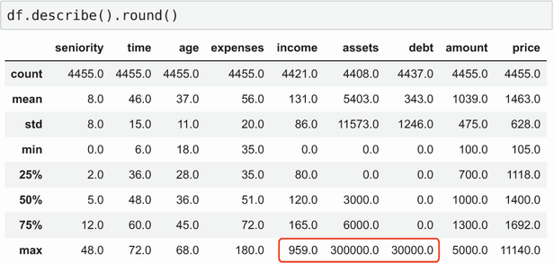


Before
we finish with the dataset preparation, let's look at our target
variable
[status]:


``` 
df.status.value_counts()
```


The
output of
[value\_counts]
shows the count of each value:


``` 
ok         3200
default    1254
unk           1
Name: status, dtype: int64
```


Notice
that there's one row with "unknown" status: we don't know whether or not
this client managed to pay back the loan. For our project, this row is
not useful, so let's remove it from the dataset:


``` 
df = df[df.status != 'unk']
```


In
this case, we don't really "remove" it: we create a new DataFrame where
we don't have records with "unknown" status.


By
looking at the data, we have identified a few important issues in the
data and addressed them.


For
this project, we skip a more detailed exploratory data analysis like we
did for lab 2 (the car-price prediction project) and lab 3
(churn prediction project), but you're free to repeat the steps we
covered there for this project as
well.


### 6.1.3 Dataset preparation


Now
our
dataset is cleaned, and we're almost ready to use it for model training.
Before we can do that, we need to do a few more steps:


-   [Split
    the dataset into train, validation, and test.]
-   [Handle
    missing values.]
-   [Use
    one-hot encoding to encode categorical variables.]
-   [Create
    the feature matrix *X* and the target variable *y* .]


Let's
start by splitting the data. We will split the data into three parts:


-   [Training
    data (60% of the original dataset)]
-   [Validation
    data (20%)]
-   [Test
    data (20%)]


Like
previously, we'll use
[train\_test\_split]
from Scikit-learn for that. Because we cannot split it into three
datasets at once, we'll need to split two times (figure 6.7). First
we'll hold out 20% of data for testing, and then split the remaining 80%
into training and validation:


``` 
from sklearn.model_selection import train_test_split
 
df_train_full, df_test = train_test_split(df, test_size=0.2, random_state=11)
df_train, df_val = train_test_split(df_train_full, test_size=0.25, random_state=11)
```


#####  can split a dataset into only two parts, but we need three, we perform the split two times.

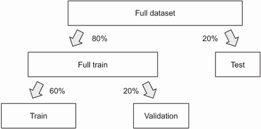


When
splitting for the second time, we put aside 25% of data instead of 20%
([test\_] [size=0.25]). Because
[df\_train\_full]
contains 80% of records, one-quarter (i.e., 25%) of 80% corresponds to
20% of the original dataset.


To
check the size of our datasets, we can use the [len]
function:


``` 
len(df_train), len(df_val), len(df_test)
```


When
running it, we get the following output:


``` 
(2672, 891, 891)
```


So,
for training, we will use approximately 2,700 examples and almost 900
for validation and testing.


The
outcome we want to predict is [status]. We will use it to train a
model, so it's our *y*---the target variable. Because our objective is
to determine if somebody fails to pay back their loan, the positive
class is [default]. This means that *y* is "1" if the client
defaulted and "0" otherwise. It's quite simple to implement:


``` 
y_train = (df_train.status == 'default').values
y_val = (df_val.status == 'default').values
```


Now
we need to remove [status] from the DataFrames. If we don't do it,
we may accidentally use this variable for training. For that, we use the
[del]
operator:


``` 
del df_train['status']
del df_val['status']
```


Next,
we'll take care of *X*---the feature matrix.


From
the initial analysis, we know our data contains missing values---we
added these NaNs ourselves. We can replace the missing values with
zero:


``` 
df_train = df_train.fillna(0)
df_val = df_val.fillna(0)
```


To
use categorical variables, we need to encode them. In lab 3, we
applied the one-hot encoding technique for that. In one-hot encoding,
each value is encoded as "1" if it's present ("hot") or "0" if it's
absent ("cold"). To implement it, we used
[DictVectorizer]
from Scikit-learn.


needs a list of dictionaries, so we first need to convert the DataFrames
into this format:


``` 
dict_train = df_train.to_dict(orient='records')
dict_val = df_val.to_dict(orient='records')
```


Each
dictionary in the result represents a row from the DataFrame. For
example, the first record in
[dict\_train]
looks like this:


``` 
{'seniority': 10,
 'home': 'owner',
 'time': 36,
 'age': 36,
 'marital': 'married',
 'records': 'no',
 'job': 'freelance',
 'expenses': 75,
 'income': 0.0,
 'assets': 10000.0,
 'debt': 0.0,
 'amount': 1000,
 'price': 1400}
```


This
list of dictionaries now can be used as input to [DictVectorizer]:


``` 
from sklearn.feature_extraction import DictVectorizer
 
dv = DictVectorizer(sparse=False)
 
X_train = dv.fit_transform(dict_train)
X_val = dv.transform(dict_val)
```


As
a result, we have feature matrices for both train and validation
datasets. Please refer to lab 3 for more details on doing one-hot
encoding with Scikit-learn.


Now
we\'re ready to train a model! In the next section, we cover the
simplest tree model:
decision
tree.


6.2 Decision trees
------------------------------------------------------------------------------------------------------------


A
*decision
tree* is a data structure that encodes a series of if-then-else rules.
Each node in a tree contains a condition. If the condition is satisfied,
we go to the right side of the tree; otherwise, we go to the left. In
the end we arrive at the final decision (figure 6.8).


##### Figure 6.8 A decision tree consists of nodes with conditions. If the condition in a node is satisfied, we go right; otherwise, we go left.

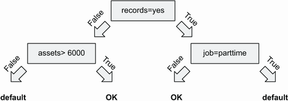


It's
quite easy to represent a decision tree as a set of [if-else]
statements
in Python. For example:


``` 
def assess_risk(client):
    if client['records'] == 'yes':
        if client['job'] == 'parttime':
            return 'default'
        else:
            return 'ok'
    else:
        if client['assets'] > 6000:
            return 'ok'
        else:
            return 'default'
```


With
machine learning, we can extract these rules from data automatically.
Let's see how we can do it.


### 6.2.1 Decision tree classifier


We'll
use
Scikit-learn for training a decision tree. Because we're solving a
classification problem, we need to use
[DecisionTreeClassifier]
from the [tree]
package.
Let's import it:


``` 
from sklearn.tree import DecisionTreeClassifier
```


Training
the model is as simple as invoking the [fit] method:


``` 
dt = DecisionTreeClassifier()
dt.fit(X_train, y_train)
```


To
check if the result is good, we need to evaluate the predictive
performance of the model on the validation set. Let's use AUC (area
under the ROC curve) for that.


Credit
risk scoring is a binary classification problem, and for cases like
that, AUC is one of the best evaluation metrics. As you may recall from
our discussion in lab 4, AUC shows how well a model separates
positive examples from negative examples. It has a nice interpretation:
it describes the probability that a randomly chosen positive example
("default") has a higher score than a randomly chosen negative example
("OK"). This is a relevant metric for the project: we want risky clients
to have higher scores than nonrisky ones. For more details on AUC, refer
to lab
4.


Like
previously, we'll use an implementation from Scikit-learn, so let's
import it:


``` 
from sklearn.metrics import roc_auc_score
```


First,
we evaluate the performance on the training set. Because we chose AUC as
the evaluation metric, we need scores, not hard predictions. As we know
from lab 3, we need to use the [predict\_proba]
method
for that:


``` 
y_pred = dt.predict_proba(X_train)[:, 1]
roc_auc_score(y_train, y_pred)
```


When
we execute it, we see that the score is 100%---the perfect score. Does
it mean that we can predict default without errors? Let's check the
score on validation before jumping to conclusions:


``` 
y_pred = dt.predict_proba(X_val)[:, 1]
roc_auc_score(y_val, y_pred)
```


After
running, we see that AUC on validation is only 65%.


We
just observed a case of
*overfitting*.
The tree learned the training data so well that it simply memorized the
outcome for each customer. However, when we applied it to the validation
set, the model failed. The rules it extracted from the data turned out
to be too specific to the training set, so it worked poorly for
customers it didn't see during training. In such cases, we say that the
model cannot *generalize*.


Overfitting
happens when we have a complex model with enough power to remember all
the training data. If we force the model to be simpler, we can make it
less powerful and improve the model's ability to generalize.


We
have multiple ways to control the complexity of a tree. One option is to
restrict its size: we can specify the [max\_depth]
parameter,
which controls the maximum number of levels. The more levels a tree has,
the more complex rules it can learn (figure 6.9).


##### Figure 6.9 A tree with more levels can learn more complex rules. A tree with two levels is less complex than a tree with three levels and, thus, less prone to overfitting.

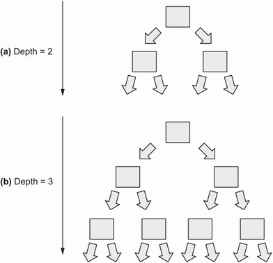


The
default value for the [max\_depth] parameter is [None],
which means that the tree can grow as large as possible. We can try a
smaller value and compare the
results.


For
example, we can change it to 2:


``` 
dt = DecisionTreeClassifier(max_depth=2)
dt.fit(X_train, y_train)
```


To
visualize the tree we just learned, we can use the [export\_text]
function
from the [tree] package:


``` 
from sklearn.tree import export_text 
 
tree_text = export_text(dt, feature_names=dv.feature_names_)
print(tree_text)
```


We
only need to specify the names of features using the
[feature\_names]
parameter.
We can get it from the [DictVectorizer]. When we print it, we get
the following:


``` 
|--- records=no <= 0.50
|   |--- seniority <= 6.50
|   |   |--- class: True
|   |--- seniority >  6.50
|   |   |--- class: False
|--- records=no >  0.50
|   |--- job=parttime <= 0.50
|   |   |--- class: False
|   |--- job=parttime >  0.50
|   |   |--- class: True
```


Each
line in the output corresponds to a node with a condition. If the
condition is true, we go inside and repeat the process until we arrive
at the final decision. At the end, if class is [True], then the
decision is "default," and otherwise it's "OK."


The
condition [records=no] [\>] [0.50] means that a
customer has no records. Recall that we use one-hot encoding to
represent [records] with two features: [records=yes] and
[records=no]. For a customer with no records, [records=no]
is set to "1" and [records=yes] to "0." Thus, "[records=no]
[\>] [0.50] is true when the value for [records] is
[no] (figure 6.10).


#####  set to 2

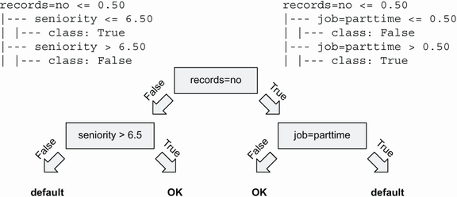


Let's
check the score:


``` 
y_pred = dt.predict_proba(X_train)[:, 1]
auc = roc_auc_score(y_train, y_pred)
print('train auc', auc)
 
y_pred = dt.predict_proba(X_val)[:, 1]
auc = roc_auc_score(y_val, y_pred)
print('validation auc', auc)
```


We
see that the score on train dropped:


``` 
train auc: 0.705
val auc: 0.669
```


Previously,
the performance on the training set was 100%, but now it's only 70.5%.
It means that the model can no longer memorize all the outcomes from the
training set.


However,
the score on the validation set is better: it's 66.9%, which is an
improvement over the previous result (65%). By making it less complex,
we improved the ability of our model to generalize. Now it's better at
predicting the outcomes for customers it hasn't seen previously.


However,
this tree has another problem---it's too simple. To make it better, we
need to tune the model: try different parameters, and see which ones
lead to the best AUC. In addition to [max\_depth], we can control
other parameters. To understand what these parameters mean and how they
influence the model, let's take a step back and look at how decision
trees learn rules from
data.


### 6.2.2 Decision tree learning algorithm


To
understand
how a decision tree learns from data, let's simplify the problem. First,
we'll use a much smaller dataset with just one feature:
[assets]
(figure 6.11).


##### .

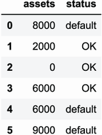


Second,
we'll grow a very small tree, with a single node.


The
only feature we have in the dataset is [assets]. This is why the
condition in the node will be [assets] [\>] [T], where
*T* is a threshold value that we need to determine. If the condition is
true, we'll predict "OK," and if it's false, our prediction will be
"default" (figure 6.12).


##### . We need to find the best value for *T*.

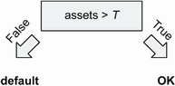


The
condition [assets] [\>] [T] is called a *split*. It
splits the dataset into two groups: the data points that satisfy the
condition and the data points that do not.


If
[T] is 4000, then we have customers with more than \$4,000 in
assets (on the right) and the customers with less than \$4,000 in assets
(on the left) (figure 6.13).


##### Figure 6.13 The condition in a node splits the dataset into two parts: data points that satisfy the condition (on the right) and data points that don't (on the left).

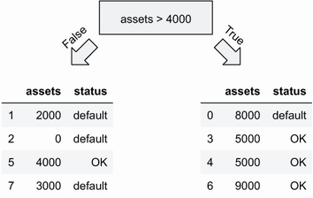


Now
we turn these groups into *leaves*---the decision nodes---by taking the
most frequent status in each group and using it as the final decision.
In our example, "default" is the most frequent outcome in the left group
and "OK" in the right (figure 6.14).


##### Figure 6.14 The most frequent outcome on the left is "default." For the group on the right, it's "OK."

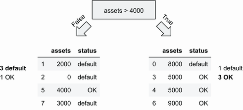


Thus,
if a customer has more than \$4,000 in assets, our decision is "OK,"
and, otherwise, it's "default" [assets] [\>] [4000]
(figure 6.15).


##### Figure 6.15 By taking the most frequent outcome in each group and assigning it to leaves, we get the final decision tree


Impurity


These
groups
should be as homogeneous as possible. Ideally, each group should contain
only observations of one class. In this case, we call these groups
*pure*.


For
example, if we have a group of four customers with outcomes \["default,"
"default," "default," "default"\], it's pure: it contains only customers
who defaulted. But a group \["default," "default," "default," "OK"\] is
impure: there's one customer who didn't default.


When
training a decision tree model, we want to find such *T* that the
*impurity* of both groups is minimal.


So,
the algorithm for finding *T* is quite simple:


-   [Try
    all possible values of *T.*]
-   [For
    each *T*, split the dataset into left and right groups and measure
    their impurity.]
-   [Select
    *T* that has the lowest degree of impurity.]


We
can use different criteria for measuring impurity. The easiest one to
understand is the *misclassification rate*, which says how many
observations in a group don't belong to the majority class.


##### Note


Scikit-learn uses more advanced split criteria such as entropy and the
Gini impurity. We do not cover them in this course, but the idea is the
same: they measure the degree of impurity of the split.


##### , the misclassification rate for both groups is one-quarter.

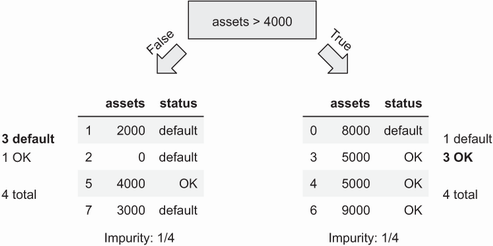


Let's
calculate the misclassification rate for the split *T* = 4000 (figure
6.16):


-   [For
    the left group, the majority class is "default." There are four data
    points in total, and one doesn't belong to "default." The
    misclassification rate is 25% (1/4).]
-   [For
    the right group, "OK" is the majority class, and there's one
    "default." Thus, the misclassification rate is also 25%
    (1/4).]
-   [To
    calculate the overall impurity of the split, we can take the average
    across both groups. In this case, the average is 25%.]


##### Note


In reality, instead of taking the simple average across both groups, we
take a weighted average---we weight each group proportionally to its
size. To simplify calculations, we use the simple average in this
lab.


*T*
= 4000 is not the only possible split for [assets]. Let's try
other values for *T* such as 2000, 3000, and 5000 (figure 6.17):


-   [For
    *T* = 2000, we have 0% impurity on the left (0/2, all are "default")
    and 33.3% impurity on the right (2/6, 2 out of 6 are "default," the
    rest are "OK"). The average is 16.6%.]
-   [For
    *T* = 3000, 0% on the left and 20% (1/5) on the right. The average
    is 10%.]
-   [For
    *T* = 5000, 50% (3/6) on the left and 50% (1/2) on the right. The
    average is 50%.]


##### , we can try other values of *T*, such as 2000, 3000, and 5000.

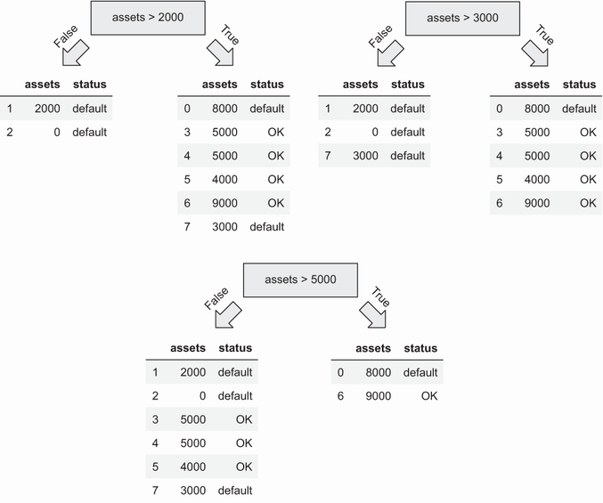


The
best average impurity is 10% for *T* = 3000: we got zero mistakes for
the left tree and only one (out of five rows) for the right. So, we
should select 3000 as the threshold for our final model (figure
6.18.


##### .

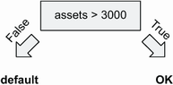


Selecting
the best feature for splitting


Now
let's make the problem a bit more complex and add another feature to the
dataset:
[debt]
(figure 6.19).


##### .

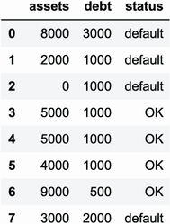


Previously
we had only one feature: [assets]. We knew for sure that it would
be used for splitting the data. Now we have two features, so in addition
to selecting the best threshold for splitting, we need to figure out
which feature to use.


The
solution is simple: we try all the features, and for each feature select
the best threshold.


Let's
modify the training algorithm to include this change:


-   [For
    each feature, try all possible thresholds.]
-   [For
    each threshold value *T*, measure the impurity of the split.]
-   [Select
    the feature and the threshold with the lowest impurity
    possible.]


Let's
apply this algorithm to our dataset:


-   [We
    already identified that for [assets], the best *T* is 3000.
    The average impurity of this split is 10%.]
-   [For
    [debt], the best *T* is 1000. In this case, the average
    impurity is 17%.]


So,
the best split is [asset] [\>] [3000] (figure
6.20).


##### , which has the average impurity of 10%.

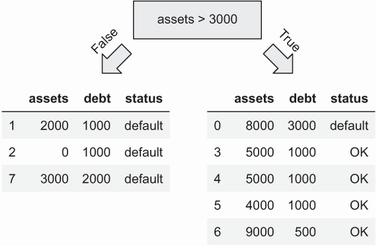


The
group on the left is already pure, but the group on the right is not. We
can make it less impure by repeating the process: split it
again!


When
we apply the same algorithm to the dataset on the right, we find that
the best split condition is [debt] [\>] [1000]. We
have two levels in the tree now---or we can say that the depth of this
tree is 2 (figure 6.21).


##### Figure 6.21 By repeating the algorithm recursively to the group on the right, we get a tree with two levels.

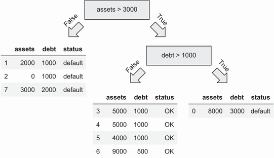


Before
the decision tree is ready, we need to do the last step: convert the
groups into decision nodes. For that, we take the most frequent status
in each group. This way, we get a decision tree
(figure
6.22).


##### Figure 6.22 The groups are already pure, so the most frequent status is the only status each group has. We take this status as the final decision in each leaf.

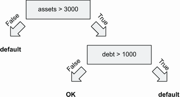


Stopping
criteria


When
training
a decision tree, we can keep splitting the data until all the groups are
pure. This is exactly what happens when we don't put any restrictions on
the trees in Scikit-learn. As we've seen, the resulting model becomes
too complex, which leads to overfitting.


We
solved this problem by using the [max\_depth] parameter---we
restricted the tree size and didn't let it grow too big.


To
decide if we want to continue splitting the data, we use *stopping
criteria*---criteria that describe if we should add another split in the
tree or
stop.


The
most common stopping criteria are


- [The group is already pure.]
- [The tree reached the depth limit (controlled by the [max\_depth]
    parameter).]
- [The group is too small to continue splitting (controlled by the
    [min\_samples\_ leaf] parameter).]


By
using these criteria to stop earlier, we force our model to be less
complex and, therefore, reduce the risk of overfitting.


Let's
use this information to adjust the training algorithm:


-   [Find
    the best split:]
    -   For
        each feature try all possible threshold values.
    -   Use
        the one with the lowest impurity.
-   [If
    the maximum allowed depth is reached, stop.]
-   [If
    the group on the left is sufficiently large and it's not pure yet,
    repeat on the left.]
-   [If
    the group on the right is sufficiently large and it's not pure yet,
    repeat on the right.]


Even
though this is a simplified version of the decision tree learning
algorithm, it should provide you enough intuition about the internals of
the learning process.


Most
important, we know two parameters control the complexity of the model.
By changing these parameters, we can improve the performance of the
model.


##### Exercise 6.1


We
have a dataset with 10 features and need to add another feature to this
dataset. What happens with the speed
of
training?


a)
With one more feature, training takes longer.


b)
The number of features does not affect the speed of training.


### 6.2.3 Parameter tuning for decision tree


The
process
of finding the best set of parameters is called *parameter tuning*. We
usually do it by changing the model and checking its score on the
validation dataset. In the end, we use the model with the best
validation score.


As
we have just learned, we can tune two parameters:


-   [
-   [


These
two are the most important ones, so we will adjust only them. You can
check the other parameters in the official documentation
([https://scikit-learn.org/stable/
modules/generated/sklearn.tree.DecisionTreeClassifier.html](https://scikit-learn.org/stable/modules/generated/sklearn.tree.DecisionTreeClassifier.html)).


When
we trained our model previously, we restricted the depth of the tree to
2, but we didn't touch
[min\_leaf\_size].
With this, we got an AUC of 66% on the validation set.


Let's
find the best parameters.


We
start by tuning max\_depth. For that, we iterate over a few reasonable
values and see what works best:


``` 
for depth in [1, 2, 3, 4, 5, 6, 10, 15, 20, None]:
    dt = DecisionTreeClassifier(max_depth=depth)
    dt.fit(X_train, y_train)
    y_pred = dt.predict_proba(X_val)[:, 1]
    auc = roc_auc_score(y_val, y_pred)
    print('%4s -> %.3f' % (depth, auc))
```


The
value [None] means that there's no restriction on depth, so the
tree will grow as large as it can.


When
we run this code, we see that [max\_depth] of 5 gives the best AUC
(76.6%), followed by 4 and 6 (figure 6.23).


##### Figure 6.23 The optimal value for depth is 5 (76.6%) followed by 4 (76.1%) and 6 (75.4%).

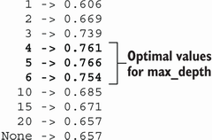


Next,
we tune [min\_leaf\_size]. For that, we iterate over the three
best parameters of [max\_depth], and for each, go over different
values of [min\_leaf\_size]:


``` 
for m in [4, 5, 6]:
    print('depth: %s' % m)
 
    for s in [1, 5, 10, 15, 20, 50, 100, 200]:
        dt = DecisionTreeClassifier(max_depth=m, min_samples_leaf=s)
        dt.fit(X_train, y_train)
        y_pred = dt.predict_proba(X_val)[:, 1]
        auc = roc_auc_score(y_val, y_pred)
        print('%s -> %.3f' % (s, auc))
   
    print()
```


After
running it, we see that the best AUC is 78.5% with parameters
[min\_sample\_ leaf=15] and [max\_depth=6] (table 6.1).


##### Note


As we see, the value we use for `min_leaf_size` influences the best
value of `max_depth`. You can experiment with a wider range of values
for `max_depth` to tweak the performance further.


#####  (columns) [(view table figure)](https://drek4537l1klr.cloudfront.net/grigorev/HighResolutionFigures/table_6-1.png)

  depth=6
  ----------------------------------------------------------------------------------------------- --------------------------------------------------------------------------------------------------- --------------------------------------------------------------------------------------------------- -----------------------------------------------------------------------------------------------------
  0.754
  0.760
  0.778
  **0.785**
  0.774
  0.770
  0.776
  0.768


We
have found the best parameters, so let's use them to train the final
model:


``` 
dt = DecisionTreeClassifier(max_depth=6, min_samples_leaf=15)
dt.fit(X_train, y_train)
```


Decision
trees are simple and effective models, but they become even more
powerful when we combine many trees together. Next, we'll see how we can
do it to achieve even better
predictive
.


6.3 Random forest
-----------------------------------------------------------------------------------------------------------


For
a
moment, let's suppose that we don't have a machine learning algorithm to
help us with credit risk scoring. Instead, we have a group of experts.


Each
expert can independently decide if we should approve a loan application
or reject it. An individual expert may make a mistake. However, it's
less likely that all the experts together decide to accept the
application, but the customer fails to pay the money back.


Thus,
we can ask all the experts independently and then combine their verdicts
into the final decision, for example, by using the majority vote (figure
6.24).


##### Figure 6.24 A group of experts can make a decision better than a single expert individually.

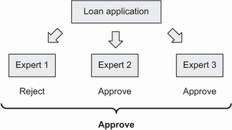


This
idea also applies to machine learning. One model individually may be
wrong, but if we combine the output of multiple models into one, the
chance of an incorrect answer is smaller. This concept is called
*ensemble learning*, and a combination of models is called an
*ensemble*.


For
this to work, the models need to be different. If we train the same
decision tree model 10 times, they will all predict the same output, so
it's not useful at all.


The
easiest way to have different models is to train each tree on a
different subset of features. For example, suppose we have three
features: [assets], [debts], and [price]. We can train
three models:


- [The first will use [assets] and [debts].]
- [The second will use [debts] and [price].]
- [The last one will use [assets] and [price].]


With
this approach, we'll have different trees, each making its own decisions
(figure 6.25). But when we put their predictions together, their
mistakes average out, and combined, they have more predictive power.


##### Figure 6.25 Models we want to combine in an ensemble should not be the same. We can make sure they are different by training each tree on a different subset of features.

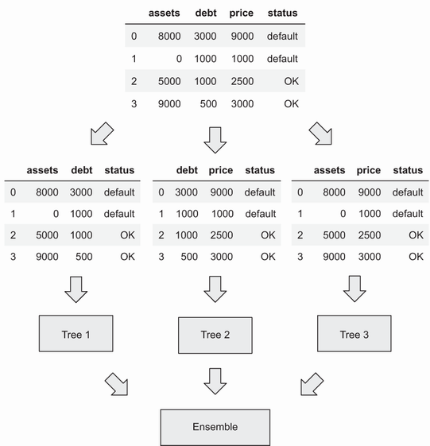


This
way of putting together multiple decision trees into an ensemble is
called a *random forest*. To train a random forest, we can do this
(figure 6.26):


-   [Train
    *N* independent decision tree models.]
-   [For
    each model, select a random subset of features, and use only them
    for training.]
-   [When
    predicting, combine the output of *N* models into one.]


##### Note


This is a very simplified version of the algorithm. It's enough to
illustrate the main idea, but in reality, it's more complex.


##### Figure 6.26 Training a random forest model: for training each tree, randomly select a subset of features. When making the final prediction, combine all the predictions into one.

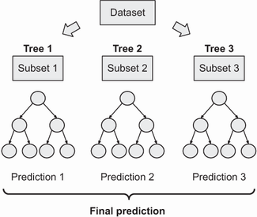


Scikit-learn
contains an implementation of a random forest, so we can use it for
solving our problem. Let's do it.


### 6.3.1 Training a random forest


To
use
random forest in Scikit-learn, we need to import
[RandomForestClassifier]
from the [ensemble]
package:


``` 
from sklearn.ensemble import RandomForestClassifier
```


When
training a model, the first thing we need to specify is the number of
trees we want to have in the ensemble. We do it with the
[n\_estimators]
parameter:


``` 
rf = RandomForestClassifier(n_estimators=10)
rf.fit(X_train, y_train)
```


After
training finishes, we can evaluate the performance of the result:


``` 
y_pred = rf.predict_proba(X_val)[:, 1]
roc_auc_score(y_val, y_pred)
```


It
shows 77.9%. However, the number you see may be different. Every time we
retrain the model, the score changes: it varies from 77% to 80%.


The
reason for this is randomization: to train a tree, we randomly select a
subset of features. To make the results consistent, we need to fix the
seed for the random-number generator by assigning some value to the
[random\_state]
parameter:


``` 
rf = RandomForestClassifier(n_estimators=10, random_state=3)
rf.fit(X_train, y_train)
```


Now
we can evaluate it:


``` 
y_pred = rf.predict_proba(X_val)[:, 1]
roc_auc_score(y_val, y_pred)
```


This
time, we get an AUC of 78%. This score doesn't change, no matter how
many times we retrain the model.


The
number of trees in the ensemble is an important parameter, and it
influences the performance of the model. Usually, a model with more
trees is better than a model with fewer trees. On the other hand, adding
too many trees is not always helpful.


To
see how many trees we need, we can iterate over different values for
[n\_estimators] and see its effect on AUC:


``` 
aucs = []
 
for i in range(10, 201, 10):
    rf = RandomForestClassifier(n_estimators=i, random_state=3)
    rf.fit(X_train, y_train)
 
    y_pred = rf.predict_proba(X_val)[:, 1]
    auc = roc_auc_score(y_val, y_pred)
    print('%s -> %.3f' % (i, auc))
 
    aucs.append(auc)
```


In
this code, we try different numbers of trees: from 10 to 200, going by
steps of 10 (10, 20, 30, \...). Each time we train a model, we calculate
its AUC on the validation set and record it.


After
we finish, we can plot the results:


``` 
plt.plot(range(10, 201, 10), aucs)
```


In
figure 6.27, we can see the results.


#####  parameter

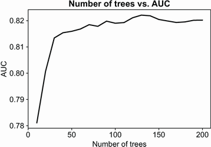


The
performance grows rapidly for the first 25--30 trees; then the growth
slows down. After 130, adding more trees is not helpful anymore: the
performance stays approximately at the level of 82%.


The
number of trees is not the only parameter we can change to get better
performance. Next, we see which other parameters we should also tune to
improve the
model.


### 6.3.2 Parameter tuning for random forest


A
random
forest ensemble consists of multiple decision trees, so the most
important parameters we need to tune for random forest are the same:


-   [
-   [


We
can change other parameters, but we won't cover them in detail in this
lab. Refer to the official documentation for more information
([https://scikit-learn.org/
stable/modules/generated/sklearn.ensemble.RandomForestClassifier.html](https://scikit-learn.org/stable/modules/generated/sklearn.ensemble.RandomForestClassifier.html)).


Let's
start with [max\_depth]. We already know that this parameter
significantly affects the performance of a decision tree. This is also
the case for random forest: larger trees tend to overfit more than
smaller trees.


Let's
test a few values for [max\_depth] and see how AUC evolves as the
number of trees grows:


``` 
all_aucs = {}
 
for depth in [5, 10, 20]:
    print('depth: %s' % depth)
    aucs = []
 
    for i in range(10, 201, 10):
        rf = RandomForestClassifier(n_estimators=i,
              max_depth=depth, random_state=1)
        rf.fit(X_train, y_train)
        y_pred = rf.predict_proba(X_val)[:, 1]
        auc = roc_auc_score(y_val, y_pred)
        print('%s -> %.3f' % (i, auc))
        aucs.append(auc)
   
    all_aucs[depth] = aucs
    print()
```


Now
for each value of [max\_depth], we have a series of AUC scores. We
can plot them now:


``` 
num_trees = list(range(10, 201, 10))
plt.plot(num_trees, all_aucs[5], label='depth=5')
plt.plot(num_trees, all_aucs[10], label='depth=10')
plt.plot(num_trees, all_aucs[20], label='depth=20')
plt.legend()
```


In
figure 6.28 we see the result.


#####  parameter

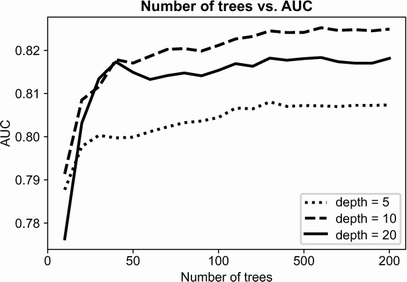


With
[max\_depth=10], AUC goes over 82%, whereas for other values it
performs worse.


Now
let's tune [min\_samples\_leaf]. We set the value for the
[max\_depth] parameter from the previous step and then follow the
same approach as previously for determining the best value for
[min\_samples\_leaf]:


``` 
all_aucs = {}
 
for m in [3, 5, 10]:
    print('min_samples_leaf: %s' % m)
    aucs = []
 
    for i in range(10, 201, 20):
        rf = RandomForestClassifier(n_estimators=i, max_depth=10, min_samples_leaf=m, random_state=1)
        rf.fit(X_train, y_train)
        y_pred = rf.predict_proba(X_val)[:, 1]
        auc = roc_auc_score(y_val, y_pred)
        print('%s -> %.3f' % (i, auc))
        aucs.append(auc)
   
    all_aucs[m] = aucs
    print()
```


Let's
plot it:


``` 
num_trees = list(range(10, 201, 20))
plt.plot(num_trees, all_aucs[3], label='min_samples_leaf=3')
plt.plot(num_trees, all_aucs[5], label='min_samples_leaf=5')
plt.plot(num_trees, all_aucs[10], label='min_samples_leaf=10')
plt.legend()
```


Then
review the results (figure 6.29).


##### )

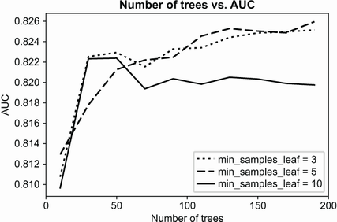


We
see that AUC is slightly better for small values of
[min\_samples\_leaf] and the best value is 5.


Thus,
the best parameters for random forest for our problem are


-   [
-   [


We
achieved the best AUC with 200 trees, so we should set the
[n\_estimators] parameter to 200.


Let's
train the final model:


``` 
rf = RandomForestClassifier(n_estimators=200, max_depth=10, min_samples_leaf=5, random_state=1)
```


Random
forest is not the only way to combine multiple decision trees. There's a
different approach: gradient boosting. We cover that next.


##### Exercise 6.2


To
make an ensemble useful, trees in a random forest should be different
from each other. This is done by


a)
Selecting different parameters for each individual tree


b)
Randomly selecting a different subset of features for each tree


c)
Randomly selecting values
for
splitting


6.4 Gradient boosting
---------------------------------------------------------------------------------------------------------------


In
a
random forest, each tree is independent: it's trained on a different set
of features. After individual trees are trained, we combine all their
decisions together to get the final decision.


It's
not the only way to combine multiple models together in one ensemble,
however. Alternatively, we can train models sequentially---each next
model tries to fix errors from the previous one:


-   [Train
    the first model.]
-   [Look
    at the errors it makes.]
-   [Train
    another model that fixes these errors.]
-   [Look
    at the errors again; repeat sequentially.]


This
way of combining models is called *boosting*. *Gradient boosting* is a
particular variation of this approach that works especially well with
trees (figure 6.30).


##### Figure 6.30 In gradient boosting, we train the models sequentially, and each next tree fixes the errors of the previous one.

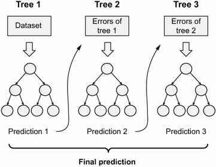


Let's
have a look at how we can use it for solving our problem.


### 6.4.1 XGBoost: Extreme gradient boosting


We
have
many good implementations of the gradient boosting model:
[GradientBoostingClassifier]
from Scikit-learn, XGBoost, LightGBM and CatBoost. In this lab, we
use XGBoost (short for "Extreme Gradient Boosting"), which is the most
popular implementation.


XGBoost
doesn't come with Anaconda, so to use it, we need to install it. The
easiest way is to install it with [pip]:


``` 
pip install xgboost
```


Next,
open the notebook with our project and import it:


``` 
import xgboost as xgb
```


##### Note


In some cases, importing XGBoost may give you a warning like
`YMLLoadWarning`.
You shouldn't worry about it; the library will work without problems.


Using
the alias [xgb] when importing XGBoost is a convention, just like
with other popular machine learning packages in Python.


Before
we can train an XGBoost model, we need to wrap our data into
[DMatrix]---a
special data structure for finding splits efficiently. Let's do it:


``` 
dtrain = xgb.DMatrix(X_train, label=y_train, feature_names=dv.feature_names_)
```


When
creating an instance of [DMatrix], we pass three parameters:


-   [:
    the feature matrix]
-   [:
    the target variable]
-   [:
    the names of features in [X\_train]]


Let's
do the same for the validation dataset:


``` 
dval = xgb.DMatrix(X_val, label=y_val, feature_names=dv.feature_names_)
```


The
next step is specifying the parameters for training. We're using only a
small subset of the default parameters of XGBoost (check the official
documentation for the entire list of parameter:
<https://xgboost.readthedocs.io/en/latest/parameter.html>):


``` 
xgb_params = {
    'eta': 0.3,
    'max_depth': 6,
    'min_child_weight': 1,
 
    'objective': 'binary:logistic',
    'nthread': 8,
    'seed': 1,
    'silent': 1
}
```


For
us, the most important parameter now is
[objective]:
it specifies the learning task. We're solving a binary classification
problem---that's why we need to choose [binary :logistic]. We
cover the rest of these parameters later in this
section.


For
training an XGBoost model, we use the [train]
function.
Let's start with 10 trees:


``` 
model = xgb.train(xgb_params, dtrain, num_boost_round=10)
```


We
provide three arguments to [train]:


-   [:
    the parameters for training]
-   [:
    the dataset for training (an instance of [DMatrix])]
-   [:
    the number of trees to train]


After
a few seconds, we get a model. To evaluate it, we need to make a
prediction on the validation dataset. For that, use the [predict]
method
with the validation data wrapped in [DMatrix]:


``` 
y_pred = model.predict(dval)
```


The
result, [y\_pred], is a one-dimensional NumPy array with
predictions: the risk score for each customer in the validation dataset
(figure 6.31).


##### Figure 6.31 The predictions of XGBoost

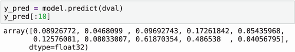


Next,
we calculate AUC using the same approach as previously:


``` 
roc_auc_score(y_val, y_pred)
```


After
executing it, we get 81.5%. This is quite a good result, but it's still
slightly worse than our best random forest model (82.5%).


Training
an XGBoost model is simpler when we can see how its performance changes
when the number of trees grows. We see how to do it
next.


### 6.4.2 Model performance monitoring


To
get
an idea of how AUC changes as the number of trees grows, we can use a
watchlist---a built-in feature in XGBoost for monitoring model
performance.


A
watchlist is a Python list with tuples. Each tuple contains a DMatrix
and its name. This is how we typically do
it:


``` 
watchlist = [(dtrain, 'train'), (dval, 'val')]
```


Additionally,
we modify the list of parameters for training: we need to specify the
metric we use for evaluation. In our case, it's the AUC:


``` 
xgb_params = {
    'eta': 0.3,
    'max_depth': 6,
    'min_child_weight': 1,
 
    'objective': 'binary:logistic',
    'eval_metric': 'auc',            #1
    'nthread': 8,
    'seed': 1,
    'silent': 1
}
```


To
use the watchlist during training, we need to specify two extra
arguments for the [train] function:


-   [:
    the watchlist.]
-   [:
    how often we print the metric. If we set it to "10," we see the
    result after each 10th step.]


Let's
train it:


``` 
model = xgb.train(xgb_params, dtrain,
                  num_boost_round=100,
                  evals=watchlist, verbose_eval=10)
```


While
training, XGBoost prints the scores to the output:


``` 
[0]  train-auc:0.862996  val-auc:0.768179
[10] train-auc:0.950021  val-auc:0.815577
[20] train-auc:0.973165  val-auc:0.817748
[30] train-auc:0.987718  val-auc:0.817875
[40] train-auc:0.994562  val-auc:0.813873
[50] train-auc:0.996881  val-auc:0.811282
[60] train-auc:0.998887  val-auc:0.808006
[70] train-auc:0.999439  val-auc:0.807316
[80] train-auc:0.999847  val-auc:0.806771
[90] train-auc:0.999915  val-auc:0.806371
[99] train-auc:0.999975  val-auc:0.805457
```


As
the number of trees grows, the score on the training set goes up (figure
6.32).


##### Figure 6.32 The effect of the number of trees on the AUC from train and validation sets. To see how to plot these values, check the notebook in the course's GitHub repository.

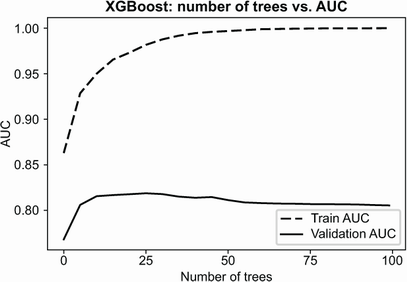


This
behavior is expected: in boosting, every next model tries to fix the
mistakes from the previous step, so the score is always
improving.


For
the validation score, however, this is not the case. It goes up
initially but then starts to decrease. This is the effect of
overfitting: our model becomes more and more complex until it simply
memorizes the entire training set. It's not helpful for predicting the
outcome for the customers outside of the training set, and the
validation score reflects that.


We
get the best AUC on the 30th iteration (81.7%), but it's not so
different from the score we got on the 10th iteration (81.5%).


Next,
we'll see how to get the best out of XGBoost by tuning its
parameters.


### 6.4.3 Parameter tuning for XGBoost


Previously,
we
used a subset of default parameters for training a model:


``` 
xgb_params = {
    'eta': 0.3,
    'max_depth': 6,
    'min_child_weight': 1,
    'objective': 'binary:logistic',
    'eval_metric': 'auc',
    'nthread': 8,
    'seed': 1,
    'silent': 1
}
```


We're
mostly interested in the first three parameters. These parameters
control the training process:


-   [:
    Learning rate. Decision trees and random forest don't have this
    parameter. We cover it later in this section when we tune it.]
-   [:
    The maximum allowed depth of each tree; the same as
    [max\_depth] in [DecisionTreeClassifier] from
    Scikit-learn.]
-   [:
    The minimal number of observations in each group; the same as
    [min\_leaf\_size] in [DecisionTreeClassifier] from
    Scikit-learn.]


Other
parameters:


-   [:
    The type of task we want to solve. For classification, it should be
    [binary:logistic].]
-   [:
    The metric we use for evaluation. For this project, it's
    "AUC."]
-   [:
    The number of threads we use for training the model. XGBoost is very
    good at parallelizing training, so set it to the number of cores
    your computer has.]
-   [:
    The seed for the random-number generator; we need to set it to make
    sure the results are
    reproducible
-   [:
    The verbosity of the output. When we set it to "1," it outputs only
    warnings.]


This
is not the full list of parameters, only the basic ones. You can learn
more about all the parameters in the official documentation
([https://xgboost.readthedocs.io/en/
latest/parameter.html](https://xgboost.readthedocs.io/en/latest/parameter.html)).


We
already know [max\_depth] and [min\_child\_weight]
([min\_leaf\_size]), but we haven\'t previously come across
[eta]---the learning rate parameter. Let's talk about it and see
how we can optimize it.


Learning
rate


In
boosting,
each tree tries to correct the mistakes from the previous iterations.
Learning rate determines the weight of this correction. If we have a
large value for [eta], the correction overweights the previous
predictions significantly. On the other hand, if the value is small,
only a small fraction of this correction is used.


In
practice it means


-   [If
    [eta] is too large, the model starts to overfit quite early
    without realizing its full potential.]
-   [If
    it's too small, we need to train too many trees before it can
    produce good results.]


The
default value of 0.3 is reasonably good for large datasets, but for
smaller datasets like ours, we should try smaller values like 0.1 or
even 0.05.


Let's
do it and see if it helps to improve the performance:


``` 
xgb_params = {
    'eta': 0.1,       #1
    'max_depth': 6,
    'min_child_weight': 1,

    'objective': 'binary:logistic',
    'eval_metric': 'auc',
    'nthread': 8,
    'seed': 1,
    'silent': 1
}
```


Because
now we can use a watchlist to monitor the performance of our model, we
can train for as many iterations as we want. Previously we used 100
iterations, but this may be not enough for smaller [eta]. So let's
use 500 rounds for
training:


``` 
model = xgb.train(xgb_params, dtrain,
                  num_boost_round=500, verbose_eval=10,
                  evals=watchlist)
```


When
running it, we see that the best validation score is 82.4%:


``` 
[60] train-auc:0.976407  val-auc:0.824456
```


Previously,
we could achieve AUC of 81.7% when [eta] was set to the default
value of 0.3. Let's compare these two models (figure 6.33).


#####  parameter on the validation score

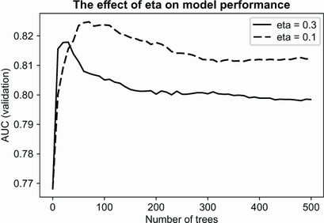


When
[eta] is 0.3, we get the best AUC pretty quickly, but then it
starts to overfit. After the 30th iteration, the performance on the
validation set goes down.


When
[eta] is 0.1, AUC grows more slowly but peaks at a higher value.
For a smaller learning rate, it takes more trees to reach the peak, but
we could achieve better performance.


For
comparison, we can also try other values of [eta] (figure 6.34):


-   [For
    0.05, the best AUC is 82.2% (after 120 iterations).]
-   [For
    0.01, the best AUC is 82.1% (after 500 iterations).]


#####  is small.

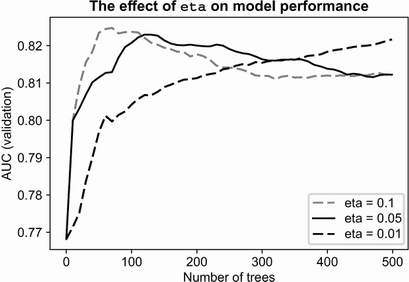


When
[eta] is 0.05, the performance is similar to 0.1, but it takes 60
more iterations to reach the peak.


For
[eta] of 0.01, it grows too slowly, and even after 500 iterations,
it hasn't reached the peak. If we tried it for more iterations, it could
potentially get to the same level of AUC as other values. Even if it was
the case, it's not practical: it becomes computationally expensive to
evaluate all these trees during prediction time.


Thus,
we use the value of 0.1 for [eta]. Next, let's tune other
parameters.


##### Exercise 6.3


We
have a gradient boosting model with `eta=0.1`. It needs 60 trees to get
the peak performance. If we increase `eta` to 0.5, what will
happen?


a)
The number of trees will not change.


b)
The model will need more trees to reach its peak performance.


c)
The model will need fewer trees to reach its peak performance.


Tuning
other parameters


The
next parameter we tune is [max\_depth]. The default value is 6, so
we can try


-   [A
    lower value; for example, 3]
-   [A
    higher value; for example, 10]


The
outcome should give us an idea if the best value for [max\_depth]
is between 3 and 6 or between 6 and 10.


First,
check 3:


``` 
xgb_params = {
    'eta': 0.1,
    'max_depth': 3,
    'min_child_weight': 1,
 
    'objective': 'binary:logistic',
    'eval_metric': 'auc',
    'nthread': 8,
    'seed': 1,
    'silent': 1
}
```


The
best AUC we get with it is 83.6%.


Next,
try 10. In this case, the best value is
81.1%.


This
means that the optimal parameter of [max\_depth] should be between
3 and 6. When we try 4, however, we see that the best AUC is 83%, which
is slightly worse than the AUC we got with the depth of 3 (figure 6.35).


#####  is 4: with it, we can achieve an AUC of 83.6%.

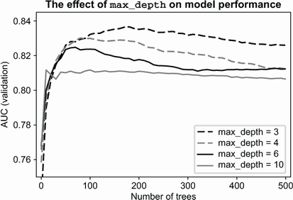


The
next parameter we tune is
[min\_child\_weight].
It's the same as [min\_leaf\_size] in decision trees from
Scikit-learn: it controls the minimal number of observations a tree can
have in a leaf.


Let's
try a range of values and see which one works best. In addition to the
default value (1), we can try 10 and 30 (figure 6.36).


#####  is 1, but it's not drastically different from other values for this parameter.

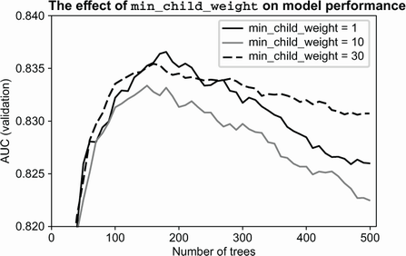


From
figure 6.36 we see that


-   [For
    [min\_child\_weight=1], AUC is 83.6%.]
-   [For
    [min\_child\_weight=10], AUC is 83.3%.]
-   [For
    [min\_child\_weight=30], AUC is 83.5%.]


The
difference between these options is not significant, so we'll leave the
default
value.


The
parameters for our final model are


``` 
xgb_params = {
    'eta': 0.1,
    'max_depth': 3,
    'min_child_weight': 1,
 
    'objective': 'binary:logistic',
    'eval_metric': 'auc',
    'nthread': 8,
    'seed': 1,
    'silent': 1
}
```


We
need to do one last step before we can finish the model: we need to
select the optimal number of trees. It's quite simple: look at the
iteration when the validation score peaked and use this number.


In
our case, we need to train 180 trees for the final model (figure 6.37):


``` 
[160] train-auc:0.935513   val-auc:0.835536
[170] train-auc:0.937885   val-auc:0.836384
[180] train-auc:0.93971    val-auc:0.836565 <- best
[190] train-auc:0.942029   val-auc:0.835621
[200] train-auc:0.943343   val-auc:0.835124
```


##### Figure 6.37 The optimal number of trees for the final model is 180.

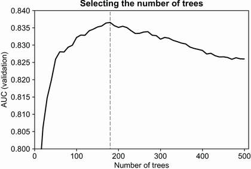


The
best the random forest model was able to get 82.5% AUC, whereas the best
the gradient boosting model could get was 1% more
(83.6%).


This
is the best model, so let's use it as our final model---and we should
use it for scoring loan
applications.


### 6.4.4 Testing the final model


We're
almost
ready to use it for risk scoring. We still need to do two things before
we can use it:


-   [Retrain
    the final model on both train and validation datasets combined. We
    no longer need the validation dataset, so we can use more data for
    training, which will make the model slightly better.]
-   [Test
    the model on the test set. This is the part of data we kept aside
    from the beginning. Now we use it to make sure the model didn't
    overfit and performs well on completely unseen data.]


The
next steps are:


-   [Apply
    the same preprocessing to
    [df\_full\_train]
    and
    [df\_test]
    as we did to
    [df\_train]
    and
    [df\_val].
    As a result, we get the feature matrices [X\_train] and
    [X\_test] as well as our target variables [y\_train] and
    [y\_test].]
-   [Train
    a model on the combined dataset with the parameters we selected
    previously.]
-   [Apply
    the model to the test data to get the test predictions.]
-   [Verify
    that the model performs well and doesn't overfit.]


Let's
do it. First, create the target variable:


``` 
y_train = (df_train_full.status == 'default').values
y_test = (df_test.status == 'default').values
```


Because
we use the entire DataFrame for creating the feature matrix, we need to
remote the target variable:


``` 
del df_train_full['status']
del df_test['status']
```


Next,
we convert DataFrames into lists of dictionaries and then use one-hot
encoding to get the feature matrices:


``` 
dict_train = df_train_full.fillna(0).to_dict(orient='records')
dict_test = df_test.fillna(0).to_dict(orient='records')
 
dv = DictVectorizer(sparse=False)
X_train = dv.fit_transform(dict_train)
X_test = dv.transform(dict_test)
```


Finally,
we train the XGBoost model using this data and the optimal parameters we
determined previously:


``` 
dtrain = xgb.DMatrix(X_train, label=y_train, feature_names=dv.feature_names_)
dtest = xgb.DMatrix(X_test, label=y_test, feature_names=dv.feature_names_)
 
xgb_params = {
    'eta': 0.1,
    'max_depth': 3,
    'min_child_weight': 1,
 
    'objective': 'binary:logistic',
    'eval_metric': 'auc',
    'nthread': 8,
    'seed': 1,
    'silent': 1
}
 
num_trees = 160
 
model = xgb.train(xgb_params, dtrain, num_boost_round=num_trees)
```


Then
evaluate its performance on the test set:


``` 
y_pred_xgb = model.predict(dtest)
roc_auc_score(y_test, y_pred_xgb)
```


The
output is 83.2%, which is comparable to 83.6%---the performance on the
validation set. It means that our model doesn't overfit and can work
well with customers it hasn't seen.


##### Exercise 6.4


The
main difference between random forest and gradient
boosting
is


a)
Trees in gradient boosting are trained sequentially, and each next tree
improves the previous one. In a random forest, all trees are trained
independently.


b)
Gradient boosting is a lot faster than using a random forest.


c)
Trees in a random forest are trained sequentially, and each next tree
improves the previous one. In gradient boosting, all trees are trained
independently.


6.5 Next steps
--------------------------------------------------------------------------------------------------------


We've
learned the basics about decision trees, random forest, and gradient
boosting. We've learned a lot, but there's much more than we could fit
in this lab. You can explore this topic further by doing the
exercises.


### 6.5.1 Exercises


-   [Feature
    engineering is the process of creating new features out of existing
    ones. For this project, we haven't created any features; we simply
    used the ones provided in the dataset. Adding more features should
    help improve the performance of our model. For example, we can add
    the ratio of requested money to the total price of the item.
    Experiment with engineering more features.]
-   [When
    training a random forest, we get different models by selecting a
    random subset of features for each tree. To control the size of the
    subset, we use the [max\_features]
    parameter.
    Try adjusting this parameter, and see if it changes the AUC on
    validation
-   [Extreme
    randomized trees (or extra trees, for short) is a variation of a
    random forest where the idea of randomization is taken to the
    extreme. Instead of finding the best possible split, it picks a
    splitting condition randomly. This approach has a few advantages:
    extra trees are faster to train, and they are less prone to
    overfitting. On the other hand, they require more trees to have
    adequate performance. In Scikit-learn,
    [ExtraTreesClassifier]
    from the [ensemble] package implements it. Experiment with it
    for this project.]
-   [In
    XGBoost, the [colsample\_bytree]
    parameter
    controls the number of features we select for each tree---it's
    similar to [max\_features] from the random forest. Experiment
    with this parameter, and see if it improves the performance: try
    values from 0.1 to 1.0 with a step of 0.1. Usually the optimal
    values are between 0.6 and 0.8, but sometimes 1.0 gives the best
    result.]
-   [In
    addition to randomly selecting columns (features), we can also
    select a subset of rows (customers). This is called *subsampling*,
    and it helps to prevent overfitting. In XGBoost, the
    [subsample]
    parameter
    controls the fraction of examples we select for training each tree
    in the ensemble. Try values from 0.4 to 1.0 with a step of 0.1.
    Usually the optimal values are between 0.6 and 0.8.]


### 6.5.2 Other projects


-   [All
    tree-based models can solve the regression problem---predict a
    number. In Scikit-learn, DecisionTreeRegressor, and
    RandomForestRegressor, implement the regression variation of the
    models. In XGBoost, we need to change the objective to
    [reg:squarederror]. Use these models for predicting the price
    of the car, and try to solve other regression problems as
    well.]


Summary
-------------------------------------------------------------------------------------------------


-   [Decision
    tree is a model that represents a sequence of if-then-else
    decisions. It's easy to understand, and it also performs quite well
    in practice.]
-   [We
    train decision trees by selecting the best split using impurity
    measures. The main parameters that we control are the depth of the
    tree and the maximum number of samples in each leaf.]
-   [A
    random forest is a way to combine many decision trees into one
    model. Like a team of experts, individual trees can make mistakes,
    but together, they are less likely to reach an incorrect
    decision.]
-   [A
    random forest should have a diverse set of models to make good
    predictions. That's why each tree in the model uses a different set
    of features for training.]
- [The main parameters we need to change for random forest are the same as
    for decision trees: the depth and the maximum number of samples in
    each leaf. Additionally, we need to select the number of trees we
    want to have in the ensemble.]
-   [While
    in a random forest the trees are independent, in gradient boosting,
    the trees are sequential, and each next model corrects the mistakes
    of the previous one. In some cases, this leads to better predictive
    performance.]
- [The parameters we need to tune for gradient boosting are similar for a
    random forest: the depth, the maximum number of observations in the
    leaf, and the number of trees. In addition to that, we have
    [eta]---the learning rate. It specifies the contribution of
    each individual tree to the ensemble.]


Tree-based
models are easy to interpret and understand, and often they perform
quite well. Gradient boosting is great and often achieves the best
possible performance on structured data (data in tabular format).


In
the next lab, we look at neural nets: a different type of model,
which, in contrast, achieves best performance on unstructured data, such
as images.


Answers to exercises
--------------------------------------------------------------------------------------------------------------


-   [Exercise
    6.1 A) With one more feature, training takes longer.]
-   [Exercise
    6.3 C) The model will need fewer trees to reach its peak
    performance.]
-   [Exercise
    6.2 B) Randomly selecting a different subset of features for each
    tree.]
-   [Exercise
    6.4 A) Trees in gradient boosting are trained sequentially. In a
    random forest, trees are trained
   independently.]


