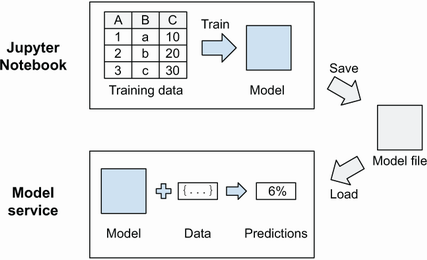
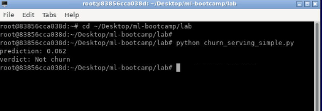
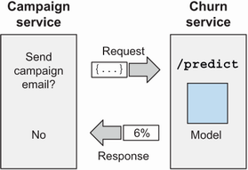
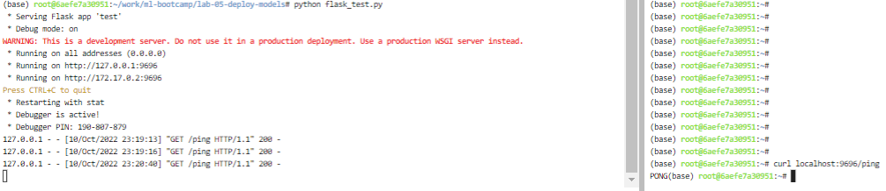
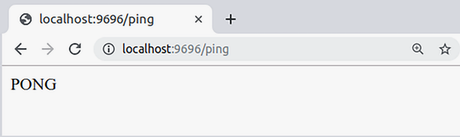
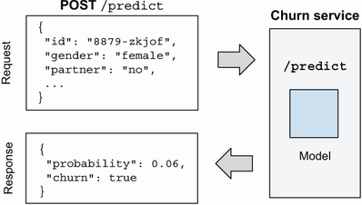
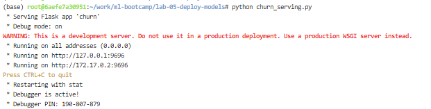
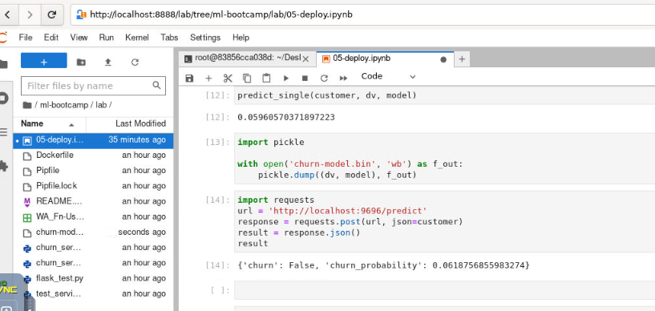

Lab: Deploying machine learning models (churn_serving_simple.py)
--------------------------------------


This chapter covers

- Saving models with Pickle
- Serving models with Flask


In this chapter, we cover model deployment : the process of putting models to use. In particular, we see how to package a model inside a web service, so other services can use it.


--------------------------------------------------------------------------------------------------------------------


To get started with deployment we use the model we trained previously. First,
in this section, we review how we can use the model for making
predictions, and then we see how to save it with Pickle.


Let's use this model to calculate the probability of churning for the
following customer:


```
customer = {
    'customerid': '8879-zkjof',
    'gender': 'female',
    'seniorcitizen': 0,
    'partner': 'no',
    'dependents': 'no',
    'tenure': 41,
    'phoneservice': 'yes',
    'multiplelines': 'no',
    'internetservice': 'dsl',
    'onlinesecurity': 'yes',
    'onlinebackup': 'no',
    'deviceprotection': 'yes',
    'techsupport': 'yes',
    'streamingtv': 'yes',
    'streamingmovies': 'yes',
    'contract': 'one_year',
    'paperlessbilling': 'yes',
    'paymentmethod': 'bank_transfer_(automatic)',
    'monthlycharges': 79.85,
    'totalcharges': 3320.75,
}
```


To predict whether this customer is going to churn, we can use the `predict` function:


```
df = pd.DataFrame([customer])
y_pred = predict(df, dv, model)
y_pred[0]
```


This function needs a dataframe, so first we create a dataframe with one
row---our customer. Next, we put it into the `predict` function.
The result is a NumPy array with a single element---the predicted
probability of churn for this
customer:


```
0.059605
```


This
means that this customer has a 6% probability of churning.


Now
let's take a look at the `predict` function, which we wrote
previously for applying the model to the customers in the validation
set:


```
def predict(df, dv, model):
    cat = df[categorical + numerical].to_dict(orient='rows')
    X = dv.transform(cat)
    y_pred = model.predict_proba(X)[:, 1]
    return y_pred
```


Using it for one customer seems inefficient and unnecessary: we create a
dataframe from a single customer only to convert this dataframe back to
a dictionary later inside `predict`.


To avoid doing this unnecessary conversion, we can create a separate
function for predicting the probability of churn for a single customer
only. Let's call this function
[predict\_single]:


```
def predict_single(customer, dv, model):    #1
    X = dv.transform([customer])            #2
    y_pred = model.predict_proba(X)[:, 1]   #3
    return y_pred[0]                        #4
```


Using it becomes simpler---we simply invoke it with our customer (a
dictionary):


```
predict_single(customer, dv, model)
```


The result is the same: this customer has a 6% probability of churning.


We trained our model inside the Jupyter Notebook we started in chapter 3.
This model lives there, and once we stop the Jupyter Notebook, the
trained model will disappear. This means that now we can use it only
inside the notebook and nowhere else. Next, we see how to address
it.


To be able to use it outside of our notebook, we need to save it, and then
later, another process can load and use it (figure 5.1).


#####  We train a model in a Jupyter Notebook. To use it, we first need to save it and then load it in a different process.





Pickle is a serialization/deserialization module that's already built into
Python: using it, we can save an arbitrary Python object (with a few
exceptions) to a file. Once we have a file, we can load the model from
there in a different process.


##### Note

"Pickle" can also be used as a verb: *pickling* an object in Python
means saving it using the Pickle module.


**Saving the model**


To save the model, we first import the Pickle module, and then use the [dump] function:


```
import pickle
 
with open('churn-model.bin', 'wb') as f_out:     #1
    pickle.dump(model, f_out)                    #2
```


To save the model, we use the [open]
function,
which takes two arguments:


-   [The
    name of the file that we want to open. For us, it's
    churn-model.bin.]
-   [The
    mode with which we open the file. For us, it's [wb], which
    means we want to write to the file ([w]), and the file is
    binary ([b]) and not text---Pickle uses binary format for
    writing to files.]


The
[open] function returns [f\_out]---the file descriptor we
can use to write to the file.


Next, we use the [dump] function from Pickle. It also takes two arguments:


-   [The
    object we want to save. For us, it's [model].]
-   [The
    file descriptor, pointing to the output file, which is
    [f\_out] for us.]


Finally,
we use the [with] construction in this code. When we open a file
with [open], we need to close it after we finish writing. When
using [with], it happens automatically. Without [with], our
code would look like this:


```
f_out = open('churn-model.bin', 'wb')
pickle.dump(model, f_out)
f_out.close()
```


In our case, however, saving just the model is not enough: we also have a
[DictVectorizer] that we "trained" together with the model. We
need to save both.


The
simplest way of doing this is to put both of them in a tuple when
pickling:


```
with open('churn-model.bin', 'wb') as f_out: 
    pickle.dump((dv, model), f_out)             #1
```


**Loading the model**


To load the model, we use the [load]
function from Pickle. We can test it in the same Jupyter Notebook:


```
with open('churn-model.bin', 'rb') as f_in:    #1
    dv, model = pickle.load(f_in)              #2
```


We again use the [open] function, but this time, with a different
mode: [rb], which means we open it for reading ([r]), and
the file is binary ([b]).


##### Warning


Be careful when specifying the mode. Accidentally specifying an
incorrect mode may result in data loss: if you open an existing file
with the `w` mode instead of `r`, it will overwrite the content.


Because we saved a tuple, we unpack it when loading, so we get both the
vectorizer and the model at the same
time.


##### Warning


Unpickling objects found on the internet is not secure: it can execute
arbitrary code on your machine. Use it only for things you trust and
things you saved yourself.


Let's create a simple Python script that loads the model and applies it to a
customer.


We will call this file churn\_serving.py. (In the course's GitHub repository,
this file is called churn\_serving\_simple.py.) It contains


-   [The
    [predict\_single] function that we wrote earlier]
-   [The
    code for loading the model]
-   [The
    code for applying the model to a customer]


First, we start with imports. For this script, we need to import Pickle and
NumPy:


```
import pickle
import numpy as np
```


Next, let's put the [predict\_single] function there:


```
def predict_single(customer, dv, model):
    X = dv.transform([customer])
    y_pred = model.predict_proba(X)[:, 1]
    return y_pred[0]
```


Now we can load our model:


```
with open('churn-model.bin', 'rb') as f_in:
    dv, model = pickle.load(f_in)
```


And apply it:


```
customer = {
    'customerid': '8879-zkjof',
    'gender': 'female',
    'seniorcitizen': 0,
    'partner': 'no',
    'dependents': 'no',
    'tenure': 41,
    'phoneservice': 'yes',
    'multiplelines': 'no',
    'internetservice': 'dsl',
    'onlinesecurity': 'yes',
    'onlinebackup': 'no',
    'deviceprotection': 'yes',
    'techsupport': 'yes',
    'streamingtv': 'yes',
    'streamingmovies': 'yes',
    'contract': 'one_year',
    'paperlessbilling': 'yes',
    'paymentmethod': 'bank_transfer_(automatic)',
    'monthlycharges': 79.85,
    'totalcharges': 3320.75,
}
 
prediction = predict_single(customer, dv, model)
```


Finally, let's display the results:


```
print('prediction: %.3f' % prediction)
 
if prediction >= 0.5:
    print('verdict: Churn')
else:
    print('verdict: Not churn')
```


After saving the file, we can run this script with Python:


```
cd ~/Desktop/ml-bootcamp/lab

python churn_serving_simple.py
```


We should immediately see the results:


```
prediction: 0.059
verdict: Not churn
```





This way, we can load the model and apply it to the customer we specified in
the script.


Of course, we aren't going to manually put the information about customers
in the script. In the next section, we cover a more practical approach:
putting the model into a web.


-----------------------------------------------------------------------------------------------------------
## (flask_test.py)


We already know how to load a trained model in a different process. Now we need to
*serve* this model---make it available for others to use.


In practice, this usually means that a model is deployed as a web service,
so other services can communicate with it, ask for predictions, and use
the results to make their own decisions.


In this section, we see how to do it in Python with Flask---a Python
framework for creating web services. First, we take a look at why we
need to use a web service for it.


We already know how to use a model to make a prediction, but so far, we have simply
hardcoded the features of a customer as a Python dictionary. Let's try
to imagine how our model will be used in practice.


Suppose
we have a service for running marketing campaigns. For each customer, it
needs to determine the probability of churn, and if it's high enough, it
will send a promotional email with discounts. Of course, this service
needs to use our model to decide whether it should send an email.


One possible way of achieving this is to modify the code of the campaign
service: load the model, and score the customers right in the service.
This approach is good, but the campaign service needs to be in Python,
and we need to have full control over its code.


Unfortunately,
this situation is not always the case: it may be written in some other
language, or a different team might be in charge of this project, which
means we won't have the control we
need.


The
typical solution for this problem is putting a model inside a web
service---a small service (a *microservice*) that only takes care of
scoring customers.


So,
we need to create a churn service---a service in Python that will serve
the churn model. Given the features of a customer, it will respond with
the probability of churn for this customer. For each customer, the
campaign service will ask the churn service for the probability of
churn, and if it's high enough, then we send a promotional email (figure
5.2).


##### Figure 5.2 The churn service takes care of serving the churn-prediction model, making it possible for other services to use it.




This gives us another advantage: separation of concerns. If the model is
created by data scientists, then they can take ownership of the service
and maintain it, while the other team takes care of the campaign
service.


One of the most popular frameworks for creating web services in Python is
Flask, which we cover next.


The easiest way to implement a web service in Python is to use Flask. It's quite
lightweight, requires little code to get started, and hides most of the
complexity of dealing with HTTP requests and responses.


Before we put our model inside a web service, let's cover the basics of using
Flask. For that, we'll create a simple function and make it available as
a web service. After covering the basics, we'll take care of the model.


Suppose
we have a simple Python function called
[ping]:


```
def ping():
    return 'PONG'
```


It doesn't do much: when invoked, it simply responds with PONG. Let's use
Flask to turn this function into a web service.


We will put this code in a Python file and will call it flask\_test.py.


To be able to use Flask, we first need to import it:


```
from flask import Flask
```


Now we create a Flask app --- the central object for registering functions
that need to be exposed in the web service. We'll call our app test:


```
app = Flask('test')
```


Next, we need to specify how to reach the function by assigning it to an
address, or a *route* in Flask terms. In our case, we want to use the
[/ping] address:


```
@app.route('/ping', methods=['GET'])      #1
def ping():
    return 'PONG'
```


This code uses decorators---an advanced Python feature that we don't cover in
this course. We don't need to understand how it works in detail; it's
enough to know that by putting
[\@app.route]
on top of the function definition, we assign the [/ping] address
of the web service to the [ping] function.


To run it, we only need one last bit:


```
if __name__ == '__main__':
    app.run(debug=True, host='0.0.0.0', port=9696)
```


The [run] method of [app] starts the service. We specify three
parameters:


- `debug=True`. Restarts our application automatically when there are changes in the code.
- `host='0.0.0.0'`. Makes the web service public; otherwise, it won't be possible to
    reach it when it's hosted on a remote machine.
- `port=9696`. The port that we use to access the application.


We're ready to start our service now. Let's do it:


```
cd ~/Desktop/ml-bootcamp/lab

python flask_test.py
```

**Note:** Solution is present in `ml-bootcamp/lab` folder on Desktop.





When we run it, we should see the following:


```
* Serving Flask app "test" (lazy loading)
 * Environment: production
   WARNING: This is a development server. Do not use it in a production deployment.
   Use a production WSGI server instead.
 * Debug mode: on
 * Running on http://0.0.0.0:9696/ (Press CTRL+C to quit)
 * Restarting with stat
 * Debugger is active!
 * Debugger PIN: 162-129-136
```


This means that our Flask app is now running and ready to get requests. To
test it, we can use our browser: open it and type localhost:9696/ping in
the address bar. If you run it on a remote server, you should replace
localhost with the address of the server.


##### Figure 5.3 The easiest way to check if our application works is to use a web browser.




Flask logs all the requests it receives, so we should see a line indicating
that there was a GET request on the [/ping] route:


```
127.0.0.1 - - [02/Apr/2020 21:59:09] "GET /ping HTTP/1.1" 200 -
```


As we can see, Flask is quite simple: with fewer than 10 lines of code, we
created a web service.


Next, we'll see how to adjust our script for churn prediction and also turn it into a web service.


We've learned a bit of Flask, so now we can come back to our script and convert it to
a Flask application.


To score a customer, our model needs to get the features, which means that
we need a way of transferring some data from one service (the campaign
service) to another (the churn service).


As a data exchange format, web services typically use JSON (Javascript
Object
Notation.
It's similar to the way we define dictionaries in Python:


```
{
    "customerid": "8879-zkjof",
    "gender": "female",
    "seniorcitizen": 0,
    "partner": "no",
    "dependents": "no",
    ...
}
```


To send data, we use POST requests, not GET: POST requests can include the
data in the request, whereas GET cannot.


Thus,
to make it possible for the campaign service to get predictions from the
churn service, we need to create a [/predict] route that accepts
POST requests. The churn service will parse JSON data about a
customer
and respond in JSON as well (figure 5.4).


##### To get predictions, we POST the data about a customer in JSON to the /predict route and get the probability of churn in response.
#### (churn_serving.py)




Now we know what we want to do, so let's start modifying the
churn\_serving.py file.


First, we add a few more imports at the top of the file:


```
from flask import Flask, request, jsonify
```


Although previously we imported only [Flask], now we need to import two
more things:


- `request`: To get the content of a POST request]
- `jsonsify`: To respond with JSON]


Next, create the Flask app. Let's call it churn:


```
app = Flask('churn')
```


Now we need to create a function that


-   [Gets
    the customer data in a request]
-   [Invokes
    [predict\_simple] to score the customer]
-   [Responds
    with the probability of churn in JSON]


We'll
call this function `predict` and assign it to the [/predict]
route:


```
@app.route('/predict', methods=['POST'])              #1
def predict():
    customer = request.get_json()                     #2
 
    prediction = predict_single(customer, dv, model)  #3
    churn = prediction >= 0.5                         #4
   
    result = {                                        #4
        'churn_probability': float(prediction),       #4
        'churn': bool(churn),                         #4
    }                                                 #4
 
    return jsonify(result)                            #5
```


To assign the route to the function, we use the [\@app.route]
decorator, where we also tell Flask to expect POST requests only.


The core content of the `predict` function is similar to what we did
in the script previously: it takes a customer, passes it to
[predict\_single], and does some work with the result.


Finally, let\'s add the last two lines for running the Flask app:


```
if __name__ == '__main__':
    app.run(debug=True, host='0.0.0.0', port=9696)
```


We're ready to run it:


```
cd ~/Desktop/ml-bootcamp/lab

python churn_serving.py
```





After running it, we should see a message saying that the app started and is
now waiting for incoming requests:


```
* Serving Flask app "churn" (lazy loading)
 * Environment: production
   WARNING: This is a development server. Do not use it in a production deployment.
   Use a production WSGI server instead.
 * Debug mode: on
 * Running on http://0.0.0.0:9696/ (Press CTRL+C to quit)
 * Restarting with stat
 * Debugger is active!
```


Testing this code is a bit more difficult than previously: this time, we need to
use POST requests and include the customer we want to score in the body
of the request.


We can open the Jupyter Notebook and test the web service from there. Start new terminal and run following commands in the terminal:


```
cd ~/Desktop

jupyter lab --allow-root
```

**Note:** Solution is available in `ml-bootcamp/lab/05-deploy.ipynb` notebook. Open notebook in `Midori` browser and run the solution to get output.


First, import requests:


```
import requests
```


Now, make a POST request to our service


```
url = 'http://localhost:9696/predict'            #1
response = requests.post(url, json=customer)     #2
result = response.json()                         #3
```





The [results] variable contains the response from the churn service:


```
{'churn': False, 'churn_probability': 0.05960590758316391}
```


This is the same information we previously saw in the terminal, but now we got it as a response from a web service.


##### Note

Some tools, like Postman (<https://www.postman.com/>), make it easier to
test web services.


If the campaign service used Python, this is exactly how it could
communicate with the churn service and decide who should get promotional
emails.


With
just a few lines of code, we created a working web service that runs on
our laptop. In the next section, we'll see how to manage dependencies in
our service and prepare it
for
deployment.


-------------------------------------------------------------------------------------------------------------------


For
local
development, Anaconda is a perfect tool: it has almost all the libraries
we may ever need. This, however, also has a downside: it takes up 4 GB
when unpacked, which is too large. For production, we prefer to have
only the libraries we actually need.


Additionally,
different services have different requirements. Often, these
requirements conflict, so we cannot use the same environment for running
multiple services at the same time.


In this section, we see how to manage dependencies of our application in an
isolated way that doesn't interfere with other services. We cover two
tools for this: Pipenv, for managing Python libraries, and Docker, for
managing the system dependencies such as the operating system and the
system libraries.


### 


To
serve the churn model, we only need a few libraries: NumPy,
Scikit-learn, and Flask. So, instead of bringing in the entire Anaconda
distribution with all its libraries, we can get a fresh Python
installation and install only the libraries we need with [pip]:


```
pip install numpy scikit-learn flask
```


Before
we do that, let's think for a moment about what happens when we use
[pip] to install a library:


-   [We
    run [pip] [install]
    [library]
    to install a Python package called Library (let's suppose it
    exists).]
-   [Pip
    goes to PyPI.org (the Python package index---a repository with
    Python packages), and gets and installs the latest version of this
    library. Let's say, it's version
    1.0.0


After
installing it, we develop and test our service using this particular
version. Everything works great. Later, our colleagues want to help us
with the project, so they also run [pip]
[install]
to set up everything on their machine---except this time, the latest
version turns out to be 1.3.1.


If
we're unlucky, versions 1.0.0 and 1.3.1 might not be compatible with
each other, meaning that the code we wrote for version 1.0.0 won't work
for version 1.3.1.


It's
possible to solve this problem by specifying the exact version of the
library when installing it with [pip]:


```
pip install library==1.0.0
```


Unfortunately,
a different problem may appear: what if some of our colleagues already
have version 1.3.1 installed, and they already used it for some other
services? In this case, they cannot go back to using version 1.0.0: it
could cause their code to stop working.


We
can solve these problems by creating a *virtual
environment*
for each project---a separate Python distribution with nothing else but
libraries required for this particular project.


Pipenv
is a tool that makes managing virtual environments easier. We can
install it with pip:


```
pip install pipenv
```


After
that, we use [pipenv] instead of [pip] for installing
dependencies:


```
pipenv install numpy scikit-learn flask
```


When
running it, we'll see that first, it configures the virtual environment,
and then it installs the libraries:


```
Running virtualenv with interpreter .../bin/python3
✔ Successfully created virtual environment!
Virtualenv location: ...
Creating a Pipfile for this project...
Installing numpy...
Adding numpy to Pipfile's [packages]...
✔ Installation Succeeded
Installing scikit-learn...
Adding scikit-learn to Pipfile's [packages]...
✔ Installation Succeeded
Installing flask...
Adding flask to Pipfile's [packages]...
✔ Installation Succeeded
Pipfile.lock not found, creating...
Locking [dev-packages] dependencies...
Locking [packages] dependencies...
⠙ Locking...
```


After
finishing the installation, it creates two files: Pipenv and
Pipenv.lock.


The
Pipenv file looks pretty simple:


```
[[source]]
name = "pypi"
url = "https://pypi.org/simple"
verify_ssl = true
 
[dev-packages]
 
[packages]
numpy = "*"
scikit-learn = "*"
flask = "*"
 
[requires]
python_version = "3.7"
```


We
see that this file contains a list of libraries as well as the version
of Python we use.


The
other file---Pipenv.lock---contains the specific versions of the
libraries that we used for the project. The file is too large to show in
its entirety here, but let's take a look at one of the entries in the
file:


```
"flask": {
    "hashes": [
        "sha256:4efa1ae2d7c9865af48986de8aeb8504...",
        "sha256:8a4fdd8936eba2512e9c85df320a37e6..."
    ],
    "index": "pypi",
    "version": "==1.1.2"
}
```


As
we can see, it records the exact version of the library that was used
during installation. To make sure the library doesn't change, it also
saves the hashes---the checksums that can be used to validate that in
the future we download the exact same version of the library. This way,
we "lock" the dependencies to specific versions. By doing this, we make
sure that in the future we will not have surprises with two incompatible
versions of the same library.


If
somebody needs to work on our project, they simply need to run the
[install]
command:


```
pipenv install
```


This
step will first create a virtual environment and then install all the
required libraries from
Pipenv.lock.


##### Important


Locking the version of a library is important for reproducibility in the
future and helps us avoid having unpleasant surprises with code
incompatibility.


After
all the libraries are installed, we need to activate the virtual
environment---this way, our application will use the correct versions of
the libraries. We do it by running the [shell]
command:


```
pipenv shell
```


It tells us that it's running in a virtual environment:


```
Launching subshell in virtual environment...
```


Now
we can run our script for serving:


```
python churn_serving.py
```


Alternatively,
instead of first explicitly entering the virtual environment and then
running the script, we can perform these two steps with just one
command:


```
pipenv run python churn_serving.py
```


The
[run]
command
in Pipenv simply runs the specified program in the virtual environment.


Regardless
of the way we run it, we should see exactly the same output as
previously:


```
* Serving Flask app "churn" (lazy loading)
 * Environment: production
   WARNING: This is a development server. Do not use it in a production deployment.
   Use a production WSGI server instead.
 * Debug mode: on
 * Running on http://0.0.0.0:9696/ (Press CTRL+C to quit)
```


When we test it with requests, we see the same output:


```
{'churn': False, 'churn_probability': 0.05960590758316391}
```


